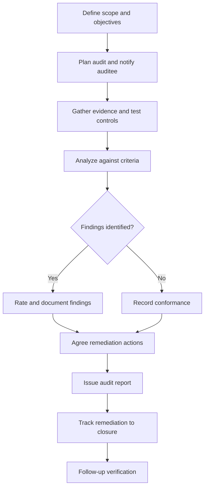

# Volume 02 - Business Audit Framework

| Field | Value |
|---|---|
| Document ID | WORLD-VOL02-A6 |
| Title | Business Audit Framework |
| Version | 1.0 |
| Status | Approved |
| Classification | Internal |
| Founder | Mahesh Choudhary |

## Purpose

This appendix defines a structured framework for conducting business audits: independent, evidence-based examinations of whether processes, controls, and practices operate as intended and comply with applicable standards. It provides a common process, rating scale, and reporting format so audits are consistent, credible, and actionable.

## Scope

The framework applies to internal reviews of any business domain. It defines audit domains, a repeatable audit process, a findings-rating scale, and a sample findings record. It complements the self-assessment approach in Appendix A5 by adding independent verification.

## Audit Domains

| # | Domain | Focus of Examination |
|---|---|---|
| 1 | Governance and Controls | Decision rights, policies, and control effectiveness. |
| 2 | Process Conformance | Adherence of operations to documented procedures. |
| 3 | Financial Integrity | Accuracy, completeness, and controls over financial records. |
| 4 | Compliance | Adherence to laws, regulations, and internal policy. |
| 5 | Data and Information | Data quality, security, retention, and access control. |
| 6 | Risk Management | Identification, assessment, and treatment of risks. |
| 7 | Performance and Value | Whether activities deliver intended outcomes efficiently. |

## Audit Process

## Findings Rating Scale

| Rating | Severity | Description | Expected Response |
|---|---|---|---|
| Critical | Very High | Immediate threat to finances, compliance, or continuity. | Act immediately; escalate to leadership. |
| Major | High | Significant control weakness or non-conformance with material impact. | Remediate on a priority schedule. |
| Moderate | Medium | Control gap or deviation with limited but real impact. | Remediate within the normal cycle. |
| Minor | Low | Isolated issue or improvement opportunity with low impact. | Address as capacity allows. |
| Observation | Informational | No breach; a recommendation to strengthen practice. | Consider for continuous improvement. |

## Sample Audit Finding

| Field | Value |
|---|---|
| Finding ID | AUD-2026-014 |
| Domain | Process Conformance |
| Rating | Major |
| Condition | The procurement approval procedure was bypassed on 6 of 20 sampled purchases. |
| Criteria | SOP requires documented approval above the defined threshold before purchase. |
| Cause | Approval step not enforced in the workflow; time pressure at period end. |
| Effect | Increased risk of unauthorized or duplicate spend and weakened control. |
| Recommendation | Enforce approval as a mandatory workflow gate and retrain purchasing staff. |
| Owner | Head of Operations |
| Due Date | 2026-08-15 |
| Status | Open |

## Related Documents

- [Volume 02 - Business Foundation Overview](/docs/blueprint/volume-02-business-foundation/README.md)
- [Appendix A4 - Business Checklists](/docs/blueprint/volume-02-business-foundation/appendices/business-checklists.md)
- [Appendix A5 - Business Assessment Framework](/docs/blueprint/volume-02-business-foundation/appendices/business-assessment-framework.md)

## References

- [Volume 01 - Vision and Philosophy](/docs/blueprint/volume-01-vision-and-philosophy/README.md)
- [Document Standards](/docs/governance/document-standards.md)

## Change Log

| Version | Date | Author | Notes |
|---|---|---|---|
| 1.0 | 2026-07-12 | Lead Software Engineer | Initial approved version. |
