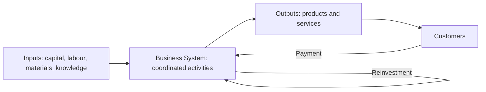

# Volume 02 - Business Definition

| Field | Value |
|---|---|
| Document ID | WORLD-VOL02-001 |
| Title | Business Definition |
| Version | 1.0 |
| Status | Approved |
| Classification | Internal |
| Founder | Mahesh Choudhary |

## Purpose

This document establishes a first-principles definition of what a business is. It provides the shared vocabulary and conceptual baseline upon which every subsequent chapter of Volume 02 depends, so that all reasoning about purpose, models, value, and finance rests on a single, unambiguous foundation.

## Scope

This chapter covers the essential nature of a business as an organised system, its constituent elements, the boundary that separates it from its environment, and the distinction between a business and adjacent concepts such as a hobby, a project, or a charity. It does not cover legal incorporation forms or WORLD's own commercial strategy.

## What Is a Business

A business is an organised system that repeatedly transforms inputs into outputs of greater value for others, and captures part of that created value in exchange, in a way that can be sustained over time. Three properties are load-bearing in this definition:

- **Organisation** - activity is coordinated and repeatable, not accidental or one-off.
- **Value exchange** - the output is valued by someone outside the business who is willing to give something (usually money) in return.
- **Sustainability** - the exchange returns enough resource to continue operating and, ideally, to grow.

Remove any one property and the entity ceases to be a business. Without organisation it is chance; without exchange it is a hobby; without sustainability it is a temporary venture that will end.

### Core Elements

Every business, regardless of size or sector, is composed of the same fundamental elements.

| Element | Description | Question It Answers |
|---|---|---|
| Customer | The party who receives value and pays | Who is served? |
| Offer | The product or service delivered | What is provided? |
| Value Proposition | The reason the offer is chosen over alternatives | Why us? |
| Resources | People, capital, assets, knowledge | With what? |
| Activities | The work that transforms inputs to outputs | How? |
| Revenue & Cost | The economic flows in and out | Does it sustain? |

### The Business as a System

A business is best understood as a value-transformation system with a clear boundary between itself and its environment.

## Distinguishing a Business from Adjacent Concepts

A hobby produces value but seeks no sustained exchange. A charity organises exchange but distributes rather than captures surplus for owners. A project is organised and value-creating but is bounded in time and does not intend to repeat indefinitely. A business uniquely combines organisation, ongoing exchange, and self-sustaining economics.

## Example

Consider a neighbourhood bakery. Its **customers** are local residents; its **offer** is fresh bread and pastries; its **value proposition** is quality and convenience; its **resources** are the oven, ingredients, and bakers; its **activities** are procurement, baking, and selling; its **revenue** comes from daily sales and its **costs** from ingredients, wages, and rent. Because the daily exchange returns more than it consumes, the bakery can open again tomorrow - it is a sustainable value-transformation system, and therefore a business.

## Relevance to WORLD

The AI Business Partner models each client organisation using exactly these core elements, giving it a structured internal representation of the business it serves. By understanding a business as a value-transformation system with defined inputs, activities, and outputs, the AI Business Partner can reason about where value is created, where it leaks, and where intervention will have the greatest effect.

## Related Documents

- [Purpose of Business](/docs/blueprint/volume-02-business-foundation/section-a-business-fundamentals/02-purpose-of-business.md)
- [Business Operating Model](/docs/blueprint/volume-02-business-foundation/section-a-business-fundamentals/05-business-operating-model.md)
- [Value Creation](/docs/blueprint/volume-02-business-foundation/section-a-business-fundamentals/06-value-creation.md)

## References

- [Volume 01 - Vision and Philosophy](/docs/blueprint/volume-01-vision-and-philosophy/README.md)
- [Document Standards](/docs/governance/document-standards.md)

## Change Log

| Version | Date | Author | Description |
|---|---|---|---|
| 1.0 | 2026-07-12 | Lead Software Engineer | Initial approved version. |
