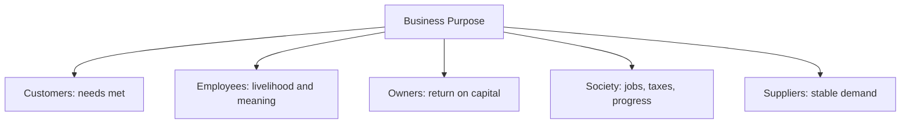

# Volume 02 - Purpose of Business

| Field | Value |
|---|---|
| Document ID | WORLD-VOL02-002 |
| Title | Purpose of Business |
| Version | 1.0 |
| Status | Approved |
| Classification | Internal |
| Founder | Mahesh Choudhary |

## Purpose

This document explains, from first principles, why businesses exist and what fundamental purpose they serve for their stakeholders and for society. It clarifies the difference between purpose, mission, and profit so that later chapters can reason about goals and value without conflating means and ends.

## Scope

This chapter covers the reason a business exists, the stakeholders it serves, the relationship between purpose and profit, and how purpose translates into direction. It excludes detailed strategy formulation and WORLD's specific corporate mission.

## Why Businesses Exist

At the deepest level, a business exists to solve a problem or satisfy a need for others in a way that is worth paying for. Profit is not the purpose of a business; it is the reward for, and the measure of, fulfilling that purpose sustainably. A business that pursues profit while ignoring the underlying need eventually loses the customer relationship that generates the profit.

This distinction matters because it orders priorities. Purpose is the end; profit is the mechanism that keeps the end achievable.

### Purpose, Mission, and Profit

| Concept | Definition | Time Horizon |
|---|---|---|
| Purpose | The fundamental reason the business exists - the need it serves | Enduring |
| Mission | The specific way it intends to serve that purpose now | Medium-term |
| Profit | The financial surplus that proves and funds the purpose | Continuous measure |

## Stakeholders Served

A business creates value for a network of stakeholders, and durable purpose accounts for all of them rather than optimising for one at the expense of the rest.

### The Value-Balance Principle

A healthy purpose keeps these interests in balance. Over-serving owners starves customers and employees; over-serving customers without capturing value starves owners and ends the business. The art of purposeful management is to sustain a balance in which every stakeholder receives enough value to keep participating.

## From Purpose to Direction

Purpose is only useful when it shapes decisions. It cascades into concrete direction through a simple chain: purpose informs mission, mission informs goals, goals inform strategy, and strategy informs daily activity. When a decision is difficult, returning to purpose usually resolves it.

## Example

A medical-devices company defines its **purpose** as improving patient recovery outcomes. Its **mission** is to make post-surgical monitoring affordable for regional hospitals. Its **profit** comes from device sales and service contracts. When faced with a choice between a cheaper component that slightly reduces reliability and a costlier one that preserves it, the purpose - patient outcomes - settles the decision in favour of reliability, protecting the customer relationship that ultimately sustains profit.

## Relevance to WORLD

The AI Business Partner anchors its recommendations to each client's stated purpose, ensuring that tactical advice on pricing, cost, or growth never drifts away from the reason the business exists. By holding purpose as the top of the goal hierarchy, the platform can flag when a proposed action optimises short-term profit at the expense of the stakeholder balance that keeps the business viable.

## Related Documents

- [Business Definition](/docs/blueprint/volume-02-business-foundation/section-a-business-fundamentals/01-business-definition.md)
- [Value Creation](/docs/blueprint/volume-02-business-foundation/section-a-business-fundamentals/06-value-creation.md)
- [Profitability](/docs/blueprint/volume-02-business-foundation/section-a-business-fundamentals/09-profitability.md)

## References

- [Volume 01 - Vision and Philosophy](/docs/blueprint/volume-01-vision-and-philosophy/README.md)
- [Document Standards](/docs/governance/document-standards.md)

## Change Log

| Version | Date | Author | Description |
|---|---|---|---|
| 1.0 | 2026-07-12 | Lead Software Engineer | Initial approved version. |
