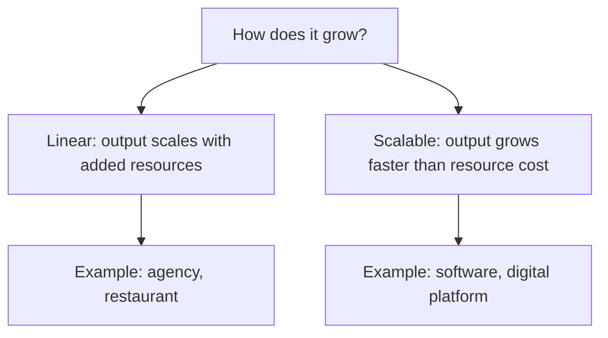

# Volume 02 - Types of Business

| Field | Value |
|---|---|
| Document ID | WORLD-VOL02-003 |
| Title | Types of Business |
| Version | 1.0 |
| Status | Approved |
| Classification | Internal |
| Founder | Mahesh Choudhary |

## Purpose

This document provides a first-principles taxonomy of businesses so that any organisation can be classified along consistent dimensions. A shared classification lets later chapters reason about how model, life cycle, and economics vary by business type.

## Scope

This chapter covers the major dimensions along which businesses differ - what they sell, who they serve, how they are owned, and how they scale. It does not cover jurisdiction-specific legal registration procedures.

## Dimensions of Classification

No single label captures a business. It is more accurate to describe a business as a point in a multi-dimensional space. Four dimensions are foundational.

### By Offering

| Type | What Is Sold | Example |
|---|---|---|
| Product | A tangible good | Furniture manufacturer |
| Service | Labour, expertise, access | Consulting firm |
| Hybrid | Product bundled with service | Software with support |
| Platform | Access to a network of other participants | Marketplace |

### By Customer

- **B2C** - sells to individual consumers.
- **B2B** - sells to other businesses.
- **B2G** - sells to government bodies.
- **B2B2C** - sells through a business to reach the end consumer.

### By Ownership

Ownership determines who bears risk and who receives surplus: sole proprietorship, partnership, private company, public company, and cooperative each distribute control and liability differently.

### By Scaling Logic

Linear businesses add cost roughly in step with revenue; scalable businesses can serve many more customers with little additional marginal cost, which changes their entire economic profile.

## Why Type Matters

A business's type governs its cost structure, its revenue model, its life-cycle rhythm, and its risks. A service business is people-heavy and hard to scale but capital-light; a platform is hard to start but scales dramatically once network effects take hold. Misclassifying a business leads to applying the wrong benchmarks and the wrong advice.

## Example

An online language-tutoring company can be described precisely along all four dimensions: by **offering** it is a hybrid (a platform connecting tutors plus its own curriculum service); by **customer** it is B2C with a B2B arm selling to schools; by **ownership** it is a private company; and by **scaling logic** the platform layer is scalable while the live-tutoring layer is linear. This composite profile immediately signals where growth will be cheap and where it will be costly.

## Relevance to WORLD

The AI Business Partner classifies each client along these dimensions to select the correct benchmarks, playbooks, and financial expectations. Knowing whether a business is linear or scalable, product or service, B2B or B2C, lets the platform tailor its guidance rather than applying generic advice that fits no one.

## Related Documents

- [Business Definition](/docs/blueprint/volume-02-business-foundation/section-a-business-fundamentals/01-business-definition.md)
- [Business Life Cycle](/docs/blueprint/volume-02-business-foundation/section-a-business-fundamentals/04-business-life-cycle.md)
- [Revenue Model](/docs/blueprint/volume-02-business-foundation/section-a-business-fundamentals/07-revenue-model.md)

## References

- [Volume 01 - Vision and Philosophy](/docs/blueprint/volume-01-vision-and-philosophy/README.md)
- [Document Standards](/docs/governance/document-standards.md)

## Change Log

| Version | Date | Author | Description |
|---|---|---|---|
| 1.0 | 2026-07-12 | Lead Software Engineer | Initial approved version. |
