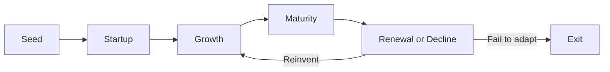

# Volume 02 - Business Life Cycle

| Field | Value |
|---|---|
| Document ID | WORLD-VOL02-004 |
| Title | Business Life Cycle |
| Version | 1.0 |
| Status | Approved |
| Classification | Internal |
| Founder | Mahesh Choudhary |

## Purpose

This document describes the stages a business typically passes through from inception to renewal or decline. Understanding the life cycle from first principles allows priorities, risks, and metrics to be matched to the stage a business is actually in.

## Scope

This chapter covers the canonical life-cycle stages, the defining challenge of each, the transitions between them, and the signals that a stage is ending. It does not prescribe a single growth playbook, since appropriate action depends on business type.

## The Life-Cycle Stages

A business is not static. Its needs, risks, and appropriate behaviours change predictably as it matures. The stages below are a first-principles progression driven by one underlying variable: the relationship between value delivered and resources consumed.

### Stage Characteristics

| Stage | Defining Challenge | Primary Metric |
|---|---|---|
| Seed | Validate the problem and solution | Evidence of demand |
| Startup | Find repeatable customers | Customer acquisition |
| Growth | Scale without breaking | Revenue growth rate |
| Maturity | Defend position, optimise | Profitability and retention |
| Renewal or Decline | Reinvent or wind down | Innovation vs erosion |

## Why Stage Awareness Matters

Each stage has a dominant risk. In the seed stage the risk is building something nobody wants; in growth the risk is scaling a broken model or running out of cash; in maturity the risk is complacency; in decline the risk is denial. Applying growth-stage tactics to a mature business, or maturity discipline to a seed-stage venture, wastes resources and can be fatal.

### Transitions and Signals

Transitions are rarely clean. A business knows it is leaving the startup stage when acquisition becomes repeatable and predictable; it knows growth is ending when the growth rate flattens despite continued investment; it knows maturity is ending when core demand begins to erode. Reading these signals early is the essence of good stage management.

## Example

A software company launches with a single pilot customer (**seed**), then signs its first ten paying accounts through a repeatable sales motion (**startup**). Demand accelerates and it triples headcount in a year (**growth**). Eventually the market saturates and growth flattens while margins improve as processes mature (**maturity**). Faced with a new competing technology, it invests in a next-generation product line, re-entering a growth curve (**renewal**) rather than allowing gradual decline.

## Relevance to WORLD

The AI Business Partner infers a client's current life-cycle stage from its metrics and history, then aligns its recommendations and benchmarks to that stage. This prevents the common error of giving mature-company advice to a startup, and it enables the platform to warn a business when the signals of an approaching transition appear.

## Related Documents

- [Types of Business](/docs/blueprint/volume-02-business-foundation/section-a-business-fundamentals/03-types-of-business.md)
- [Business Operating Model](/docs/blueprint/volume-02-business-foundation/section-a-business-fundamentals/05-business-operating-model.md)
- [Cash Flow](/docs/blueprint/volume-02-business-foundation/section-a-business-fundamentals/10-cash-flow.md)

## References

- [Volume 01 - Vision and Philosophy](/docs/blueprint/volume-01-vision-and-philosophy/README.md)
- [Document Standards](/docs/governance/document-standards.md)

## Change Log

| Version | Date | Author | Description |
|---|---|---|---|
| 1.0 | 2026-07-12 | Lead Software Engineer | Initial approved version. |
