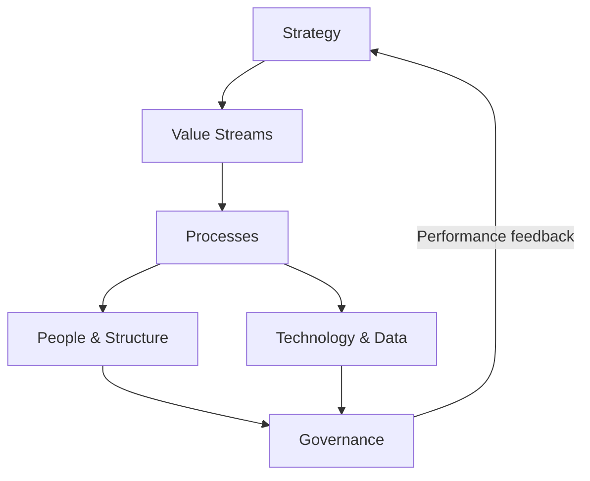

# Volume 02 - Business Operating Model

| Field | Value |
|---|---|
| Document ID | WORLD-VOL02-005 |
| Title | Business Operating Model |
| Version | 1.0 |
| Status | Approved |
| Classification | Internal |
| Founder | Mahesh Choudhary |

## Purpose

This document defines what an operating model is and how it connects strategy to daily execution. It gives a first-principles framework for describing how a business actually runs, distinct from what it sells or why it exists.

## Scope

This chapter covers the components of an operating model, the difference between business model and operating model, and how the parts fit together into a coherent whole. It excludes detailed organisational-design methodology.

## What an Operating Model Is

A business model describes how a business creates and captures value; an operating model describes how the business is organised to deliver that value day after day. If the business model is the promise, the operating model is the machine that keeps the promise. It answers a single question: how does work actually get done here?

### Core Components

| Component | Question It Answers |
|---|---|
| Value Streams | What end-to-end flows deliver value to customers? |
| Processes | What repeatable activities make up each stream? |
| People & Structure | Who does the work and how are they organised? |
| Technology & Data | What systems and information enable the work? |
| Governance | How are decisions made and controlled? |
| Suppliers & Partners | What external parties are relied upon? |

## How the Components Fit Together

The components are not independent; they form a system in which strategy flows down into execution and performance flows back up.

### Coherence and Fit

The power of an operating model comes from coherence. Each component must reinforce the others: a premium value proposition demands processes, people, and technology aligned to quality, while a low-cost proposition demands the opposite. Misalignment - for example, a high-touch service strategy running on a self-service technology stack - produces friction, cost, and customer dissatisfaction.

## Why It Matters

Many strategies fail not because they are wrong but because the operating model cannot deliver them. The operating model is where intention meets reality; diagnosing business problems almost always means locating the broken component and the misalignment it causes.

## Example

A subscription meal-kit company has a strategy of reliable weekly delivery of fresh ingredients. Its **value stream** runs from menu design through sourcing, packing, and last-mile delivery. Its **processes** standardise recipe portioning; its **people** are organised into culinary, fulfilment, and logistics teams; its **technology** forecasts demand to reduce waste; its **governance** sets food-safety controls. When delivery reliability drops, the fault is traced to the fulfilment process and its forecasting data - a specific, fixable component rather than a vague failing.

## Relevance to WORLD

The AI Business Partner maintains a structured operating-model map of each client, linking strategy to value streams, processes, people, technology, and governance. This map lets the platform pinpoint exactly which component is causing an observed problem and reason about the downstream effects of any proposed change before it is made.

## Related Documents

- [Business Definition](/docs/blueprint/volume-02-business-foundation/section-a-business-fundamentals/01-business-definition.md)
- [Value Creation](/docs/blueprint/volume-02-business-foundation/section-a-business-fundamentals/06-value-creation.md)
- [Cost Structure](/docs/blueprint/volume-02-business-foundation/section-a-business-fundamentals/08-cost-structure.md)

## References

- [Volume 01 - Vision and Philosophy](/docs/blueprint/volume-01-vision-and-philosophy/README.md)
- [Document Standards](/docs/governance/document-standards.md)

## Change Log

| Version | Date | Author | Description |
|---|---|---|---|
| 1.0 | 2026-07-12 | Lead Software Engineer | Initial approved version. |
