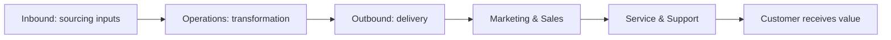

# Volume 02 - Value Creation

| Field | Value |
|---|---|
| Document ID | WORLD-VOL02-006 |
| Title | Value Creation |
| Version | 1.0 |
| Status | Approved |
| Classification | Internal |
| Founder | Mahesh Choudhary |

## Purpose

This document explains, from first principles, what value is, how businesses create it, and how created value is captured. Value creation is the engine beneath revenue, cost, and profit, so a precise understanding of it underpins all later financial chapters.

## Scope

This chapter covers the meaning of value, the mechanisms by which businesses create it, the value chain, and the relationship between value created and value captured. It excludes detailed pricing mechanics, which build on these ideas in a later chapter.

## What Value Is

Value is the benefit a customer perceives relative to what they must give up to obtain it. It is inherently subjective and contextual - the same offer can hold high value for one customer and none for another. This leads to a foundational equation of business:

**Customer Value = Perceived Benefit - Perceived Cost (price, effort, risk)**

A business creates value whenever it raises perceived benefit or lowers the customer's total cost of obtaining that benefit.

### Mechanisms of Value Creation

| Mechanism | How Value Is Created | Example |
|---|---|---|
| Form | Transforming inputs into a more useful form | Raw flour into bread |
| Time | Making something available when needed | Same-day delivery |
| Place | Making something available where needed | Local availability |
| Convenience | Reducing effort to obtain or use | One-click purchase |
| Risk reduction | Providing certainty or guarantees | Warranty, insurance |
| Information | Reducing uncertainty through knowledge | Advisory services |

## The Value Chain

Value is created through a connected sequence of activities, each adding benefit as inputs move toward the customer.

Support activities - infrastructure, people, technology, and procurement - enable this primary flow. Analysing the chain reveals where the business genuinely adds value and where it merely adds cost.

## Value Created Versus Value Captured

Creating value is necessary but not sufficient; a business must also capture a portion of it to survive. The gap between the value a customer receives and the price they pay is the customer's surplus, which drives loyalty. The gap between price and cost is the business's captured value, which drives profit. Sustainable businesses leave enough surplus with the customer to keep them returning while capturing enough for themselves to continue operating.

## Example

A logistics firm buys warehouse space and trucks (inputs) and organises them so that a retailer's goods reach stores overnight. The firm creates **time** and **place** value and reduces the retailer's **risk** of stockouts. The retailer perceives this as worth far more than the fee charged, so it renews gladly, while the fee comfortably exceeds the firm's operating cost - value is both created for the customer and captured by the business.

## Relevance to WORLD

The AI Business Partner maps each client's value chain to identify where genuine value is created and where activities add cost without adding benefit. By quantifying value created versus value captured, the platform can recommend where to invest, where to trim, and how to widen the margin between customer surplus and business profit without eroding either.

## Related Documents

- [Business Operating Model](/docs/blueprint/volume-02-business-foundation/section-a-business-fundamentals/05-business-operating-model.md)
- [Revenue Model](/docs/blueprint/volume-02-business-foundation/section-a-business-fundamentals/07-revenue-model.md)
- [Profitability](/docs/blueprint/volume-02-business-foundation/section-a-business-fundamentals/09-profitability.md)

## References

- [Volume 01 - Vision and Philosophy](/docs/blueprint/volume-01-vision-and-philosophy/README.md)
- [Document Standards](/docs/governance/document-standards.md)

## Change Log

| Version | Date | Author | Description |
|---|---|---|---|
| 1.0 | 2026-07-12 | Lead Software Engineer | Initial approved version. |
