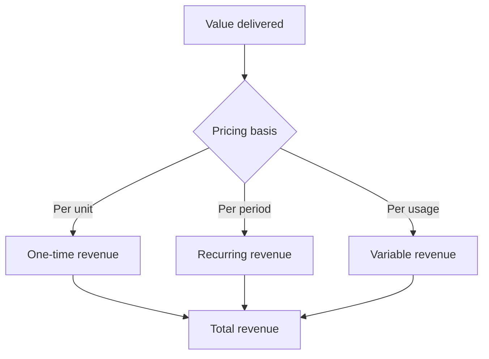

# Volume 02 - Revenue Model

| Field | Value |
|---|---|
| Document ID | WORLD-VOL02-007 |
| Title | Revenue Model |
| Version | 1.0 |
| Status | Approved |
| Classification | Internal |
| Founder | Mahesh Choudhary |

## Purpose

This document explains, from first principles, how a business converts the value it creates into revenue. It defines the components of a revenue model and surveys the common patterns, so that later chapters on cost and profit have a clear source of the inflows they work against.

## Scope

This chapter covers the definition of revenue, the levers that determine it, the major revenue-model patterns, and how model choice shapes business economics. It does not cover WORLD's own pricing or any specific market figures.

## What a Revenue Model Is

A revenue model is the design of how, and from whom, a business earns money in exchange for the value it delivers. Revenue itself reduces to a small set of levers:

**Revenue = Number of Customers x Frequency of Purchase x Average Transaction Value**

Every revenue-growth idea ultimately operates on one of these three levers. A revenue model is the deliberate arrangement of pricing basis, payment timing, and payer that sets those levers.

### Common Revenue-Model Patterns

| Pattern | How Money Is Earned | Suits |
|---|---|---|
| One-time sale | Single payment per unit sold | Products, durable goods |
| Subscription | Recurring fee for ongoing access | Software, media, services |
| Usage-based | Charge proportional to consumption | Utilities, cloud, APIs |
| Licensing | Fee to use intellectual property | Technology, brands |
| Commission | Percentage of transactions facilitated | Marketplaces, agents |
| Advertising | Payment for audience attention | Media, platforms |
| Freemium | Free base tier, paid upgrades | Digital products |

## How Revenue Flows

Revenue models differ most in the timing and predictability of the money they produce.

### Why Model Choice Matters

The revenue model shapes cash-flow timing, predictability, and customer relationship. One-time sales produce lumpy, hard-to-forecast income; subscriptions produce smooth, predictable income and deepen the customer relationship; usage-based models align cost with customer value but introduce volatility. The same product can be far more or less valuable to its owner depending on how its revenue is modelled.

## Example

A design-software maker can sell its tool as a one-time licence for a single large payment, or as a monthly subscription. The subscription lowers the entry price, increases the **number of customers**, raises **frequency** to monthly, and produces predictable recurring revenue - transforming a volatile one-time business into a stable, forecastable one, even though the underlying product is unchanged.

## Relevance to WORLD

The AI Business Partner analyses a client's revenue model against its three underlying levers to find the highest-impact growth opportunities. By understanding whether revenue is one-time, recurring, or usage-based, the platform can forecast income realistically and advise whether a change in model would improve predictability, cash timing, or customer lifetime value.

## Related Documents

- [Types of Business](/docs/blueprint/volume-02-business-foundation/section-a-business-fundamentals/03-types-of-business.md)
- [Value Creation](/docs/blueprint/volume-02-business-foundation/section-a-business-fundamentals/06-value-creation.md)
- [Cost Structure](/docs/blueprint/volume-02-business-foundation/section-a-business-fundamentals/08-cost-structure.md)

## References

- [Volume 01 - Vision and Philosophy](/docs/blueprint/volume-01-vision-and-philosophy/README.md)
- [Document Standards](/docs/governance/document-standards.md)

## Change Log

| Version | Date | Author | Description |
|---|---|---|---|
| 1.0 | 2026-07-12 | Lead Software Engineer | Initial approved version. |
