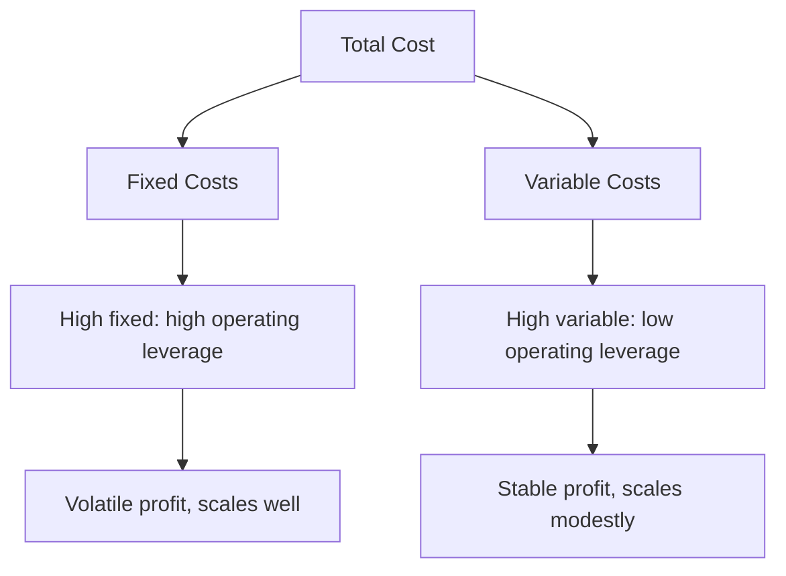

# Volume 02 - Cost Structure

| Field | Value |
|---|---|
| Document ID | WORLD-VOL02-008 |
| Title | Cost Structure |
| Version | 1.0 |
| Status | Approved |
| Classification | Internal |
| Founder | Mahesh Choudhary |

## Purpose

This document explains, from first principles, what costs a business incurs, how they behave, and how they combine into a cost structure. Understanding cost behaviour is essential to reasoning about profitability, pricing, and cash.

## Scope

This chapter covers the definition of cost, the fixed-variable distinction, direct and indirect costs, the concept of the cost structure, and how structure affects risk. It excludes detailed accounting standards and tax treatment.

## What Cost Is

Cost is the value of resources consumed to create and deliver an offering. Costs are not merely to be minimised; they are investments in value creation, and the goal is to spend efficiently rather than simply to spend less. Understanding costs begins with understanding how they behave as activity changes.

### Cost Behaviour

| Cost Type | Behaviour as Volume Rises | Example |
|---|---|---|
| Fixed | Stays roughly constant | Rent, salaries, insurance |
| Variable | Rises in proportion to volume | Materials, shipping, commissions |
| Semi-variable | Fixed base plus a variable part | Utilities, some staffing |
| Step | Jumps at capacity thresholds | Adding a new facility |

A parallel distinction separates **direct costs**, traceable to a specific product, from **indirect costs** (overheads) that support the business as a whole.

## The Cost Structure

The cost structure is the mix of fixed and variable costs a business carries. This mix determines how profit responds to changes in volume.

### Operating Leverage

A business with high fixed costs and low variable costs has high operating leverage: once fixed costs are covered, additional sales are highly profitable, but a drop in volume is punishing. A business with mostly variable costs has stable but modest margins and lower risk. Neither is inherently better; the right structure depends on demand volatility and the ability to cover fixed costs.

## Why It Matters

Cost structure sets the break-even point, the risk profile, and the scalability of a business. Two firms with identical revenue can have completely different resilience depending on how much of their cost is fixed versus variable.

## Example

A software firm and a consulting firm each earn the same revenue. The software firm has high fixed costs (engineering) and near-zero variable cost per additional user, giving it high operating leverage - every new sale is almost pure margin, but a downturn still leaves the fixed engineering bill. The consulting firm's cost is mostly variable (consultant time), so its margins are steadier but it cannot profit from scale the way the software firm can. The same revenue, structured differently, produces very different economics.

## Relevance to WORLD

The AI Business Partner classifies each client's costs by behaviour and traceability to compute break-even, operating leverage, and the profit impact of volume changes. This lets the platform advise whether a business should shift fixed costs to variable to reduce risk, or invest in fixed capacity to capture scale, based on its demand stability.

## Related Documents

- [Business Operating Model](/docs/blueprint/volume-02-business-foundation/section-a-business-fundamentals/05-business-operating-model.md)
- [Revenue Model](/docs/blueprint/volume-02-business-foundation/section-a-business-fundamentals/07-revenue-model.md)
- [Profitability](/docs/blueprint/volume-02-business-foundation/section-a-business-fundamentals/09-profitability.md)

## References

- [Volume 01 - Vision and Philosophy](/docs/blueprint/volume-01-vision-and-philosophy/README.md)
- [Document Standards](/docs/governance/document-standards.md)

## Change Log

| Version | Date | Author | Description |
|---|---|---|---|
| 1.0 | 2026-07-12 | Lead Software Engineer | Initial approved version. |
