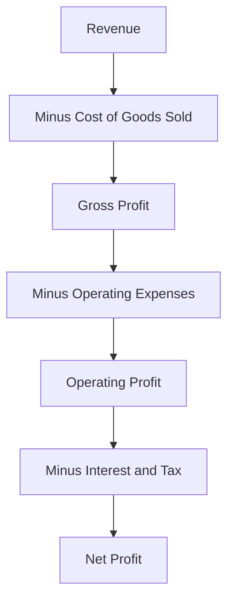

# Volume 02 - Profitability

| Field | Value |
|---|---|
| Document ID | WORLD-VOL02-009 |
| Title | Profitability |
| Version | 1.0 |
| Status | Approved |
| Classification | Internal |
| Founder | Mahesh Choudhary |

## Purpose

This document explains, from first principles, what profitability is, how it is measured at successive levels, and why it differs from both revenue and cash. It ties together the revenue and cost chapters into a single measure of economic performance.

## Scope

This chapter covers the definition of profit, the layers of the profit calculation, the common profitability ratios, and the distinction between profit and cash. It excludes detailed accounting policy and WORLD's own financials.

## What Profit Is

Profit is what remains after the cost of creating value is subtracted from the value captured as revenue. It is the fundamental signal that a business is creating more value than it consumes:

**Profit = Revenue - Costs**

Profit is measured in layers, each subtracting a further category of cost, because each layer answers a different question about the health of the business.

### Layers of Profit

| Layer | Formula | Question Answered |
|---|---|---|
| Gross Profit | Revenue - Cost of Goods Sold | Is the core offering economically sound? |
| Operating Profit | Gross Profit - Operating Expenses | Is the business itself well run? |
| Net Profit | Operating Profit - Interest & Tax | What is left for owners? |

## Profitability Ratios

Absolute profit is less informative than profit expressed as a ratio, which allows comparison across time and between businesses. Gross margin (gross profit / revenue) shows product economics; operating margin shows operational efficiency; net margin shows overall return. Return on investment relates profit to the capital deployed to earn it.

## Profit Is Not Cash

A critical first principle is that profit and cash are different. Profit is recognised when value is exchanged, not when money moves; a business can be profitable on paper yet run out of cash if customers pay slowly or inventory ties up funds. Profitability measures whether the model works; cash measures whether the business can pay its bills now.

## Example

A furniture retailer records revenue of 1,000 on a sofa that cost 600 to buy, giving **gross profit** of 400. After allocating 250 of store and staff **operating expenses**, its **operating profit** is 150. After 30 of interest and tax, **net profit** is 120 - a 12 percent net margin. Yet if the customer pays on 60-day terms while the supplier demanded payment upfront, the sale is profitable but temporarily consumes cash, illustrating why profit and cash must be tracked separately.

## Relevance to WORLD

The AI Business Partner decomposes each client's profitability into its gross, operating, and net layers to locate exactly where margin is won or lost. By tracking profitability ratios over time and against benchmarks, and by distinguishing profit from cash, the platform can advise whether a problem lies in pricing, cost of goods, operating overhead, or financing.

## Related Documents

- [Revenue Model](/docs/blueprint/volume-02-business-foundation/section-a-business-fundamentals/07-revenue-model.md)
- [Cost Structure](/docs/blueprint/volume-02-business-foundation/section-a-business-fundamentals/08-cost-structure.md)
- [Cash Flow](/docs/blueprint/volume-02-business-foundation/section-a-business-fundamentals/10-cash-flow.md)

## References

- [Volume 01 - Vision and Philosophy](/docs/blueprint/volume-01-vision-and-philosophy/README.md)
- [Document Standards](/docs/governance/document-standards.md)

## Change Log

| Version | Date | Author | Description |
|---|---|---|---|
| 1.0 | 2026-07-12 | Lead Software Engineer | Initial approved version. |
