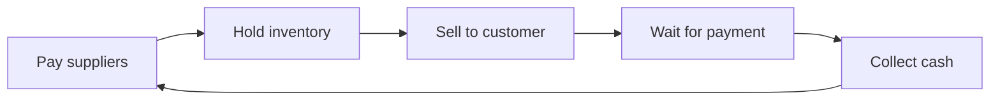

# Volume 02 - Cash Flow

| Field | Value |
|---|---|
| Document ID | WORLD-VOL02-010 |
| Title | Cash Flow |
| Version | 1.0 |
| Status | Approved |
| Classification | Internal |
| Founder | Mahesh Choudhary |

## Purpose

This document explains, from first principles, what cash flow is, why it differs from profit, and why it is the ultimate constraint on a business's survival. It completes the financial foundation of Section A by focusing on the movement of money through time.

## Scope

This chapter covers the definition of cash flow, its three categories, the working-capital cycle, and the principle that cash - not profit - determines short-term survival. It excludes detailed treasury techniques and financial-statement preparation.

## What Cash Flow Is

Cash flow is the movement of money into and out of a business over a period of time. Where profit measures economic performance, cash flow measures liquidity - the ability to meet obligations as they fall due. The guiding principle is simple and unforgiving: a business fails when it runs out of cash, even if it is profitable.

### The Three Categories

| Category | Source of Cash Movement | Example |
|---|---|---|
| Operating | Day-to-day trading | Customer receipts, supplier payments, wages |
| Investing | Buying or selling long-term assets | Equipment purchase, asset sale |
| Financing | Raising or repaying capital | Loans, equity, dividends |

Healthy businesses generate positive cash from operations over time; investing and financing flows support growth and capital structure but cannot substitute indefinitely for weak operations.

## The Working-Capital Cycle

The timing gap between paying for inputs and collecting from customers is the working-capital cycle, and it is where profitable businesses most often run into cash trouble.

The longer this cycle, the more cash is tied up and unavailable. Shortening it - by collecting faster, holding less inventory, or paying suppliers on fair terms - releases cash without changing profit at all.

## Why Cash Is the Ultimate Constraint

Profit is an opinion measured over a period; cash is a fact measured at a moment. A growing, profitable business can be especially cash-hungry, because growth requires paying for more inputs before the resulting sales are collected. This is why cash-flow management, not profit alone, governs survival - and why forecasting cash is a core discipline of any well-run business.

## Example

A fast-growing apparel brand is highly profitable, yet each season it must pay manufacturers months before its retailers pay it. As it grows, this timing gap widens, tying up ever more cash in unpaid invoices and stock. Despite strong profit, it nearly cannot make payroll - until it negotiates faster retailer payment and staged supplier terms, shortening the working-capital cycle and freeing the cash that growth had trapped.

## Relevance to WORLD

The AI Business Partner forecasts each client's cash position by category and models the working-capital cycle to warn of shortfalls before they occur. By tracking cash independently of profit, the platform can distinguish a business that is unprofitable from one that is merely illiquid, and recommend the specific lever - collections, inventory, or terms - that will restore liquidity.

## Related Documents

- [Business Life Cycle](/docs/blueprint/volume-02-business-foundation/section-a-business-fundamentals/04-business-life-cycle.md)
- [Cost Structure](/docs/blueprint/volume-02-business-foundation/section-a-business-fundamentals/08-cost-structure.md)
- [Profitability](/docs/blueprint/volume-02-business-foundation/section-a-business-fundamentals/09-profitability.md)

## References

- [Volume 01 - Vision and Philosophy](/docs/blueprint/volume-01-vision-and-philosophy/README.md)
- [Document Standards](/docs/governance/document-standards.md)

## Change Log

| Version | Date | Author | Description |
|---|---|---|---|
| 1.0 | 2026-07-12 | Lead Software Engineer | Initial approved version. |
