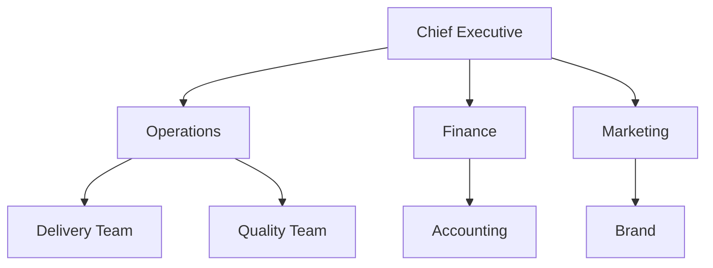

# Volume 02 - Organization Structure

| Field | Value |
|---|---|
| Document ID | WORLD-VOL02-011 |
| Title | Organization Structure |
| Version | 1.0 |
| Status | Approved |
| Classification | Internal |
| Founder | Mahesh Choudhary |

## Purpose

This document explains, from first principles, what an organization structure is, why every business needs one, and the common structural patterns used to arrange people, authority, and information. It provides a shared reference vocabulary for all subsequent chapters in Section B.

## Scope

The document covers the definition, purpose, building blocks, and canonical types of organization structure. It is a general business-knowledge reference and does not prescribe a specific structure for any single enterprise.

## What Is an Organization Structure

An organization structure is the deliberate arrangement of roles, reporting lines, and coordination mechanisms that determines how work is divided, who reports to whom, and how decisions and information flow. It is the skeleton of a business: it does not perform the work itself, but it shapes how work gets done.

At its core, structure answers three primitive questions:

- **Division of labour** - how is total work split into specialized tasks and units?
- **Coordination** - how are those specialized units re-integrated into coherent output?
- **Authority** - who has the right to direct, decide, and hold others accountable?

## Why Structure Matters

Without a defined structure, accountability blurs, duplicated effort grows, and decisions stall. A sound structure reduces coordination cost, clarifies ownership, and lets a business scale without proportional growth in confusion. Structure is not permanent; it evolves as strategy, size, and environment change.

## Core Building Blocks

| Building Block | Definition | Example |
|---|---|---|
| Unit | A grouping of roles performing related work | A Department |
| Reporting line | The formal chain linking a role to its manager | Analyst to Manager |
| Span of control | Number of direct reports per manager | One manager, seven reports |
| Layer | A horizontal level in the hierarchy | Executive, middle, front line |
| Coordination mechanism | Means of aligning units | Shared processes, committees |

## Common Structural Types

### Functional

Units are grouped by specialization (finance, marketing, operations). Efficient and clear, but can create silos.

### Divisional

Units are grouped by product, market, or geography, each with its own functions. Improves focus at the cost of duplication.

### Matrix

Staff report along two axes simultaneously (for example, function and project). Maximizes resource sharing but introduces dual-authority tension.

### Flat and Networked

Few layers and wide spans, often used by small or agile organizations to keep decisions fast and close to the work.

## Concrete Example

Consider a growing software company of 60 people. It begins flat, with everyone reporting to the founder. As it grows, it adopts a functional structure: Engineering, Product, Sales, and Operations each led by a director reporting to the CEO. When it later serves two distinct markets, it overlays a divisional layer so each market has dedicated product and sales teams while shared services remain centralized - a pragmatic hybrid.

## Relevance to WORLD

The AI Business Partner models a client's organization structure as a living graph, using it to route tasks, respect reporting lines, and surface where accountability or coordination is weak. By understanding structure, WORLD can recommend when a business should re-organize as it scales and can simulate the impact of structural change before it is made.

## Related Documents

- [Departments](/docs/blueprint/volume-02-business-foundation/section-b-business-structure/12-departments.md)
- [Business Functions](/docs/blueprint/volume-02-business-foundation/section-b-business-structure/13-business-functions.md)
- [Decision Hierarchy](/docs/blueprint/volume-02-business-foundation/section-b-business-structure/15-decision-hierarchy.md)

## References

- [Volume 01 - Vision and Philosophy](/docs/blueprint/volume-01-vision-and-philosophy/README.md)
- [Document Standards](/docs/governance/document-standards.md)

## Change Log

| Version | Date | Author | Notes |
|---|---|---|---|
| 1.0 | 2026-07-12 | Lead Software Engineer | Initial approved version. |
