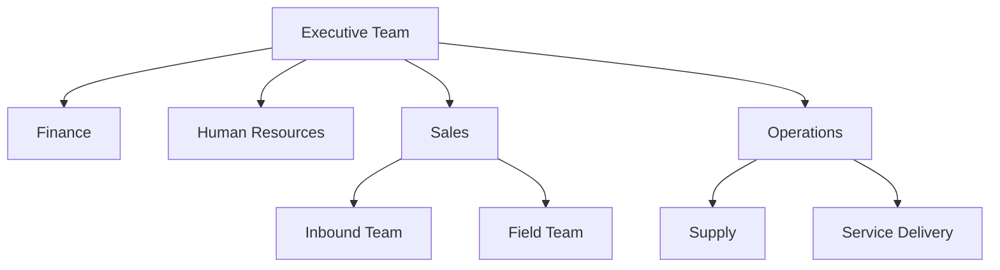

# Volume 02 - Departments

| Field | Value |
|---|---|
| Document ID | WORLD-VOL02-012 |
| Title | Departments |
| Version | 1.0 |
| Status | Approved |
| Classification | Internal |
| Founder | Mahesh Choudhary |

## Purpose

This document defines what a department is, distinguishes it from a business function, and describes how departments are formed, sized, and coordinated. It establishes a common reference for how businesses group people into stable operating units.

## Scope

The document covers the definition, rationale, common departments, and coordination patterns. It is general reference knowledge and does not mandate a departmental layout for any specific enterprise.

## What Is a Department

A department is a permanent organizational unit that groups people who perform related work under shared management. Where a *function* is a category of work the business must perform, a *department* is the concrete team of people organized to perform it. One department may cover several functions, and one function may be split across departments.

## Why Businesses Form Departments

Departments create focus, expertise, and clear ownership. Grouping specialists together produces economies of skill, simplifies supervision, and gives each area a single accountable leader. The trade-off is the risk of silos, where departments optimize locally at the expense of the whole - which is why cross-department coordination is a core management responsibility.

## Common Departments

| Department | Primary Remit | Typical Leader |
|---|---|---|
| Finance | Capital, accounting, reporting | Chief Financial Officer |
| Human Resources | People, talent, culture | HR Director |
| Sales | Revenue generation | Sales Director |
| Marketing | Demand and brand | Marketing Director |
| Operations | Delivery of product or service | Operations Director |
| Technology | Systems and engineering | Chief Technology Officer |
| Legal | Compliance and risk | General Counsel |

## How Departments Are Sized and Structured

Department size follows workload, specialization, and span of control. Small businesses often combine several functions into one lean department; large enterprises subdivide a single department into specialized teams. A healthy department has a clear charter, defined interfaces with other departments, and measurable outcomes.

## Coordination Between Departments

Because value usually flows across several departments, coordination mechanisms are essential: shared processes, service-level agreements, cross-functional projects, and regular operating reviews. Poor inter-departmental hand-offs are one of the most common sources of operational friction.

## Concrete Example

A mid-sized e-commerce firm structures itself into five departments: Merchandising, Marketing, Operations (warehousing and fulfilment), Customer Service, and Finance. A single customer order touches Marketing (which acquired the customer), Operations (which ships it), Customer Service (which handles queries), and Finance (which recognizes revenue). A shared order-management process is the coordination mechanism that keeps these departments aligned.

## Relevance to WORLD

The AI Business Partner maintains a departmental map of each client, associating tasks, metrics, and data sources with the owning department. This lets WORLD direct requests to the right team, detect overloaded or under-resourced departments, and highlight broken hand-offs between them.

## Related Documents

- [Organization Structure](/docs/blueprint/volume-02-business-foundation/section-b-business-structure/11-organization-structure.md)
- [Business Functions](/docs/blueprint/volume-02-business-foundation/section-b-business-structure/13-business-functions.md)
- [Roles and Responsibilities](/docs/blueprint/volume-02-business-foundation/section-b-business-structure/14-roles-and-responsibilities.md)

## References

- [Volume 01 - Vision and Philosophy](/docs/blueprint/volume-01-vision-and-philosophy/README.md)
- [Document Standards](/docs/governance/document-standards.md)

## Change Log

| Version | Date | Author | Notes |
|---|---|---|---|
| 1.0 | 2026-07-12 | Lead Software Engineer | Initial approved version. |
