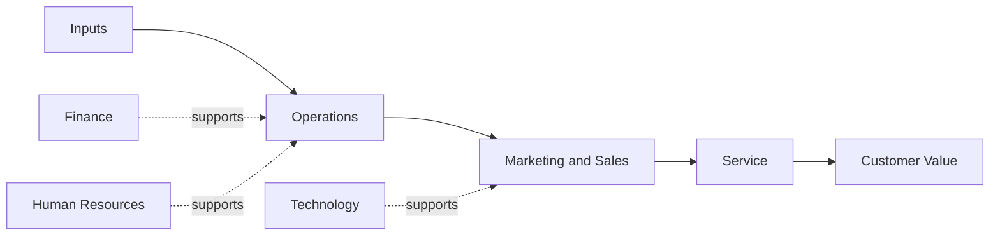

# Volume 02 - Business Functions

| Field | Value |
|---|---|
| Document ID | WORLD-VOL02-013 |
| Title | Business Functions |
| Version | 1.0 |
| Status | Approved |
| Classification | Internal |
| Founder | Mahesh Choudhary |

## Purpose

This document explains what a business function is, why functions are a more durable lens than departments, and how the standard set of functions combine to create and deliver value. It gives readers a function-based vocabulary that is independent of any particular organizational chart.

## Scope

The document covers the definition of a business function, the distinction between primary and support functions, and how functions map to value creation. It is general reference material.

## What Is a Business Function

A business function is a category of related activity that a business must perform to operate, regardless of how it is organized. Functions describe *what* work must be done; departments describe *who* does it. Because functions are defined by the work itself, they remain stable even when a company reorganizes its departments.

## Primary Versus Support Functions

Drawing on the value-chain idea, functions divide into two broad classes:

- **Primary functions** directly create, sell, and deliver the product or service.
- **Support functions** enable the primary functions to operate effectively.

| Class | Function | Purpose |
|---|---|---|
| Primary | Inbound and Operations | Produce the product or service |
| Primary | Marketing and Sales | Generate and convert demand |
| Primary | Service | Support customers after sale |
| Support | Finance | Fund and account for the business |
| Support | Human Resources | Acquire and develop people |
| Support | Technology | Provide systems and infrastructure |
| Support | Procurement | Source inputs and manage suppliers |

## How Functions Create Value

Value is produced when primary functions transform inputs into a valued output, while support functions raise the efficiency and quality of that transformation. A weakness in any single function constrains the whole; for example, strong operations cannot compensate for a broken sales function.

## Functions Versus Departments

A single department may own multiple functions - a small firm's Operations department may cover procurement, production, and logistics. Conversely, a large firm may spread one function across many departments. Recognizing this decoupling prevents the common error of assuming the org chart reveals everything about how work flows.

## Concrete Example

A specialty coffee roaster performs the same functions whether it has three employees or three hundred. The primary functions are procurement of green beans, roasting operations, marketing, sales, and customer service; the support functions are finance, HR, and technology. In the early days the founder personally performs the finance and HR functions; as the company grows, dedicated departments take them over - but the underlying functions never changed.

## Relevance to WORLD

The AI Business Partner reasons in terms of functions so that its guidance transfers across businesses of any size or structure. By mapping a client's activities to a canonical function model, WORLD can benchmark performance function by function, spot missing or under-served functions, and offer advice that remains valid even as the client reorganizes.

## Related Documents

- [Departments](/docs/blueprint/volume-02-business-foundation/section-b-business-structure/12-departments.md)
- [Organization Structure](/docs/blueprint/volume-02-business-foundation/section-b-business-structure/11-organization-structure.md)
- [Roles and Responsibilities](/docs/blueprint/volume-02-business-foundation/section-b-business-structure/14-roles-and-responsibilities.md)

## References

- [Volume 01 - Vision and Philosophy](/docs/blueprint/volume-01-vision-and-philosophy/README.md)
- [Document Standards](/docs/governance/document-standards.md)

## Change Log

| Version | Date | Author | Notes |
|---|---|---|---|
| 1.0 | 2026-07-12 | Lead Software Engineer | Initial approved version. |
