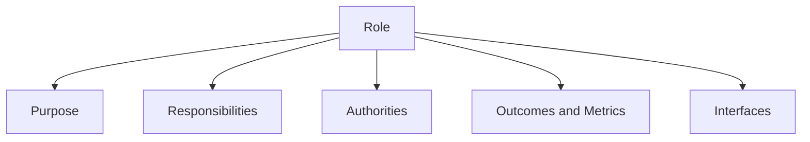

# Volume 02 - Roles & Responsibilities

| Field | Value |
|---|---|
| Document ID | WORLD-VOL02-014 |
| Title | Roles & Responsibilities |
| Version | 1.0 |
| Status | Approved |
| Classification | Internal |
| Founder | Mahesh Choudhary |

## Purpose

This document defines what a role is, how it differs from a person or a job title, and how clearly specified responsibilities create accountability. It provides the vocabulary needed to describe who is expected to do what within any organization.

## Scope

The document covers the definition of roles and responsibilities, their key components, common design principles, and a worked example. It is general reference knowledge.

## What Is a Role

A role is a defined set of responsibilities, authorities, and expected outcomes that an organization assigns to be performed. A role is distinct from a person: one person can hold several roles, and one role can be shared or rotated among people. A role is also distinct from a job title, which is merely a label; the substance of a role lies in its responsibilities and the results it must produce.

## Responsibilities Versus Accountability

- **Responsibility** is the obligation to perform a task or activity.
- **Accountability** is answerability for the outcome - it cannot be shared and ultimately rests with one role.

A role may hold both, but the distinction matters: several roles can be responsible for contributing to a result, while exactly one role is accountable for it.

## Anatomy of a Well-Defined Role

| Component | Description |
|---|---|
| Purpose | Why the role exists in one sentence |
| Key responsibilities | The recurring activities the role performs |
| Authorities | Decisions the role may make unaided |
| Outcomes and metrics | The results the role is measured on |
| Reporting line | Who the role reports to and who reports to it |
| Interfaces | The roles it must collaborate with |

## Design Principles

Good role design avoids gaps (work no one owns) and overlaps (work several people own without clarity). Each responsibility should map to exactly one accountable role. Roles should be defined by outcomes rather than tasks alone, so that holders retain judgement about how to achieve results.

## Concrete Example

Consider the role of *Customer Success Manager* at a subscription software firm. Its purpose is to ensure customers achieve value and renew. Its key responsibilities are onboarding new accounts, conducting quarterly reviews, and escalating product issues. Its authority extends to approving service credits up to a set limit. It is measured on net revenue retention and customer satisfaction. It reports to the Head of Customer Success and interfaces with Sales and Support. One person may hold this role for a portfolio of accounts, while several people share the role across the customer base.

## Relevance to WORLD

The AI Business Partner represents each client's roles as structured objects linking responsibilities, authorities, and metrics. This allows WORLD to assign tasks to the correct role, detect responsibility gaps and overlaps, and generate clear role descriptions - forming the foundation on which decision hierarchy, authority, and RACI models are built.

## Related Documents

- [Departments](/docs/blueprint/volume-02-business-foundation/section-b-business-structure/12-departments.md)
- [Decision Hierarchy](/docs/blueprint/volume-02-business-foundation/section-b-business-structure/15-decision-hierarchy.md)
- [Responsibility Matrix (RACI)](/docs/blueprint/volume-02-business-foundation/section-b-business-structure/17-responsibility-matrix-raci.md)

## References

- [Volume 01 - Vision and Philosophy](/docs/blueprint/volume-01-vision-and-philosophy/README.md)
- [Document Standards](/docs/governance/document-standards.md)

## Change Log

| Version | Date | Author | Notes |
|---|---|---|---|
| 1.0 | 2026-07-12 | Lead Software Engineer | Initial approved version. |
