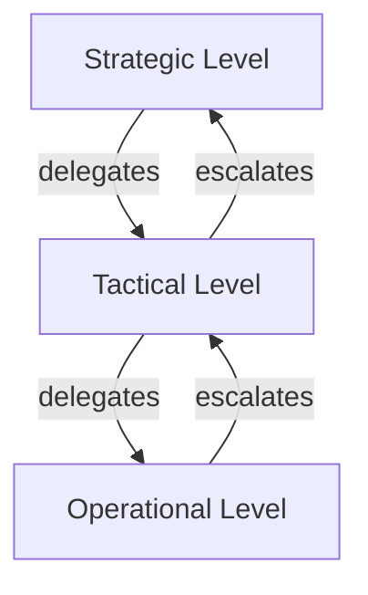

# Volume 02 - Decision Hierarchy

| Field | Value |
|---|---|
| Document ID | WORLD-VOL02-015 |
| Title | Decision Hierarchy |
| Version | 1.0 |
| Status | Approved |
| Classification | Internal |
| Founder | Mahesh Choudhary |

## Purpose

This document explains what a decision hierarchy is, why decisions are classified by type and level, and how organizations route decisions to the appropriate level. It gives readers a principled way to think about where and how decisions should be made.

## Scope

The document covers the definition of a decision hierarchy, the classic strategic-tactical-operational levels, escalation and delegation, and a worked example. It is general reference knowledge.

## What Is a Decision Hierarchy

A decision hierarchy is the layered arrangement that determines which level of an organization is responsible for which kinds of decisions. Its purpose is to ensure that decisions are made by those with the right information, authority, and time horizon - neither so high that trivial matters clog leadership, nor so low that consequential choices lack oversight.

## The Three Classic Levels

| Level | Time Horizon | Nature | Typical Owner |
|---|---|---|---|
| Strategic | Years | Direction, scope, major investment | Board and executives |
| Tactical | Quarters to a year | Resource allocation, programs | Middle management |
| Operational | Days to weeks | Routine execution | Front-line staff and supervisors |

Strategic decisions shape what the business will become; tactical decisions translate strategy into plans; operational decisions keep daily work flowing. Each level should be aligned so that operational choices support tactical plans, which in turn serve strategic intent.

## Delegation and Escalation

A healthy hierarchy pushes decisions to the lowest level capable of making them well (delegation) while providing clear paths to raise decisions that exceed a level's authority or risk threshold (escalation). Delegation increases speed and engagement; escalation protects against decisions being made without adequate authority or information.

## Designing an Effective Hierarchy

Effective decision hierarchies define, for each decision type, who decides, who must be consulted, what thresholds trigger escalation, and how quickly a decision must be made. Ambiguity here is a leading cause of both bottlenecks and unauthorized action.

## Concrete Example

A retail chain faces three decisions on the same day. Whether to enter a new country is *strategic* and belongs to the executive team and board. How to allocate the marketing budget across regions this quarter is *tactical* and belongs to the regional marketing manager. Whether to approve a customer refund within policy is *operational* and belongs to the store supervisor. If the refund exceeds the supervisor's limit, it escalates one level; if the country decision were pushed down to a store manager, the hierarchy would be broken.

## Relevance to WORLD

The AI Business Partner classifies incoming decisions by type and level and routes them to the correct role, applying the client's delegation and escalation rules. This lets WORLD accelerate routine operational decisions autonomously while ensuring strategic choices are surfaced to the right human authority, keeping speed and control in balance.

## Related Documents

- [Roles and Responsibilities](/docs/blueprint/volume-02-business-foundation/section-b-business-structure/14-roles-and-responsibilities.md)
- [Authority Matrix](/docs/blueprint/volume-02-business-foundation/section-b-business-structure/16-authority-matrix.md)
- [Business Ownership Model](/docs/blueprint/volume-02-business-foundation/section-b-business-structure/18-business-ownership-model.md)

## References

- [Volume 01 - Vision and Philosophy](/docs/blueprint/volume-01-vision-and-philosophy/README.md)
- [Document Standards](/docs/governance/document-standards.md)

## Change Log

| Version | Date | Author | Notes |
|---|---|---|---|
| 1.0 | 2026-07-12 | Lead Software Engineer | Initial approved version. |
