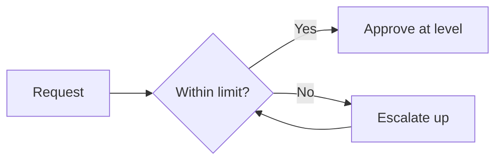

# Volume 02 - Authority Matrix

| Field | Value |
|---|---|
| Document ID | WORLD-VOL02-016 |
| Title | Authority Matrix |
| Version | 1.0 |
| Status | Approved |
| Classification | Internal |
| Founder | Mahesh Choudhary |

## Purpose

This document explains what an authority matrix is, why organizations formalize decision rights and approval limits, and how such a matrix is constructed. It provides a reference model for defining who may approve what, and up to which threshold.

## Scope

The document covers the definition of an authority matrix, its components, a worked example matrix, and design guidance. It is general reference knowledge and its example figures are illustrative only.

## What Is an Authority Matrix

An authority matrix - often called a delegation-of-authority or approval matrix - is a structured table that specifies, for each type of decision or transaction, which role has the authority to approve it and up to what limit. It converts the abstract idea of authority into explicit, auditable rules.

## Why Formalize Authority

Without explicit authority rules, organizations suffer two failure modes: decisions stall because no one is sure they may act, or people act beyond their proper authority and create risk. An authority matrix removes ambiguity, speeds routine approvals, and creates a clear control for governance and audit.

## Components of an Authority Matrix

| Component | Description |
|---|---|
| Decision type | The category of action being authorized |
| Authority level | The role empowered to approve |
| Threshold | The monetary or scope limit of that authority |
| Escalation rule | Where the decision goes if it exceeds the limit |
| Conditions | Any preconditions or required consultations |

## Example Authority Matrix

The following illustrative matrix shows approval limits for capital expenditure across roles. Figures are examples only and would be set by each business.

| Decision Type | Team Lead | Department Head | Executive | Board |
|---|---|---|---|---|
| Operating expense | Up to 1,000 | Up to 25,000 | Up to 250,000 | Above 250,000 |
| Capital expenditure | None | Up to 50,000 | Up to 500,000 | Above 500,000 |
| Hiring approval | None | Team roles | Department heads | Executives |
| Contract signing | None | Up to 12 months | Up to 36 months | Above 36 months |
| Discount authority | Up to 5% | Up to 15% | Up to 30% | Above 30% |

## Design Guidance

Authority thresholds should reflect the risk and reversibility of a decision, not merely its monetary size. Limits should be reviewed periodically, kept consistent with the decision hierarchy, and paired with clear escalation so that exceeding a limit triggers an orderly path upward rather than an improvised one.

## Concrete Example

A department head at a manufacturing firm wishes to purchase a machine costing 120,000. The authority matrix caps departmental capital expenditure at 50,000, so the request escalates to the executive level, whose limit of 500,000 covers it. The purchase is approved with a clear, auditable trail showing who authorized it and why escalation occurred.

## Relevance to WORLD

The AI Business Partner encodes each client's authority matrix as machine-readable rules, checking every proposed action against the appropriate threshold before it proceeds. This lets WORLD auto-approve in-limit actions, route out-of-limit actions to the correct approver, and maintain a complete audit record of authority exercised.

## Related Documents

- [Decision Hierarchy](/docs/blueprint/volume-02-business-foundation/section-b-business-structure/15-decision-hierarchy.md)
- [Responsibility Matrix (RACI)](/docs/blueprint/volume-02-business-foundation/section-b-business-structure/17-responsibility-matrix-raci.md)
- [Business Ownership Model](/docs/blueprint/volume-02-business-foundation/section-b-business-structure/18-business-ownership-model.md)

## References

- [Volume 01 - Vision and Philosophy](/docs/blueprint/volume-01-vision-and-philosophy/README.md)
- [Document Standards](/docs/governance/document-standards.md)

## Change Log

| Version | Date | Author | Notes |
|---|---|---|---|
| 1.0 | 2026-07-12 | Lead Software Engineer | Initial approved version. |
