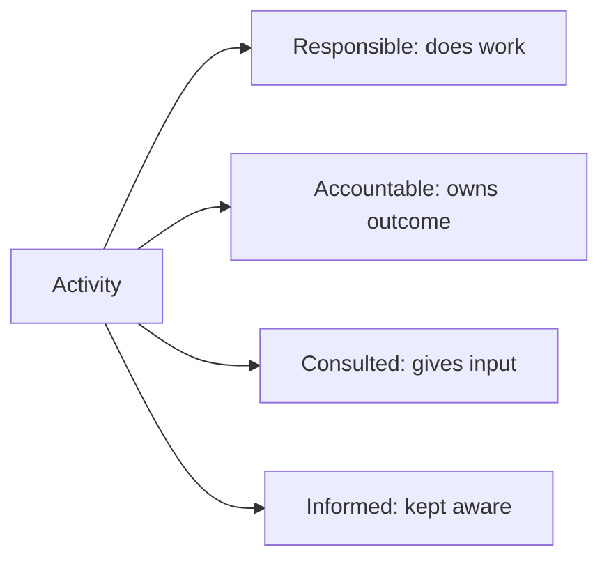

# Volume 02 - Responsibility Matrix (RACI)

| Field | Value |
|---|---|
| Document ID | WORLD-VOL02-017 |
| Title | Responsibility Matrix (RACI) |
| Version | 1.0 |
| Status | Approved |
| Classification | Internal |
| Founder | Mahesh Choudhary |

## Purpose

This document explains the RACI responsibility matrix, defines each of its four roles, and shows how to build one. It provides a reference technique for eliminating ambiguity about who does what on any activity or deliverable.

## Scope

The document covers the RACI model, its rules of use, a worked example matrix, and common pitfalls. It is general reference knowledge.

## What Is a RACI Matrix

A RACI matrix is a grid that maps activities (rows) against roles (columns), assigning to each intersection one or more of four participation types. It makes explicit, at a glance, who is responsible for doing work, who is accountable for the result, who must be consulted, and who must be kept informed.

## The Four RACI Roles

| Letter | Role | Meaning |
|---|---|---|
| R | Responsible | Does the work to complete the activity |
| A | Accountable | Owns the outcome; approves the work; exactly one per activity |
| C | Consulted | Provides input before the work is done; two-way dialogue |
| I | Informed | Kept up to date on progress or completion; one-way |

## Rules of a Sound RACI

- Every activity has exactly one **A** - accountability is never shared.
- Every activity has at least one **R**; the same role can be both A and R.
- Keep **C** and **I** minimal to avoid slowing the work.
- No row should be empty, and no role should carry an unrealistic share of the As.

## Example RACI Matrix

The following matrix maps a product-launch process across four roles.

| Activity | Product Manager | Engineering Lead | Marketing Lead | Executive Sponsor |
|---|---|---|---|---|
| Define launch scope | A | C | C | I |
| Build the feature | I | A/R | I | I |
| Prepare launch campaign | C | I | A/R | I |
| Approve go-live | R | C | C | A |
| Post-launch review | A/R | C | C | I |

## Common Pitfalls

Typical mistakes include assigning two accountable roles to one activity (diffusing ownership), over-using Consulted (creating decision drag), and leaving activities without any Responsible role (guaranteeing they slip). A RACI should be reviewed with all named roles so that everyone accepts their assignments.

## Concrete Example

In the launch matrix above, when it is time to approve go-live, there is no confusion: the Executive Sponsor is accountable, the Product Manager is responsible for driving the decision, and Engineering and Marketing are consulted. Should the launch slip, accountability clearly rests with the sponsor, while responsibility for remediation is equally clear - avoiding the finger-pointing that unclear roles produce.

## Relevance to WORLD

The AI Business Partner generates and maintains RACI matrices for a client's processes and applies them when orchestrating work: it assigns tasks to Responsible roles, requests sign-off from the Accountable role, gathers input from Consulted parties, and notifies the Informed. This turns a static chart into live workflow logic.

## Related Documents

- [Roles and Responsibilities](/docs/blueprint/volume-02-business-foundation/section-b-business-structure/14-roles-and-responsibilities.md)
- [Authority Matrix](/docs/blueprint/volume-02-business-foundation/section-b-business-structure/16-authority-matrix.md)
- [Decision Hierarchy](/docs/blueprint/volume-02-business-foundation/section-b-business-structure/15-decision-hierarchy.md)

## References

- [Volume 01 - Vision and Philosophy](/docs/blueprint/volume-01-vision-and-philosophy/README.md)
- [Document Standards](/docs/governance/document-standards.md)

## Change Log

| Version | Date | Author | Notes |
|---|---|---|---|
| 1.0 | 2026-07-12 | Lead Software Engineer | Initial approved version. |
