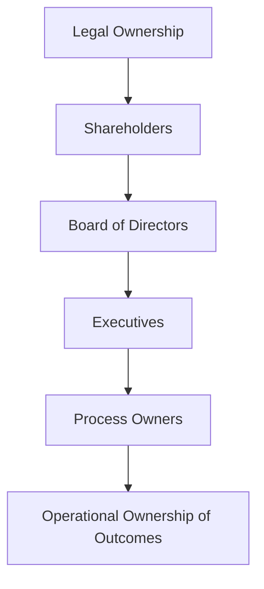

# Volume 02 - Business Ownership Model

| Field | Value |
|---|---|
| Document ID | WORLD-VOL02-018 |
| Title | Business Ownership Model |
| Version | 1.0 |
| Status | Approved |
| Classification | Internal |
| Founder | Mahesh Choudhary |

## Purpose

This document explains what a business ownership model is, distinguishes legal ownership from operational ownership, and describes the common forms each takes. It provides a reference for understanding who owns a business and who owns the work within it.

## Scope

The document covers legal ownership structures, operational ownership of processes and outcomes, the relationship between the two, and a worked example. It is general reference knowledge and does not describe the ownership of any specific enterprise.

## What Is a Business Ownership Model

A business ownership model describes how ownership - the right to control and to claim the residual value of an enterprise - is held and distributed. The term operates on two distinct planes: **legal ownership** (who holds equity and ultimate control) and **operational ownership** (who is accountable for a given process, asset, or outcome day to day). Confusing the two is a frequent source of governance error.

## Legal Ownership Structures

| Structure | Ownership Held By | Liability | Typical Use |
|---|---|---|---|
| Sole proprietorship | One individual | Unlimited personal | Very small businesses |
| Partnership | Two or more partners | Shared, often personal | Professional firms |
| Private company | Shareholders | Limited to capital | Most SMEs and startups |
| Public company | Dispersed shareholders | Limited to capital | Large listed firms |
| Cooperative | Members | Limited | Member-serving entities |

Legal ownership determines who appoints the board, how profits are distributed, and who bears risk. It is recorded in constitutional documents and share registers.

## Operational Ownership

Operational ownership assigns a single accountable owner to each process, system, metric, or asset - the person answerable for its performance regardless of who does the work. This concept links directly to accountability in the roles model and to the Accountable role in RACI. Clear operational ownership prevents orphaned processes that degrade because no one is responsible for them.

## How the Two Planes Relate

Legal owners delegate authority to a board, which delegates management to executives, who in turn assign operational ownership of processes and outcomes throughout the organization. This chain of delegation connects the ultimate owners to the daily custodians of value, and it is the backbone of corporate governance.

## Concrete Example

A private software company is legally owned by three founders and an investment fund holding equity. The fund and founders appoint a board, which hires a CEO. The CEO assigns operational ownership: the Head of Engineering owns the platform's reliability, the Head of Finance owns the monthly close process, and a product owner owns each product line's outcomes. A shareholder does not own the release process - the accountable executive does - illustrating why the two planes must be kept distinct.

## Relevance to WORLD

The AI Business Partner captures both legal and operational ownership for each client, mapping every process, asset, and metric to an accountable operational owner while respecting the legal ownership and governance chain. This lets WORLD escalate correctly, attribute outcomes accurately, and ensure that no critical process is left without a clear owner.

## Related Documents

- [Decision Hierarchy](/docs/blueprint/volume-02-business-foundation/section-b-business-structure/15-decision-hierarchy.md)
- [Authority Matrix](/docs/blueprint/volume-02-business-foundation/section-b-business-structure/16-authority-matrix.md)
- [Responsibility Matrix (RACI)](/docs/blueprint/volume-02-business-foundation/section-b-business-structure/17-responsibility-matrix-raci.md)

## References

- [Volume 01 - Vision and Philosophy](/docs/blueprint/volume-01-vision-and-philosophy/README.md)
- [Document Standards](/docs/governance/document-standards.md)

## Change Log

| Version | Date | Author | Notes |
|---|---|---|---|
| 1.0 | 2026-07-12 | Lead Software Engineer | Initial approved version. |
