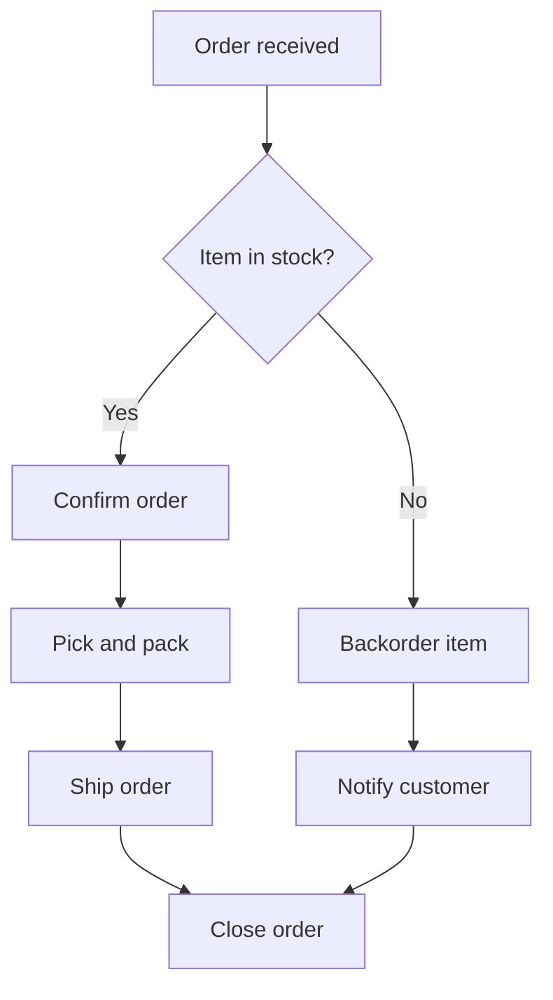

# Volume 02 - Business Processes

| Field | Value |
|---|---|
| Document ID | WORLD-VOL02-019 |
| Title | Business Processes |
| Version | 1.0 |
| Status | Approved |
| Classification | Internal |
| Founder | Mahesh Choudhary |

## Purpose

This document establishes a first-principles reference for business processes: what they are, why they are the fundamental unit of organized work, and how they are structured, classified, and improved. It provides a shared vocabulary that later chapters on procedures, workflows, controls, and escalation build upon.

## Scope

The document covers the definition and anatomy of a business process, the primary process categories, common modeling notation, lifecycle and improvement approaches, and measurement. It applies to all operational domains and is written as general business knowledge rather than the commercial strategy of any single organization.

## What a Business Process Is

A business process is a structured, repeatable set of activities that transforms one or more inputs into an output of value for a customer or another process. Every organization, regardless of size or sector, ultimately delivers value through processes. Individual talent and technology matter, but it is the process that makes outcomes repeatable, measurable, and improvable.

From first principles, a process exists because work must be coordinated across people, systems, and time. Without an explicit process, the same task is performed differently each time, quality varies, and knowledge lives only in individual heads. A defined process converts tacit knowledge into an organizational asset.

### Anatomy of a Process

Every process can be decomposed into a consistent set of elements:

| Element | Description |
|---|---|
| Trigger | The event that starts the process (e.g., an order is placed). |
| Inputs | Materials, data, or requests consumed by the process. |
| Activities | The ordered steps that transform inputs into outputs. |
| Roles | The actors responsible for performing each activity. |
| Rules | Policies and decision logic that govern activity outcomes. |
| Outputs | The value delivered when the process completes. |
| Outcome | The measurable result and its effect on a stakeholder. |

## Why Processes Matter

Processes matter because they make value creation predictable. They enable division of labor, allow quality to be controlled at each step, create the audit trail needed for governance, and provide the measurement points required for continuous improvement. A well-defined process also reduces dependency on specific individuals, lowering operational risk.

## Classifying Processes

Processes are commonly grouped into three categories that reflect their contribution to the organization.

| Category | Purpose | Example |
|---|---|---|
| Core | Directly create value for the customer | Order fulfillment, service delivery |
| Support | Enable core processes to function | Human resources, IT support, finance |
| Management | Govern, plan, and monitor the enterprise | Strategic planning, compliance oversight |

## Modeling a Process

Processes are documented using flow diagrams so that structure and decision points are explicit. The example below models a simple customer order process.

## The Process Lifecycle

Processes are living artifacts. They are designed, executed, monitored, and improved in a continuous loop. Improvement disciplines such as Lean (removing waste), Six Sigma (reducing variation), and Business Process Management (end-to-end lifecycle governance) all operate on this loop.

### Concrete Example

Consider employee onboarding. The trigger is a signed offer letter. Inputs include the new hire's details and role definition. Activities include provisioning accounts, assigning equipment, scheduling orientation, and enrolling in payroll. Roles span HR, IT, and the hiring manager. The output is a fully enabled employee, and the outcome is measured by time-to-productivity. Mapping this process reveals bottlenecks, such as equipment provisioning delays, that can then be targeted for improvement.

## Measuring Processes

Processes are measured on cycle time, cost per execution, error or defect rate, and throughput. These metrics establish a baseline, expose variation, and quantify the impact of improvement efforts.

## Relevance to WORLD

The AI Business Partner treats business processes as the primary structure through which it understands and operates a business. By modeling each process explicitly, it can execute steps, monitor cycle time and error rates in real time, and recommend or apply improvements automatically. Processes are the connective tissue linking the platform's understanding of work to measurable business outcomes.

## Related Documents

- [Standard Operating Procedures](/docs/blueprint/volume-02-business-foundation/section-c-business-operations/20-standard-operating-procedures.md)
- [Workflow Management](/docs/blueprint/volume-02-business-foundation/section-c-business-operations/21-workflow-management.md)
- [Operational Controls](/docs/blueprint/volume-02-business-foundation/section-c-business-operations/23-operational-controls.md)

## References

- [Volume 01 - Vision and Philosophy](/docs/blueprint/volume-01-vision-and-philosophy/README.md)
- [Document Standards](/docs/governance/document-standards.md)

## Change Log

| Version | Date | Author | Notes |
|---|---|---|---|
| 1.0 | 2026-07-12 | Lead Software Engineer | Initial approved version. |
