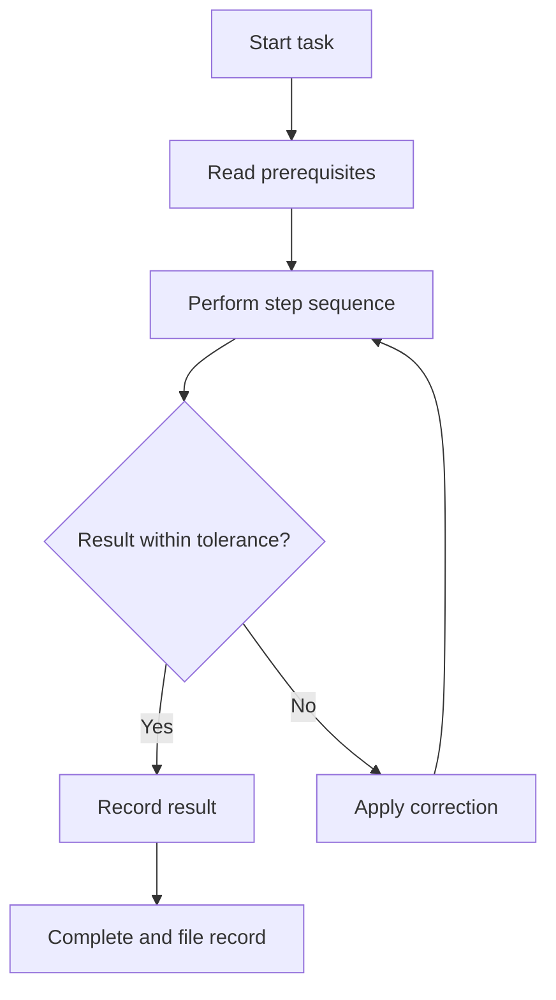

# Volume 02 - Standard Operating Procedures

| Field | Value |
|---|---|
| Document ID | WORLD-VOL02-020 |
| Title | Standard Operating Procedures |
| Version | 1.0 |
| Status | Approved |
| Classification | Internal |
| Founder | Mahesh Choudhary |

## Purpose

This document defines standard operating procedures (SOPs) from first principles: what they are, how they differ from processes, how they are structured and maintained, and why they are essential to consistent, compliant execution.

## Scope

The document covers the definition of an SOP, its relationship to business processes, common formats, the authoring lifecycle, quality criteria, and a worked example. It is general business reference material applicable to any operational function.

## What a Standard Operating Procedure Is

A standard operating procedure is a documented, step-by-step instruction that describes how to perform a specific task correctly and consistently every time. Where a business process describes what happens end to end and why, an SOP describes precisely how a single activity within that process is carried out.

From first principles, SOPs exist to remove ambiguity. When a task depends on human judgment alone, outcomes vary with experience, memory, and attention. An SOP encodes the proven best-known method so that any qualified person can achieve the same result. This is the mechanism by which quality becomes independent of the individual.

### Process versus Procedure

| Dimension | Business Process | Standard Operating Procedure |
|---|---|---|
| Question answered | What and why | How |
| Scope | End-to-end, cross-role | Single task or activity |
| Level of detail | Conceptual flow | Explicit, step-by-step |
| Primary audience | Managers and designers | Operators and performers |

## Why SOPs Matter

SOPs deliver consistency, accelerate training, preserve institutional knowledge, and provide the evidence base for regulatory compliance and audits. They also enable safe delegation: work can be handed to a new person or an automated agent with confidence that the documented method will be followed.

## Anatomy of an SOP

A well-formed SOP contains a predictable set of sections so that readers know where to find information.

| Section | Purpose |
|---|---|
| Title and ID | Uniquely identifies the SOP |
| Purpose | States the objective of the task |
| Scope | Defines when and where the SOP applies |
| Responsibilities | Names the roles that perform and approve |
| Materials/Prerequisites | Lists what is required before starting |
| Procedure Steps | The ordered, numbered instructions |
| Records | Evidence produced by execution |
| Revision History | Version and change tracking |

## SOP Formats

SOPs are written in different formats depending on task complexity: simple step-by-step lists for linear tasks, hierarchical lists for tasks with sub-steps, and flowcharts for tasks with decision points. The flowchart form is illustrated below.

## The SOP Lifecycle

An SOP is drafted by a subject-matter expert, reviewed for accuracy, approved by an accountable owner, published, and then periodically reviewed. Controlled versioning ensures that only the current approved version is in use and that superseded versions are archived, not deleted.

### Concrete Example

A customer-refund SOP might read: (1) verify the refund request against the original transaction; (2) confirm the request is within the returns window; (3) if the amount exceeds the approval threshold, route to a supervisor; (4) process the refund in the payment system; (5) record the transaction ID and reason code; (6) send confirmation to the customer. Any trained agent following these six steps produces an identical, auditable outcome.

## Quality Criteria

A good SOP is accurate, unambiguous, current, and testable. Each step should be observable and verifiable, written in plain imperative language, and free of undefined jargon. If two competent people can follow the SOP and reach different results, it is not yet complete.

## Relevance to WORLD

The AI Business Partner consumes SOPs as executable instructions. Because each SOP encodes a precise, verifiable method, the platform can perform the task directly, guide a human through it, or check that a completed task conformed to the standard. SOPs also give the platform a structured way to capture and continually refine institutional knowledge.

## Related Documents

- [Business Processes](/docs/blueprint/volume-02-business-foundation/section-c-business-operations/19-business-processes.md)
- [Workflow Management](/docs/blueprint/volume-02-business-foundation/section-c-business-operations/21-workflow-management.md)
- [Operational Controls](/docs/blueprint/volume-02-business-foundation/section-c-business-operations/23-operational-controls.md)

## References

- [Volume 01 - Vision and Philosophy](/docs/blueprint/volume-01-vision-and-philosophy/README.md)
- [Document Standards](/docs/governance/document-standards.md)

## Change Log

| Version | Date | Author | Notes |
|---|---|---|---|
| 1.0 | 2026-07-12 | Lead Software Engineer | Initial approved version. |
