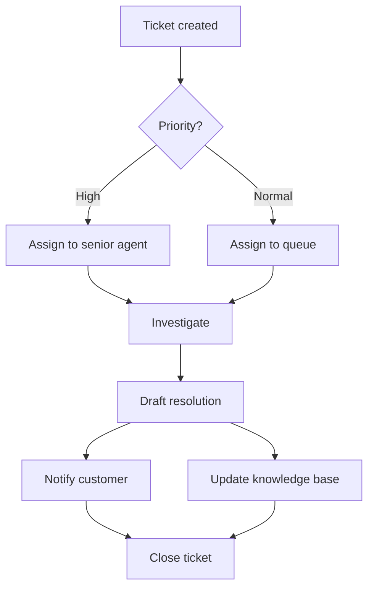

# Volume 02 - Workflow Management

| Field | Value |
|---|---|
| Document ID | WORLD-VOL02-021 |
| Title | Workflow Management |
| Version | 1.0 |
| Status | Approved |
| Classification | Internal |
| Founder | Mahesh Choudhary |

## Purpose

This document provides a first-principles reference for workflow management: the coordination of tasks, people, and systems so that work moves reliably from initiation to completion. It explains how workflows differ from processes and how they are designed, orchestrated, and monitored.

## Scope

The document covers the definition of a workflow, its core building blocks, workflow patterns, the role of a workflow engine, monitoring, and a worked example. It is general business knowledge applicable across functions and industries.

## What Workflow Management Is

Workflow management is the discipline of defining, executing, and monitoring the flow of work between participants according to a set of rules. A workflow is the operational realization of a process: while a process describes the intended sequence of value-creating activities, a workflow governs how each unit of work is routed, assigned, tracked, and completed in practice.

From first principles, work must move. A task completed by one person or system usually triggers another. Without deliberate management, this handoff is where delay, loss, and ambiguity accumulate. Workflow management makes handoffs explicit, assigns clear ownership, and ensures nothing stalls or is dropped.

### Core Building Blocks

| Building Block | Description |
|---|---|
| Task | A single unit of work to be completed |
| Actor | The person, team, or system that performs a task |
| Transition | The rule that moves work from one task to the next |
| State | The current status of a work item (e.g., open, in progress) |
| Routing rule | Logic that decides who receives the next task |
| SLA | The time target within which a task must complete |

## Why Workflow Management Matters

Effective workflow management increases throughput, reduces idle handoff time, makes status visible, and enforces accountability. It converts an abstract process into a running system whose performance can be measured and tuned.

## Workflow Patterns

Workflows are assembled from a small set of reusable control patterns.

| Pattern | Behavior |
|---|---|
| Sequential | Tasks execute one after another |
| Parallel | Multiple tasks execute simultaneously |
| Conditional | The path taken depends on data or a decision |
| Loop | A set of tasks repeats until a condition is met |
| Ad hoc | Participants determine order at runtime |

The diagram below shows a conditional and parallel workflow for processing a support ticket.

## The Workflow Engine

A workflow engine is the component that interprets the workflow definition, tracks the state of each work item, applies routing rules, enforces SLAs, and records history. Separating the workflow definition from its execution allows the same logic to be changed centrally without rewriting the underlying tasks.

## Monitoring and Optimization

Workflows are monitored through dashboards that show queue depth, average time in each state, SLA compliance, and bottleneck locations. This visibility drives optimization: rebalancing assignments, adding automation to slow steps, or re-sequencing tasks to reduce waiting.

### Concrete Example

Consider an invoice-approval workflow. When an invoice arrives, the engine creates a work item in the state received, routes it to accounts payable for verification, then applies a conditional transition: invoices under a threshold move straight to payment, while larger invoices route to a manager in parallel with a budget check. Each state carries an SLA, and any item breaching its SLA is highlighted on the operations dashboard for intervention.

## Relevance to WORLD

The AI Business Partner acts as an intelligent workflow engine. It routes work to the right person or automated capability, tracks every item's state and SLA, and surfaces bottlenecks before they cause delay. Because it observes real execution data, it can continuously rebalance assignments and recommend structural improvements to how work flows.

## Related Documents

- [Business Processes](/docs/blueprint/volume-02-business-foundation/section-c-business-operations/19-business-processes.md)
- [Approval Workflows](/docs/blueprint/volume-02-business-foundation/section-c-business-operations/22-approval-workflows.md)
- [Exception Management](/docs/blueprint/volume-02-business-foundation/section-c-business-operations/24-exception-management.md)

## References

- [Volume 01 - Vision and Philosophy](/docs/blueprint/volume-01-vision-and-philosophy/README.md)
- [Document Standards](/docs/governance/document-standards.md)

## Change Log

| Version | Date | Author | Notes |
|---|---|---|---|
| 1.0 | 2026-07-12 | Lead Software Engineer | Initial approved version. |
