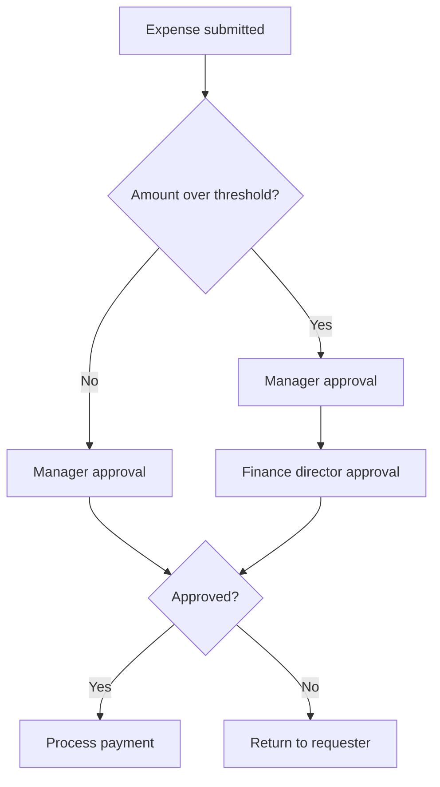

# Volume 02 - Approval Workflows

| Field | Value |
|---|---|
| Document ID | WORLD-VOL02-022 |
| Title | Approval Workflows |
| Version | 1.0 |
| Status | Approved |
| Classification | Internal |
| Founder | Mahesh Choudhary |

## Purpose

This document defines approval workflows from first principles: structured decision paths through which a request is authorized before an action is taken. It explains why approvals exist, how they are structured, and how to balance control with speed.

## Scope

The document covers the definition and purpose of approval workflows, approval patterns, the anatomy of an approval step, delegation and thresholds, and a worked example. It is general business reference material applicable to any function requiring authorization.

## What an Approval Workflow Is

An approval workflow is a specialized workflow whose purpose is to obtain authorization for a request before it proceeds. It routes a request to one or more approvers, captures their decision, and either advances the request when approved or halts and returns it when rejected.

From first principles, approvals exist because some actions carry risk, cost, or commitment that should not rest with a single individual. An approval workflow inserts a deliberate decision checkpoint, ensuring that the right authority reviews the right request before value or risk is committed. It is the mechanism that turns policy into enforced practice.

### Anatomy of an Approval Step

| Element | Description |
|---|---|
| Requester | The party submitting the request |
| Approver | The authority who decides |
| Criteria | The policy the approver evaluates against |
| Decision | Approve, reject, or request changes |
| Threshold | The value that determines routing or level required |
| Record | The auditable log of who decided and when |

## Why Approval Workflows Matter

Approval workflows enforce accountability, prevent unauthorized commitments, ensure regulatory and budgetary compliance, and create an audit trail. They also protect approvers and requesters alike by making authority and responsibility explicit.

## Approval Patterns

Approval logic is assembled from a set of recognized patterns.

| Pattern | Behavior |
|---|---|
| Single approver | One authority decides |
| Sequential (chain) | Approvers decide in a fixed order |
| Parallel | Multiple approvers decide independently |
| Threshold-based | Required level scales with value or risk |
| Quorum | A minimum number of approvals is required |

The diagram below shows a threshold-based, sequential expense-approval workflow.

## Thresholds and Delegation

Thresholds define the value at which higher authority is required, allowing routine low-risk requests to move quickly while reserving senior attention for material decisions. Delegation rules ensure that when an approver is unavailable, authority passes temporarily to a designated alternate so work does not stall. Both mechanisms balance the competing needs of control and speed.

### Concrete Example

A procurement request for office supplies below a set amount requires only line-manager approval and is processed within hours. A request for new software above that amount routes sequentially to the line manager, then to finance for budget confirmation, and then to a department head. Each approver sees the request, the policy criteria, and the prior decisions, and the system records every action. If the finance approver is on leave, delegation automatically routes the step to their designated deputy.

## Designing for Balance

Over-engineered approvals create bottlenecks and encourage workarounds; under-engineered approvals create risk. Good design applies the minimum number of checkpoints that adequately manage the risk, uses thresholds to right-size scrutiny, and always provides a clear path when an approver is absent.

## Relevance to WORLD

The AI Business Partner orchestrates approval workflows by routing each request to the correct authority based on policy and thresholds, applying delegation when approvers are unavailable, and maintaining a complete audit trail. It can pre-screen requests against policy to flag likely issues before an approver reviews them, reducing decision time while preserving control.

## Related Documents

- [Workflow Management](/docs/blueprint/volume-02-business-foundation/section-c-business-operations/21-workflow-management.md)
- [Operational Controls](/docs/blueprint/volume-02-business-foundation/section-c-business-operations/23-operational-controls.md)
- [Escalation Matrix](/docs/blueprint/volume-02-business-foundation/section-c-business-operations/25-escalation-matrix.md)

## References

- [Volume 01 - Vision and Philosophy](/docs/blueprint/volume-01-vision-and-philosophy/README.md)
- [Document Standards](/docs/governance/document-standards.md)

## Change Log

| Version | Date | Author | Notes |
|---|---|---|---|
| 1.0 | 2026-07-12 | Lead Software Engineer | Initial approved version. |
