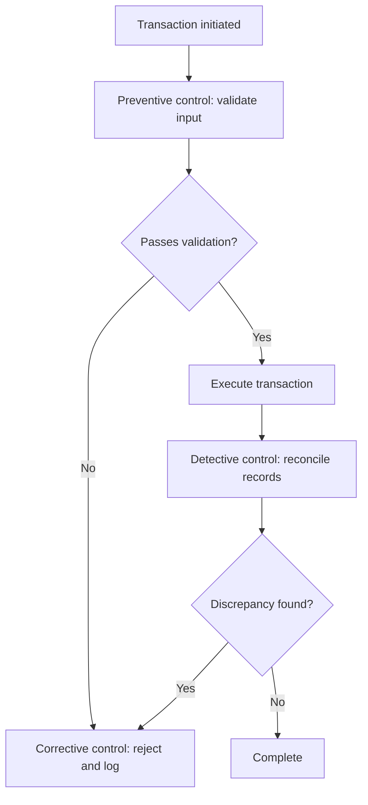

# Volume 02 - Operational Controls

| Field | Value |
|---|---|
| Document ID | WORLD-VOL02-023 |
| Title | Operational Controls |
| Version | 1.0 |
| Status | Approved |
| Classification | Internal |
| Founder | Mahesh Choudhary |

## Purpose

This document provides a first-principles reference for operational controls: the safeguards embedded in processes and workflows to ensure that work is performed correctly, risks are contained, and objectives are met. It explains control types, design principles, and monitoring.

## Scope

The document covers the definition and purpose of operational controls, the main control types, control design and the concept of segregation of duties, control testing, and a worked example. It is general business reference material applicable across all operational domains.

## What an Operational Control Is

An operational control is a mechanism designed to prevent, detect, or correct errors, fraud, and deviations that could stop a process from achieving its intended outcome. Controls are the guardrails of execution: they do not perform the work but ensure the work is performed within acceptable limits.

From first principles, any system that produces value can also produce error. As volume and complexity grow, the probability of mistakes, misuse, and drift increases. Controls exist to keep the actual behavior of a process aligned with its intended behavior, providing reasonable assurance that objectives will be met despite human and system fallibility.

### Control Objectives

Controls are designed to protect four fundamental things: the accuracy and completeness of information, the safeguarding of assets, compliance with policy and regulation, and the reliability of operations. Every specific control traces back to one or more of these objectives.

## Types of Controls

Controls are classified by when they act and by how they operate.

| Type | When it Acts | Example |
|---|---|---|
| Preventive | Before an error can occur | Access restrictions, mandatory fields |
| Detective | After an event, to find issues | Reconciliations, audit logs |
| Corrective | After detection, to fix and restore | Rollback procedures, remediation |
| Directive | Guides behavior toward the desired outcome | Policies, training, standards |

Controls are also classified as manual (performed by people) or automated (enforced by systems). Automated preventive controls are generally the most reliable because they act consistently and cannot be forgotten.

## Control Design Principles

Well-designed controls are proportionate to risk, embedded in the process rather than bolted on, and measurable. A key principle is segregation of duties: no single individual should control all stages of a high-risk transaction, so that error or fraud requires collusion rather than a single act.

## Control Testing and Assurance

Controls degrade if not maintained. They are tested periodically for both design effectiveness (is the control capable of achieving its objective?) and operating effectiveness (is it actually working as intended?). Findings feed a remediation cycle that strengthens weak or failing controls.

### Concrete Example

In a payments function, a preventive control requires that bank details be entered only from a verified vendor record; a segregation-of-duties control ensures the person who sets up a vendor cannot also approve a payment to it; a detective control reconciles the daily payment file against approved invoices; and a corrective control freezes and investigates any unmatched payment. Together these controls make an erroneous or fraudulent payment far less likely and quickly detectable if it occurs.

## Relevance to WORLD

The AI Business Partner embeds operational controls directly into the work it executes, enforcing preventive checks automatically, running detective reconciliations continuously, and flagging control breaches the moment they arise. Because it observes every transaction, it can monitor control effectiveness in real time rather than relying on periodic sampling, raising assurance while lowering the cost of control.

## Related Documents

- [Business Processes](/docs/blueprint/volume-02-business-foundation/section-c-business-operations/19-business-processes.md)
- [Approval Workflows](/docs/blueprint/volume-02-business-foundation/section-c-business-operations/22-approval-workflows.md)
- [Exception Management](/docs/blueprint/volume-02-business-foundation/section-c-business-operations/24-exception-management.md)

## References

- [Volume 01 - Vision and Philosophy](/docs/blueprint/volume-01-vision-and-philosophy/README.md)
- [Document Standards](/docs/governance/document-standards.md)

## Change Log

| Version | Date | Author | Notes |
|---|---|---|---|
| 1.0 | 2026-07-12 | Lead Software Engineer | Initial approved version. |
