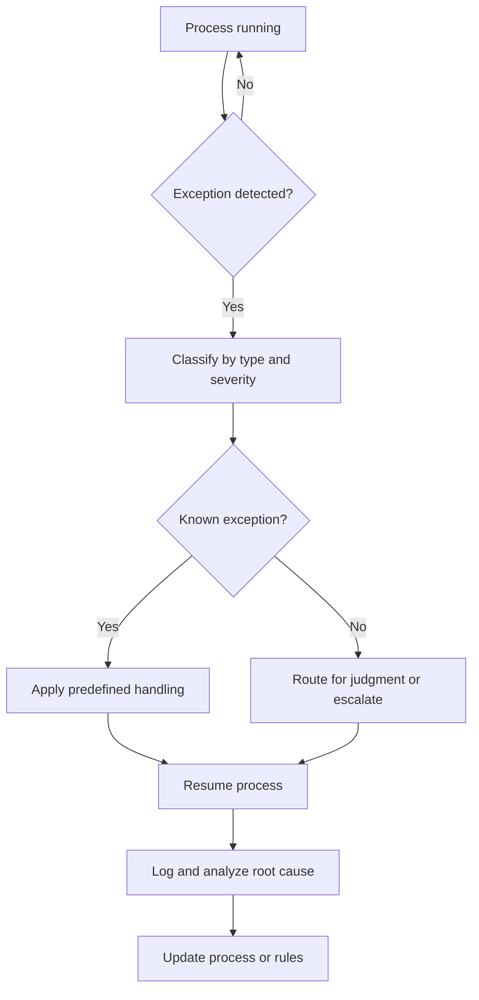

# Volume 02 - Exception Management

| Field | Value |
|---|---|
| Document ID | WORLD-VOL02-024 |
| Title | Exception Management |
| Version | 1.0 |
| Status | Approved |
| Classification | Internal |
| Founder | Mahesh Choudhary |

## Purpose

This document provides a first-principles reference for exception management: the disciplined handling of situations that fall outside the normal, expected path of a process. It explains what exceptions are, how they are detected and categorized, and how they are resolved and learned from.

## Scope

The document covers the definition of an exception, exception categories, the exception-handling lifecycle, resolution strategies, root-cause analysis, and a worked example. It is general business reference material applicable to any operational process.

## What an Exception Is

An exception is any event or condition that deviates from the defined, expected flow of a process and therefore cannot be handled by the standard path. Examples include missing data, a failed validation, an out-of-tolerance result, an unavailable system, or a case the rules did not anticipate.

From first principles, no process design can foresee every possible input and condition. Reality is more varied than any model of it. Exception management exists to handle this residual variety deliberately, so that the unexpected is contained and resolved rather than causing silent failure, stalled work, or inconsistent ad hoc responses.

### Exceptions versus Errors

An error is something done incorrectly; an exception is a condition the standard path cannot process, which may arise even when every actor behaves correctly. Some exceptions are anticipated and have predefined handling; others are novel and require judgment. A mature operation converts recurring novel exceptions into anticipated ones with defined handling.

## Categorizing Exceptions

Exceptions are triaged by type and severity so that response is proportionate.

| Category | Description | Typical Response |
|---|---|---|
| Data exception | Missing, invalid, or inconsistent data | Correct data and resume |
| Business-rule exception | A case outside policy limits | Route for a decision |
| System exception | A technical failure or outage | Retry or fail over |
| Timing exception | An SLA or deadline breach | Prioritize or escalate |

## The Exception-Handling Lifecycle

Effective exception management follows a consistent lifecycle: detect, classify, contain, resolve, and learn. The diagram below illustrates the flow.

## Resolution Strategies

Common resolution strategies include automatic retry for transient system exceptions, data correction and resumption for data exceptions, routing to a human for judgment on business-rule exceptions, and controlled failure with notification when no safe resolution exists. The goal is always to return the work item to a valid state or to close it cleanly with a full record.

## Learning from Exceptions

Every exception is information. Root-cause analysis asks why the exception occurred and whether the process, rules, or data quality should change to prevent recurrence. A rising rate of a particular exception is an early warning of underlying weakness. Over time, systematic learning shrinks the volume of exceptions and expands the share that are handled automatically.

### Concrete Example

In an order-processing workflow, an order arrives with a shipping address that fails postal validation. This data exception is detected at the validation step, classified as low severity, and handled by a predefined rule that requests a corrected address from the customer while holding the order. Once corrected, the order resumes. The system logs the event; if address-validation failures spike for a particular region, root-cause analysis may reveal a stale reference dataset that is then updated, preventing future occurrences.

## Relevance to WORLD

The AI Business Partner detects exceptions the moment work leaves the expected path, classifies them by type and severity, and applies predefined handling automatically where it can. For novel cases it routes to the right person with full context, and it performs continuous root-cause analysis so recurring exceptions are engineered out and an ever-larger share of the unexpected is handled without human intervention.

## Related Documents

- [Workflow Management](/docs/blueprint/volume-02-business-foundation/section-c-business-operations/21-workflow-management.md)
- [Operational Controls](/docs/blueprint/volume-02-business-foundation/section-c-business-operations/23-operational-controls.md)
- [Escalation Matrix](/docs/blueprint/volume-02-business-foundation/section-c-business-operations/25-escalation-matrix.md)

## References

- [Volume 01 - Vision and Philosophy](/docs/blueprint/volume-01-vision-and-philosophy/README.md)
- [Document Standards](/docs/governance/document-standards.md)

## Change Log

| Version | Date | Author | Notes |
|---|---|---|---|
| 1.0 | 2026-07-12 | Lead Software Engineer | Initial approved version. |
