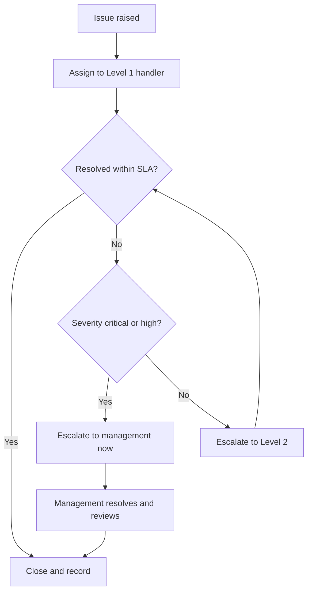

# Volume 02 - Escalation Matrix

| Field | Value |
|---|---|
| Document ID | WORLD-VOL02-025 |
| Title | Escalation Matrix |
| Version | 1.0 |
| Status | Approved |
| Classification | Internal |
| Founder | Mahesh Choudhary |

## Purpose

This document provides a first-principles reference for the escalation matrix: the predefined structure that determines when, to whom, and how an issue is raised to a higher level of authority or expertise. It explains why escalation is necessary and how a matrix makes it fast and consistent.

## Scope

The document covers the definition and purpose of escalation, the two axes of escalation, the structure of an escalation matrix, severity and time triggers, and a worked example. It is general business reference material applicable to any operational context.

## What an Escalation Matrix Is

An escalation matrix is a documented map that specifies, for a given issue type and severity, which role should be engaged, within what timeframe, and through what channel. It removes the guesswork from the question "who do I take this to, and when?" by defining the answer in advance.

From first principles, no single role has the authority, expertise, or bandwidth to resolve every issue. When an issue exceeds the capacity of the current handler, it must move to someone who can act. Left informal, this movement is slow, inconsistent, and often too late. An escalation matrix codifies the path so that the right person is engaged at the right moment, every time.

### The Two Axes of Escalation

| Axis | Meaning | When Used |
|---|---|---|
| Functional (horizontal) | Move to a different skill or team | Issue needs different expertise |
| Hierarchical (vertical) | Move to a higher level of authority | Issue needs greater decision power |

Many real situations combine both: an issue may need specialist expertise and, if unresolved, senior authority.

## Why an Escalation Matrix Matters

A well-defined matrix reduces resolution time, prevents issues from stalling in the wrong hands, sets clear expectations for response, and protects staff by making authority boundaries explicit. It also prevents both under-escalation (issues left too long at the wrong level) and over-escalation (routine matters consuming senior attention).

## Triggers: Severity and Time

Escalation is driven by two kinds of trigger. Severity triggers escalate based on impact, and time triggers escalate when an issue remains unresolved beyond a threshold. Combining them ensures that both high-impact and long-running issues receive appropriate attention.

| Severity | Description | First Response | Escalates To | Time to Escalate |
|---|---|---|---|---|
| Critical | Major business impact | Immediate | Senior management | 30 minutes |
| High | Significant impact | Within 1 hour | Department head | 2 hours |
| Medium | Limited impact | Within 4 hours | Team lead | 1 business day |
| Low | Minimal impact | Within 1 day | Assigned owner | 3 business days |

The diagram below shows a time-and-severity escalation flow.

### Concrete Example

A payment-system outage is logged as critical. The Level 1 support handler acknowledges it immediately and attempts recovery. Because the severity is critical, the matrix requires notification of senior management within 30 minutes regardless of progress. A specialist team is engaged functionally to restore service while a manager is engaged hierarchically to authorize customer communications and any commercial decisions. Every action and handoff is timestamped, producing a clear record for the post-incident review.

## Maintaining the Matrix

An escalation matrix must be kept current: contacts, roles, thresholds, and channels change over time. It is reviewed periodically and after major incidents, and out-of-date entries are corrected so that escalation never fails because a named contact has moved on.

## Relevance to WORLD

The AI Business Partner applies the escalation matrix automatically, monitoring severity and elapsed time against thresholds and engaging the correct functional expert or authority the instant a trigger is met. Because it never forgets a timer and always has current contact routing, it eliminates the delay and inconsistency of manual escalation while producing a complete, timestamped record for review.

## Related Documents

- [Approval Workflows](/docs/blueprint/volume-02-business-foundation/section-c-business-operations/22-approval-workflows.md)
- [Operational Controls](/docs/blueprint/volume-02-business-foundation/section-c-business-operations/23-operational-controls.md)
- [Exception Management](/docs/blueprint/volume-02-business-foundation/section-c-business-operations/24-exception-management.md)

## References

- [Volume 01 - Vision and Philosophy](/docs/blueprint/volume-01-vision-and-philosophy/README.md)
- [Document Standards](/docs/governance/document-standards.md)

## Change Log

| Version | Date | Author | Notes |
|---|---|---|---|
| 1.0 | 2026-07-12 | Lead Software Engineer | Initial approved version. |
