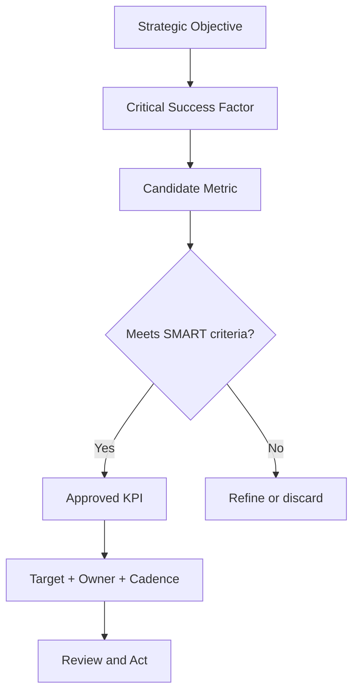

# Volume 02 - Key Performance Indicators (KPIs)

| Field | Value |
|---|---|
| Document ID | WORLD-VOL02-026 |
| Title | KPIs |
| Version | 1.0 |
| Status | Approved |
| Classification | Internal |
| Founder | Mahesh Choudhary |

## Purpose

This chapter establishes, from first principles, what a Key Performance Indicator (KPI) is, why organizations rely on KPIs, and how well-designed KPIs turn raw activity into decision-grade signal. It provides a shared, foundational vocabulary that later chapters on specific metric families build upon.

## Scope

The chapter covers the definition of a KPI, its distinction from ordinary metrics, the anatomy of a good KPI, the categories in which KPIs are typically organized, and a worked example. It is a general business-knowledge reference and does not prescribe any specific commercial targets.

## What a KPI Is

A **Key Performance Indicator** is a quantifiable measure that reflects how effectively an organization is achieving a specific, strategically important objective. The emphasis is on the word *key*: while a business can measure hundreds of things, only a small set of measures are decisive for success.

### KPI Versus Metric

Every KPI is a metric, but not every metric is a KPI. A metric is any measurement of activity or state. A KPI is a metric that has been elevated because it is tied to an objective, carries a target, and drives action.

| Attribute | Ordinary Metric | KPI |
|---|---|---|
| Linked to a strategic objective | Sometimes | Always |
| Has an explicit target | Rarely | Always |
| Owned by an accountable person | Optional | Required |
| Triggers decisions | Occasionally | By design |

## Why KPIs Matter

KPIs matter because attention and resources are finite. By naming the few measures that matter most, an organization aligns teams, makes progress visible, and enables timely correction. Without KPIs, effort drifts toward what is easy to measure rather than what is important.

## Anatomy of a Good KPI

A robust KPI is commonly described by the SMART properties: Specific, Measurable, Achievable, Relevant, and Time-bound. In practice a complete KPI definition includes a name, a precise formula, a data source, a target, a review cadence, and a named owner.

## Categories of KPIs

KPIs are frequently grouped to balance perspective:

- **Leading vs. lagging** - leading KPIs predict future outcomes (for example, pipeline coverage); lagging KPIs confirm past results (for example, revenue booked).
- **Strategic vs. operational** - strategic KPIs track long-horizon goals; operational KPIs track day-to-day execution.
- **Quantitative vs. qualitative** - most KPIs are numeric, but some encode survey-based sentiment on a defined scale.

## Worked Example

Consider a subscription business whose objective is sustainable growth. It selects **Net Revenue Retention (NRR)** as a KPI.

- Starting recurring revenue from a cohort: 100,000 currency units.
- Expansion during the period: +18,000.
- Contraction and churn during the period: -8,000.
- NRR = (100,000 + 18,000 - 8,000) / 100,000 = 110,000 / 100,000 = **110%**.

An NRR above 100% indicates the existing customer base is growing in value even before new acquisition, so the target might be set at "maintain NRR at or above 105%" with monthly review.

## Relevance to WORLD

An AI Business Partner treats KPIs as the primary interface between strategy and daily operation. It helps a founder select the few decisive measures, computes them continuously from connected data, and surfaces anomalies against targets. By reasoning over leading indicators, the AI can recommend corrective action before lagging results are locked in.

## Related Documents

- [Business Metrics](/docs/blueprint/volume-02-business-foundation/section-d-business-intelligence/27-business-metrics.md)
- [Financial Metrics](/docs/blueprint/volume-02-business-foundation/section-d-business-intelligence/28-financial-metrics.md)
- [Growth Metrics](/docs/blueprint/volume-02-business-foundation/section-d-business-intelligence/33-growth-metrics.md)

## References

- [Volume 01 - Vision and Philosophy](/docs/blueprint/volume-01-vision-and-philosophy/README.md)
- [Document Standards](/docs/governance/document-standards.md)

## Change Log

| Version | Date | Author | Notes |
|---|---|---|---|
| 1.0 | 2026-07-12 | Lead Software Engineer | Initial approved version. |
