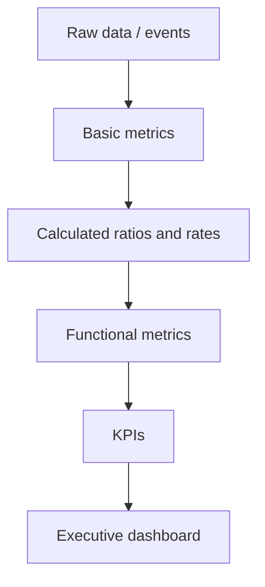

# Volume 02 - Business Metrics

| Field | Value |
|---|---|
| Document ID | WORLD-VOL02-027 |
| Title | Business Metrics |
| Version | 1.0 |
| Status | Approved |
| Classification | Internal |
| Founder | Mahesh Choudhary |

## Purpose

This chapter defines business metrics as a general discipline: what they are, how they differ from KPIs, how they are structured across the functions of a business, and how they combine to describe overall business health. It provides the connective framework beneath the specialized metric families detailed in later chapters.

## Scope

The chapter covers the definition of a business metric, the metric hierarchy, the major functional domains in which metrics arise, a representative catalogue, and a worked example. It excludes deep treatment of any single domain, which is reserved for the dedicated chapters that follow.

## What a Business Metric Is

A **business metric** is a standardized measurement used to track, compare, and manage some aspect of business performance over time. Metrics translate the continuous activity of an organization into discrete, comparable numbers that support judgement and accountability.

### The Metric Hierarchy

Metrics exist at different altitudes. Raw counts feed calculated ratios, ratios roll up into functional metrics, and a selected few functional metrics are promoted to KPIs.

## Why Business Metrics Matter

Metrics create a common language across teams, replace opinion with evidence, and make trends and outliers visible. They enable benchmarking against past performance and peers, and they form the raw material from which forecasts and decisions are made.

## Functional Domains

Business metrics naturally organize by function. The families covered later in this section map onto these domains.

| Domain | Focus | Example Metric |
|---|---|---|
| Financial | Money in, money out, value created | Gross margin |
| Operational | Efficiency of processes | Cycle time |
| Productivity | Output relative to input | Revenue per employee |
| Quality | Conformance and defects | Defect rate |
| Customer | Acquisition, satisfaction, loyalty | Net Promoter Score |
| Growth | Rate and durability of expansion | Month-over-month growth |

## Representative Business Metrics

| Metric | Formula | Definition |
|---|---|---|
| Revenue | Sum of sales in period | Total value of goods or services sold |
| Gross Margin | (Revenue - COGS) / Revenue | Share of revenue kept after direct costs |
| Conversion Rate | Conversions / Opportunities | Share of prospects that take a desired action |
| Utilization | Productive hours / Available hours | Degree to which capacity is used |
| Retention Rate | Retained / Starting count | Share of customers or staff kept over a period |

## Worked Example

A services firm reports quarterly revenue of 500,000 currency units with cost of goods sold of 300,000.

- Gross Margin = (500,000 - 300,000) / 500,000 = 200,000 / 500,000 = **40%**.

Compared with the prior quarter's 36%, the four-point improvement signals better pricing or delivery efficiency, prompting a review of which projects drove the gain.

## Relevance to WORLD

An AI Business Partner maintains a unified metric layer across every connected system so that definitions stay consistent and comparable. It automatically classifies raw events into the correct functional domain, computes ratios on demand, and explains how a change in one metric propagates to related metrics, giving the founder a coherent, always-current picture of business health.

## Related Documents

- [KPIs](/docs/blueprint/volume-02-business-foundation/section-d-business-intelligence/26-kpis.md)
- [Financial Metrics](/docs/blueprint/volume-02-business-foundation/section-d-business-intelligence/28-financial-metrics.md)
- [Operational Metrics](/docs/blueprint/volume-02-business-foundation/section-d-business-intelligence/29-operational-metrics.md)

## References

- [Volume 01 - Vision and Philosophy](/docs/blueprint/volume-01-vision-and-philosophy/README.md)
- [Document Standards](/docs/governance/document-standards.md)

## Change Log

| Version | Date | Author | Notes |
|---|---|---|---|
| 1.0 | 2026-07-12 | Lead Software Engineer | Initial approved version. |
