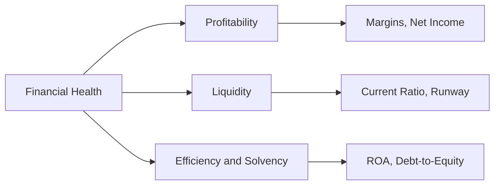

# Volume 02 - Financial Metrics

| Field | Value |
|---|---|
| Document ID | WORLD-VOL02-028 |
| Title | Financial Metrics |
| Version | 1.0 |
| Status | Approved |
| Classification | Internal |
| Founder | Mahesh Choudhary |

## Purpose

This chapter explains financial metrics from first principles: the measures that describe how a business earns, spends, and preserves money, and how those measures reveal profitability, liquidity, and solvency. It equips the reader to interpret the language of financial performance without assuming prior accounting expertise.

## Scope

The chapter covers the definition of financial metrics, the three lenses of profitability, liquidity, and efficiency, a representative catalogue with formulas, a worked example, and the relationship of these metrics to core financial statements. It is a general reference and prescribes no specific financial targets.

## What a Financial Metric Is

A **financial metric** is a quantitative measure derived from an organization's monetary activity, typically sourced from the income statement, balance sheet, and cash flow statement. Financial metrics answer three enduring questions: Is the business profitable? Can it meet its obligations? Is it using capital efficiently?

### The Three Lenses

## Why Financial Metrics Matter

Financial metrics are the ultimate scorecard: they determine whether a business can survive and reward its stakeholders. They inform investment decisions, credit assessments, pricing, and the pace at which a company can safely grow. Misreading them can mask insolvency behind apparent growth.

## Representative Financial Metrics

| Metric | Formula | Definition |
|---|---|---|
| Gross Profit Margin | (Revenue - COGS) / Revenue | Profitability after direct production costs |
| Net Profit Margin | Net Income / Revenue | Profit remaining after all expenses and taxes |
| Operating Margin | Operating Income / Revenue | Profitability of core operations |
| Current Ratio | Current Assets / Current Liabilities | Ability to cover short-term obligations |
| Burn Rate | Net cash spent per period | Speed at which cash reserves decline |
| Runway | Cash balance / Monthly burn | Months of operation before cash is exhausted |
| Return on Assets | Net Income / Total Assets | Efficiency of asset use in generating profit |

## Worked Example

A company holds 240,000 currency units in cash and spends net 30,000 per month.

- Runway = 240,000 / 30,000 = **8 months**.

If revenue does not grow, the business must reach profitability or secure funding within eight months. Reducing burn to 24,000 per month extends runway to 10 months, illustrating how a modest cost adjustment materially changes strategic options.

## Financial Statements Behind the Metrics

Profitability metrics draw mainly from the income statement, liquidity metrics from the balance sheet, and burn and runway from the cash flow statement. Reading the three together prevents the distortion that any single statement can create in isolation.

## Relevance to WORLD

An AI Business Partner continuously derives financial metrics from a company's accounting and banking connections, flags deteriorating margins or shortening runway early, and models how decisions such as a new hire or price change would ripple through profitability and cash. This lets a founder reason about financial trade-offs in plain language rather than spreadsheets.

## Related Documents

- [KPIs](/docs/blueprint/volume-02-business-foundation/section-d-business-intelligence/26-kpis.md)
- [Business Metrics](/docs/blueprint/volume-02-business-foundation/section-d-business-intelligence/27-business-metrics.md)
- [Growth Metrics](/docs/blueprint/volume-02-business-foundation/section-d-business-intelligence/33-growth-metrics.md)

## References

- [Volume 01 - Vision and Philosophy](/docs/blueprint/volume-01-vision-and-philosophy/README.md)
- [Document Standards](/docs/governance/document-standards.md)

## Change Log

| Version | Date | Author | Notes |
|---|---|---|---|
| 1.0 | 2026-07-12 | Lead Software Engineer | Initial approved version. |
