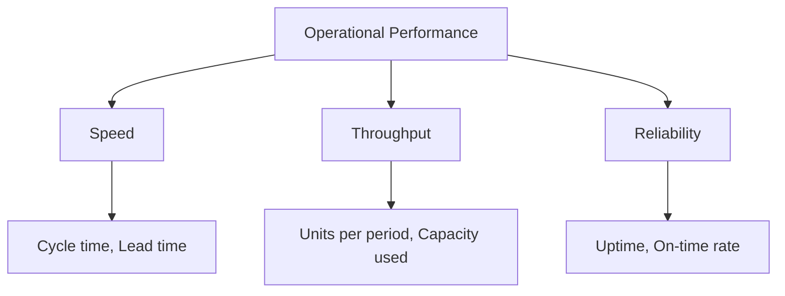

# Volume 02 - Operational Metrics

| Field | Value |
|---|---|
| Document ID | WORLD-VOL02-029 |
| Title | Operational Metrics |
| Version | 1.0 |
| Status | Approved |
| Classification | Internal |
| Founder | Mahesh Choudhary |

## Purpose

This chapter defines operational metrics from first principles: the measures that describe how efficiently and reliably a business converts inputs into delivered outputs. It gives the reader a framework for understanding process performance independent of any particular industry.

## Scope

The chapter covers the definition of operational metrics, the dimensions of speed, throughput, and reliability, a representative catalogue with formulas, a process view, and a worked example. Financial and quality dimensions are treated in their own chapters and are referenced only where they intersect operations.

## What an Operational Metric Is

An **operational metric** measures the performance of the processes by which an organization produces and delivers value. Where financial metrics ask whether the business made money, operational metrics ask how well the underlying machine is running: how fast, how much, and how dependably.

### Core Dimensions

## Why Operational Metrics Matter

Operations are where strategy meets reality. Even a business with strong demand fails if it cannot deliver reliably and efficiently. Operational metrics expose bottlenecks, idle capacity, and variability, enabling continuous improvement and predictable customer experience. They are typically leading indicators of the financial results that follow.

## Representative Operational Metrics

| Metric | Formula | Definition |
|---|---|---|
| Cycle Time | End time - Start time | Duration to complete one unit of work |
| Lead Time | Request time to delivery time | Total elapsed time a customer waits |
| Throughput | Units completed / Time period | Rate of output from a process |
| Capacity Utilization | Actual output / Maximum output | Share of available capacity in use |
| On-Time Delivery Rate | On-time deliveries / Total deliveries | Reliability of meeting commitments |
| Uptime | Available time / Total time | Share of time a system is operational |

## Worked Example

A fulfilment team completes 480 orders during a 40-hour week.

- Throughput = 480 / 40 = **12 orders per hour**.

If the maximum sustainable rate is 15 orders per hour, capacity utilization is 12 / 15 = 80%. The 20% headroom suggests the team can absorb a demand increase before new capacity is required, while a sustained rise toward 95% would signal the need to hire or automate.

## Relevance to WORLD

An AI Business Partner instruments a company's operational processes, measuring cycle time, throughput, and reliability from connected tools. It detects emerging bottlenecks, forecasts when capacity limits will be reached, and recommends process changes, allowing a founder to keep operations predictable as the business scales.

## Related Documents

- [Business Metrics](/docs/blueprint/volume-02-business-foundation/section-d-business-intelligence/27-business-metrics.md)
- [Productivity Metrics](/docs/blueprint/volume-02-business-foundation/section-d-business-intelligence/30-productivity-metrics.md)
- [Quality Metrics](/docs/blueprint/volume-02-business-foundation/section-d-business-intelligence/31-quality-metrics.md)

## References

- [Volume 01 - Vision and Philosophy](/docs/blueprint/volume-01-vision-and-philosophy/README.md)
- [Document Standards](/docs/governance/document-standards.md)

## Change Log

| Version | Date | Author | Notes |
|---|---|---|---|
| 1.0 | 2026-07-12 | Lead Software Engineer | Initial approved version. |
