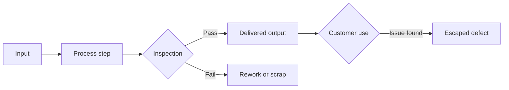

# Volume 02 - Quality Metrics

| Field | Value |
|---|---|
| Document ID | WORLD-VOL02-031 |
| Title | Quality Metrics |
| Version | 1.0 |
| Status | Approved |
| Classification | Internal |
| Founder | Mahesh Choudhary |

## Purpose

This chapter defines quality metrics from first principles: measures of how well a product, service, or process conforms to requirements and satisfies the people who depend on it. It frames quality not as an abstract virtue but as something measurable and manageable.

## Scope

The chapter covers the definition of quality, the dimensions of conformance and defects, a representative catalogue with formulas, a defect-flow view, a worked example, and the cost-of-quality concept. It complements the operational and customer chapters, which address speed and satisfaction respectively.

## What a Quality Metric Is

A **quality metric** measures the degree to which output meets defined standards and expectations. Quality has two faces: *conformance quality*, meaning freedom from defects relative to specification, and *perceived quality*, meaning how well output meets the needs of the customer. Robust programs measure both.

### Where Defects Enter and Escape

## Why Quality Metrics Matter

Poor quality is expensive: it causes rework, scrap, returns, warranty claims, and lost trust. Quality metrics make these costs visible and locate their source, enabling prevention rather than firefighting. High, consistent quality reduces cost, protects reputation, and underpins customer loyalty, linking quality directly to growth and profitability.

## Representative Quality Metrics

| Metric | Formula | Definition |
|---|---|---|
| Defect Rate | Defective units / Total units | Share of output that fails specification |
| First Pass Yield | Units passing first time / Total units | Share completed correctly without rework |
| Defect Density | Defects / Size unit | Defects per unit of size or volume |
| Rework Rate | Reworked units / Total units | Share of output requiring correction |
| Escaped Defects | Defects found by customers / Total defects | Share of defects that reached customers |
| Mean Time Between Failures | Operating time / Number of failures | Average reliable interval before failure |

## Worked Example

A production line processes 2,000 units and finds 40 defective before shipment.

- Defect Rate = 40 / 2,000 = **2%**.
- First Pass Yield = (2,000 - 40) / 2,000 = 1,960 / 2,000 = **98%**.

If 5 defects later escape to customers, the escaped-defect ratio is 5 / 45 = about 11%, indicating inspection catches most but not all issues and that upstream prevention deserves attention.

## Cost of Quality

The cost of quality sums prevention, appraisal, and failure costs. Investing in prevention typically reduces far larger failure costs, so quality metrics are best read alongside their financial consequences.

## Relevance to WORLD

An AI Business Partner monitors quality signals across delivery and support channels, detects rising defect or rework rates early, and traces them to their process origin. By correlating quality with cost and customer satisfaction, it helps a founder invest in prevention where it yields the greatest return.

## Related Documents

- [Operational Metrics](/docs/blueprint/volume-02-business-foundation/section-d-business-intelligence/29-operational-metrics.md)
- [Productivity Metrics](/docs/blueprint/volume-02-business-foundation/section-d-business-intelligence/30-productivity-metrics.md)
- [Customer Metrics](/docs/blueprint/volume-02-business-foundation/section-d-business-intelligence/32-customer-metrics.md)

## References

- [Volume 01 - Vision and Philosophy](/docs/blueprint/volume-01-vision-and-philosophy/README.md)
- [Document Standards](/docs/governance/document-standards.md)

## Change Log

| Version | Date | Author | Notes |
|---|---|---|---|
| 1.0 | 2026-07-12 | Lead Software Engineer | Initial approved version. |
