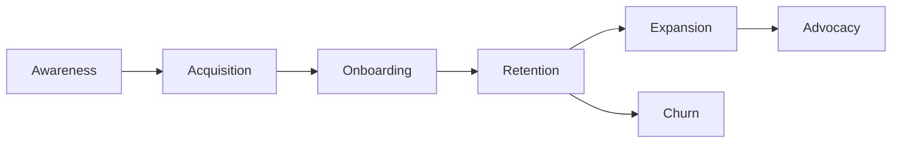

# Volume 02 - Customer Metrics

| Field | Value |
|---|---|
| Document ID | WORLD-VOL02-032 |
| Title | Customer Metrics |
| Version | 1.0 |
| Status | Approved |
| Classification | Internal |
| Founder | Mahesh Choudhary |

## Purpose

This chapter defines customer metrics from first principles: measures that describe how a business acquires customers, satisfies them, retains them, and grows their value over time. It provides a lifecycle view of the customer relationship expressed in measurable terms.

## Scope

The chapter covers the definition of customer metrics, the customer lifecycle, satisfaction and loyalty measures, unit economics, a representative catalogue with formulas, and a worked example. It focuses on general concepts and prescribes no specific commercial figures.

## What a Customer Metric Is

A **customer metric** quantifies some aspect of the relationship between a business and the people it serves. Because customers are the source of all revenue, these metrics link marketing, sales, product, and support to financial outcomes. They span the full lifecycle from first contact to long-term loyalty.

### The Customer Lifecycle

## Why Customer Metrics Matter

Acquiring a customer usually costs more than retaining one, so understanding acquisition cost, satisfaction, and retention is central to sustainable growth. Customer metrics reveal whether a business is creating durable relationships or merely renting attention, and they underpin the unit economics that determine long-run viability.

## Representative Customer Metrics

| Metric | Formula | Definition |
|---|---|---|
| Customer Acquisition Cost | Sales and marketing spend / New customers | Average cost to acquire one customer |
| Customer Lifetime Value | Average value x Gross margin x Lifespan | Total profit expected from a customer |
| Churn Rate | Customers lost / Starting customers | Share of customers lost in a period |
| Retention Rate | Customers retained / Starting customers | Share of customers kept in a period |
| Net Promoter Score | % Promoters - % Detractors | Willingness to recommend, from -100 to 100 |
| LTV to CAC Ratio | Customer Lifetime Value / Acquisition Cost | Return on acquisition investment |

## Worked Example

A business spends 50,000 currency units to acquire 100 customers, each generating 40 in monthly gross profit and staying an average of 30 months.

- CAC = 50,000 / 100 = **500 per customer**.
- LTV = 40 x 30 = **1,200 per customer**.
- LTV to CAC = 1,200 / 500 = **2.4**.

A ratio of 2.4 means each acquisition currency returns 2.4 in lifetime profit. Many operators regard a ratio near 3 as healthy, so the business might improve retention or reduce acquisition cost to strengthen its economics.

## Relevance to WORLD

An AI Business Partner unifies customer data across marketing, sales, and support to compute lifecycle metrics continuously. It identifies which segments and channels produce the best LTV-to-CAC economics, predicts churn risk from behavioural signals, and recommends retention and expansion actions, helping a founder invest where customer value compounds.

## Related Documents

- [Growth Metrics](/docs/blueprint/volume-02-business-foundation/section-d-business-intelligence/33-growth-metrics.md)
- [Financial Metrics](/docs/blueprint/volume-02-business-foundation/section-d-business-intelligence/28-financial-metrics.md)
- [Quality Metrics](/docs/blueprint/volume-02-business-foundation/section-d-business-intelligence/31-quality-metrics.md)

## References

- [Volume 01 - Vision and Philosophy](/docs/blueprint/volume-01-vision-and-philosophy/README.md)
- [Document Standards](/docs/governance/document-standards.md)

## Change Log

| Version | Date | Author | Notes |
|---|---|---|---|
| 1.0 | 2026-07-12 | Lead Software Engineer | Initial approved version. |
