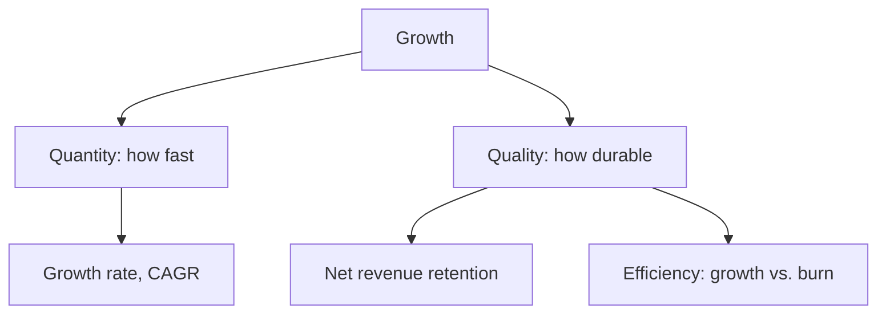

# Volume 02 - Growth Metrics

| Field | Value |
|---|---|
| Document ID | WORLD-VOL02-033 |
| Title | Growth Metrics |
| Version | 1.0 |
| Status | Approved |
| Classification | Internal |
| Founder | Mahesh Choudhary |

## Purpose

This chapter defines growth metrics from first principles: measures of the rate, quality, and durability with which a business expands. It distinguishes healthy, compounding growth from growth that is fragile or purchased at unsustainable cost.

## Scope

The chapter covers the definition of growth, the mathematics of growth rates and compounding, the distinction between quantity and quality of growth, a representative catalogue with formulas, and a worked example. It is a general reference and does not state any specific commercial targets.

## What a Growth Metric Is

A **growth metric** measures change over time, usually expressed as a rate. Growth is the mechanism by which small advantages compound into large outcomes, but not all growth is equal: it can be efficient or wasteful, retained or leaky. Growth metrics therefore measure both the speed of expansion and the quality that determines whether it lasts.

### Quantity Versus Quality of Growth

## Why Growth Metrics Matter

Growth attracts investment, talent, and momentum, and it can offset the natural attrition every business faces. But growth pursued without regard to retention or cost can consume a company. Growth metrics let leaders judge whether expansion is compounding on a solid base or masking underlying churn and inefficiency.

## The Mathematics of Growth

A single-period growth rate is straightforward, but growth compounds. The Compound Annual Growth Rate (CAGR) smooths multi-period growth into a single annualized figure and is the standard way to compare growth over different time spans.

## Representative Growth Metrics

| Metric | Formula | Definition |
|---|---|---|
| Period Growth Rate | (Current - Prior) / Prior | Change relative to the previous period |
| Compound Annual Growth Rate | (End / Start)^(1/Years) - 1 | Smoothed annualized growth over multiple years |
| Net Revenue Retention | (Start + Expansion - Churn) / Start | Growth from existing customers alone |
| Growth Efficiency | Net new revenue / Cash burned | Revenue gained per unit of cash spent |
| Activation Rate | Activated users / New users | Share of new users reaching first value |

## Worked Example

A business grows revenue from 1,000,000 to 1,728,000 currency units over three years.

- CAGR = (1,728,000 / 1,000,000)^(1/3) - 1 = (1.728)^(0.333) - 1 = 1.20 - 1 = **20% per year**.

If, over the same period, net revenue retention stays above 100%, the growth is compounding on a base that expands on its own, indicating durable rather than purely acquisition-driven growth.

## Relevance to WORLD

An AI Business Partner tracks growth across acquisition, activation, and retention, and continually tests whether expansion is efficient and durable rather than merely fast. It links growth to cash consumption and customer economics, warning the founder when growth outpaces sustainability and recommending the levers most likely to compound long-term value.

## Related Documents

- [Customer Metrics](/docs/blueprint/volume-02-business-foundation/section-d-business-intelligence/32-customer-metrics.md)
- [Financial Metrics](/docs/blueprint/volume-02-business-foundation/section-d-business-intelligence/28-financial-metrics.md)
- [KPIs](/docs/blueprint/volume-02-business-foundation/section-d-business-intelligence/26-kpis.md)

## References

- [Volume 01 - Vision and Philosophy](/docs/blueprint/volume-01-vision-and-philosophy/README.md)
- [Document Standards](/docs/governance/document-standards.md)

## Change Log

| Version | Date | Author | Notes |
|---|---|---|---|
| 1.0 | 2026-07-12 | Lead Software Engineer | Initial approved version. |
