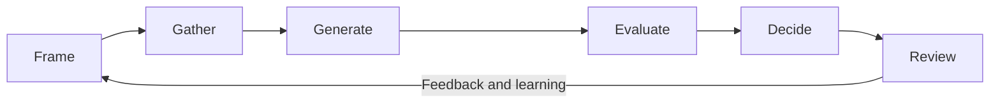

# Volume 02 - Decision Making Framework

| Field | Value |
|---|---|
| Document ID | WORLD-VOL02-034 |
| Title | Decision Making Framework |
| Version | 1.0 |
| Status | Approved |
| Classification | Internal |
| Founder | Mahesh Choudhary |

## Purpose

This document establishes, from first principles, a general-purpose framework for making business decisions. It defines what a decision is, why a disciplined framework matters, and the repeatable steps an organization or an intelligent system can follow to convert uncertainty into deliberate, defensible action.

## Scope

The framework applies to any consequential business decision: strategic, operational, financial, or organizational. It is method-neutral and foundational; specialized techniques (problem identification, root-cause analysis, prioritization, scenario planning) are treated in their own chapters and referenced here.

## What a Decision Is

A decision is an irreversible commitment of resources under uncertainty, made to move from a current state toward a preferred future state. Every decision has three irreducible elements: a set of **alternatives** (mutually exclusive courses of action), a set of **outcomes** (states of the world that may follow), and a set of **preferences** (the values used to rank outcomes). Good decisions are distinct from good outcomes: a sound process can still yield an unlucky result, and a reckless choice can succeed by chance. The framework therefore optimizes the quality of the process.

## Why a Framework Matters

Unaided human judgement is vulnerable to bias, inconsistency, and information overload. A framework imposes structure that improves transparency, repeatability, and accountability. It forces the explicit separation of facts, assumptions, and values, and it creates an auditable record that can be reviewed and improved over time.

## The Decision Cycle

The framework is a closed loop of six stages.

| Stage | Objective | Key Question |
|---|---|---|
| 1. Frame | Define the decision and its boundaries | What exactly must be decided, and why now? |
| 2. Gather | Collect facts and surface assumptions | What do we know, and how confident are we? |
| 3. Generate | Produce viable alternatives | What are the genuinely distinct options? |
| 4. Evaluate | Score alternatives against criteria | Which option best satisfies our objectives? |
| 5. Decide | Commit and assign ownership | Who commits to what, by when? |
| 6. Review | Compare outcome to expectation | What did we learn for next time? |

### Framing

Most poor decisions fail at framing. A well-framed decision states the objective, the constraints, the decision owner, the deadline, and the reversibility of the choice. Reversible, low-cost decisions warrant speed; irreversible, high-cost decisions warrant deliberation.

### Evaluation Criteria

Alternatives should be scored against weighted criteria that reflect stated objectives. Common criteria include expected value, cost, risk exposure, strategic fit, and time to impact. Weighted scoring converts qualitative judgement into a comparable index.

## Concrete Example

A services firm must decide whether to build, buy, or partner for a new analytics capability. Framing sets the objective (capability live within two quarters) and constraint (fixed budget). Three alternatives are generated and scored on a weighted matrix.

| Criterion | Weight | Build | Buy | Partner |
|---|---|---|---|---|
| Time to impact | 0.35 | 2 | 5 | 4 |
| Total cost | 0.30 | 3 | 4 | 3 |
| Strategic control | 0.20 | 5 | 2 | 3 |
| Risk | 0.15 | 2 | 4 | 3 |
| Weighted total | 1.00 | 2.85 | 4.05 | 3.40 |

The scoring favours "Buy", and the decision is recorded with an owner, a date, and a review trigger.

## Relevance to WORLD

The AI Business Partner uses this framework as the backbone of its advisory reasoning. When a founder poses a question, the platform frames the decision, surfaces assumptions, generates alternatives, and presents a weighted evaluation with an explicit rationale, so the human remains the accountable decision owner while benefiting from a disciplined, auditable process.

## Related Documents

- [Problem Identification](/docs/blueprint/volume-02-business-foundation/section-e-decision-science/35-problem-identification.md)
- [Risk Assessment](/docs/blueprint/volume-02-business-foundation/section-e-decision-science/37-risk-assessment.md)
- [Prioritization Framework](/docs/blueprint/volume-02-business-foundation/section-e-decision-science/40-prioritization-framework.md)

## References

- [Volume 01 - Vision and Philosophy](/docs/blueprint/volume-01-vision-and-philosophy/README.md)
- [Document Standards](/docs/governance/document-standards.md)

## Change Log

| Version | Date | Author | Notes |
|---|---|---|---|
| 1.0 | 2026-07-12 | Lead Software Engineer | Initial approved version. |
