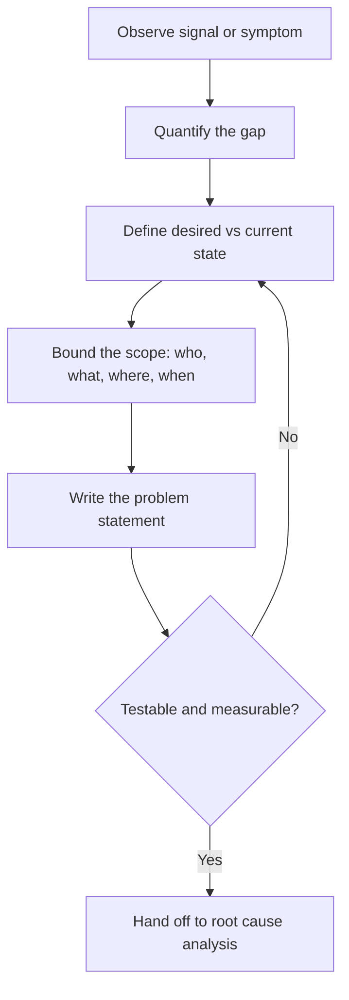

# Volume 02 - Problem Identification

| Field | Value |
|---|---|
| Document ID | WORLD-VOL02-035 |
| Title | Problem Identification |
| Version | 1.0 |
| Status | Approved |
| Classification | Internal |
| Founder | Mahesh Choudhary |

## Purpose

This document explains, from first principles, how to correctly identify and define a business problem before attempting to solve it. It establishes the discipline of distinguishing symptoms from problems and problems from solutions, so that effort is spent on the right question.

## Scope

The practice applies wherever a gap exists between an expected and an observed state: operational failures, missed targets, customer complaints, or emerging threats. It precedes root-cause analysis and decision making, and it feeds directly into both.

## What a Problem Is

A problem is a measurable gap between a desired state and the current state, whose cause is not yet fully understood. This definition contains three parts: a **desired state** (a target or standard), a **current state** (observed reality), and a **gap** (the quantified difference). If there is no gap, there is no problem; if the cause is already known and accepted, it is a task, not a problem.

## Why Correct Identification Matters

The most expensive mistakes come from solving the wrong problem well. Organizations frequently react to symptoms, launching solutions before the underlying issue is understood. A rigorous identification step prevents premature solutioning, aligns stakeholders on a shared definition, and creates the measurable baseline against which any solution will later be judged.

## Symptoms Versus Problems Versus Solutions

| Layer | Description | Example |
|---|---|---|
| Symptom | An observable signal of distress | Customer churn rose 4% this quarter |
| Problem | The underlying gap | Onboarding fails to deliver value in the first week |
| Solution | A proposed intervention | Redesign the onboarding flow |

Jumping from symptom to solution skips the problem entirely, which is the most common failure mode.

## A Method for Problem Identification

### Structuring the Statement

A disciplined problem statement answers: what is happening, where and when, how large the gap is, and who is affected. A useful template is: "[Metric] is [current value] against a target of [desired value], observed in [context] since [time], affecting [stakeholder]." The **5W1H** questions (who, what, where, when, why, how) help ensure completeness, while the statement deliberately excludes any presumed cause or solution.

### Common Pitfalls

Stating the problem as a missing solution ("we lack a mobile app"), defining it too broadly to be actionable, or embedding an unverified cause all bias the analysis that follows.

## Concrete Example

A subscription business observes rising cancellations (symptom). Rather than immediately discounting, the team quantifies the gap: monthly retention is 88% against a 94% target, concentrated in accounts younger than 30 days. The problem statement becomes: "First-month retention is 88% versus a 94% target, observed since Q1, affecting new self-serve customers." This is measurable, bounded, cause-free, and ready for root-cause analysis.

## Relevance to WORLD

The AI Business Partner continuously monitors business signals and reframes vague concerns into precise, measurable problem statements. By quantifying gaps and separating symptoms from causes before proposing action, the platform protects founders from solving the wrong problem and establishes the baseline needed to verify that any later intervention worked.

## Related Documents

- [Decision Making Framework](/docs/blueprint/volume-02-business-foundation/section-e-decision-science/34-decision-making-framework.md)
- [Root Cause Analysis](/docs/blueprint/volume-02-business-foundation/section-e-decision-science/36-root-cause-analysis.md)
- [Opportunity Analysis](/docs/blueprint/volume-02-business-foundation/section-e-decision-science/38-opportunity-analysis.md)

## References

- [Volume 01 - Vision and Philosophy](/docs/blueprint/volume-01-vision-and-philosophy/README.md)
- [Document Standards](/docs/governance/document-standards.md)

## Change Log

| Version | Date | Author | Notes |
|---|---|---|---|
| 1.0 | 2026-07-12 | Lead Software Engineer | Initial approved version. |
