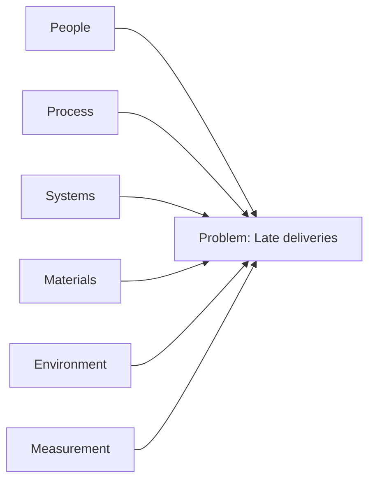

# Volume 02 - Root Cause Analysis

| Field | Value |
|---|---|
| Document ID | WORLD-VOL02-036 |
| Title | Root Cause Analysis |
| Version | 1.0 |
| Status | Approved |
| Classification | Internal |
| Founder | Mahesh Choudhary |

## Purpose

This document defines root cause analysis (RCA) from first principles: the systematic practice of tracing an identified problem back to the fundamental cause whose removal prevents recurrence, rather than merely suppressing symptoms.

## Scope

RCA applies after a problem has been clearly identified and quantified. It covers the two most established techniques, the 5 Whys and the Ishikawa (fishbone) diagram, and the principles for validating a candidate cause before acting on it.

## What a Root Cause Is

A root cause is the deepest factor in a causal chain that, if corrected, would prevent the problem from recurring, and which is within the organization's control to change. Causes exist in layers: immediate causes trigger the symptom, contributing causes enable it, and the root cause originates it. Treating only immediate causes produces temporary relief and repeated failures.

## Why RCA Matters

Without RCA, organizations enter a cycle of firefighting, repeatedly paying to fix the same recurring problem. RCA converts reactive effort into durable prevention, reduces long-run cost, and builds institutional knowledge about how the system actually behaves.

## Technique 1: The 5 Whys

The 5 Whys iteratively asks "why" until the causal chain reaches a factor that is both fundamental and actionable. Five is a guideline, not a rule.

| Level | Question | Answer |
|---|---|---|
| Why 1 | Why did the order ship late? | The item was out of stock |
| Why 2 | Why was it out of stock? | Reorder was not triggered |
| Why 3 | Why was reorder not triggered? | The threshold was set to zero |
| Why 4 | Why was the threshold zero? | It defaulted during migration |
| Why 5 | Why did the default persist? | No validation check existed |

The root cause is the missing validation check, not the out-of-stock symptom.

## Technique 2: Ishikawa (Fishbone) Diagram

When a problem has many possible contributing factors, the Ishikawa diagram organizes candidate causes into standard categories for systematic examination.

Each branch is explored for specific causes, and the most probable are carried forward for validation.

## Validating the Root Cause

A candidate cause is confirmed only when three tests pass: the cause logically explains the observed evidence, removing the cause would plausibly eliminate the problem, and the link is supported by data rather than assumption. Correlation must not be mistaken for causation; where possible, the cause is verified by a controlled change or historical evidence.

## Concrete Example

Revisiting the retention problem from problem identification (first-month retention at 88% versus a 94% target), an RCA team applies the 5 Whys and finds that new users who never complete a key setup step churn at triple the rate. A fishbone review confirms the dominant branch is Process, specifically an onboarding step that is easy to skip. The validated root cause is a non-guided setup flow, which becomes the target of the corrective decision.

## Relevance to WORLD

The AI Business Partner automates RCA by correlating operational data, proposing candidate causal chains, and ranking them by evidential support. Rather than recommending superficial fixes, the platform guides founders toward the underlying cause and flags when a proposed action would only address a symptom.

## Related Documents

- [Problem Identification](/docs/blueprint/volume-02-business-foundation/section-e-decision-science/35-problem-identification.md)
- [Decision Making Framework](/docs/blueprint/volume-02-business-foundation/section-e-decision-science/34-decision-making-framework.md)
- [Risk Assessment](/docs/blueprint/volume-02-business-foundation/section-e-decision-science/37-risk-assessment.md)

## References

- [Volume 01 - Vision and Philosophy](/docs/blueprint/volume-01-vision-and-philosophy/README.md)
- [Document Standards](/docs/governance/document-standards.md)

## Change Log

| Version | Date | Author | Notes |
|---|---|---|---|
| 1.0 | 2026-07-12 | Lead Software Engineer | Initial approved version. |
