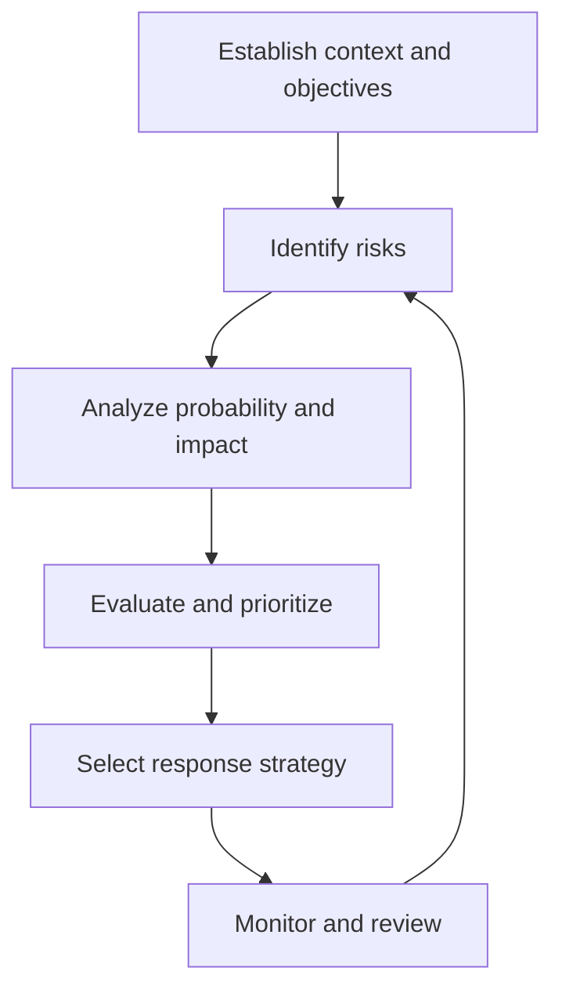

# Volume 02 - Risk Assessment

| Field | Value |
|---|---|
| Document ID | WORLD-VOL02-037 |
| Title | Risk Assessment |
| Version | 1.0 |
| Status | Approved |
| Classification | Internal |
| Founder | Mahesh Choudhary |

## Purpose

This document defines risk assessment from first principles: the structured process of identifying uncertain events that could affect objectives, estimating their likelihood and impact, and deciding how to respond.

## Scope

Risk assessment applies to any decision or initiative exposed to uncertainty. It covers risk identification, analysis, evaluation using a probability-impact matrix, and the standard set of response strategies. It complements decision making and scenario planning.

## What Risk Is

Risk is the effect of uncertainty on objectives. Formally, a risk has a **cause** (a source condition), an **event** (the uncertain occurrence), and a **consequence** (its effect on objectives). Risk is not inherently negative; the same uncertainty framed as an upside is an opportunity. Risk is commonly quantified as **exposure = probability x impact**.

## Why Assessment Matters

All consequential decisions are made under uncertainty. Without structured assessment, organizations either freeze in the face of ambiguity or proceed blind to material threats. Systematic assessment makes risk visible, comparable, and manageable, and it directs limited mitigation resources to where they matter most.

## The Assessment Process

### Identification and Analysis

Risks are identified through checklists, historical data, expert judgement, and structured brainstorming. Each is analyzed for probability (how likely) and impact (how severe if it occurs), scored on a consistent scale.

### The Probability-Impact Matrix

Exposure is visualized on a matrix that maps likelihood against severity, producing an ordered priority.

| Probability \\ Impact | Low | Medium | High |
|---|---|---|---|
| High | Medium | High | Critical |
| Medium | Low | Medium | High |
| Low | Low | Low | Medium |

Risks in the Critical and High cells demand active response; those in Low cells are typically accepted and monitored.

## Response Strategies

For each significant risk, one of four standard strategies is chosen.

| Strategy | Description | When to Use |
|---|---|---|
| Avoid | Eliminate the cause or change the plan | High probability and high impact |
| Mitigate | Reduce probability or impact | Manageable but material risk |
| Transfer | Shift the impact to a third party | Insurable or outsourceable risk |
| Accept | Acknowledge and monitor | Low exposure or unavoidable |

## Concrete Example

A company plans to launch in a new region dependent on a single logistics provider. A supplier failure is assessed as medium probability and high impact, placing it in the High cell. The chosen response is Mitigate plus Transfer: qualify a second provider (reduce probability) and add contractual penalties (transfer impact). A residual-risk score is recorded and monitored monthly.

## Relevance to WORLD

The AI Business Partner maintains a living risk register for the businesses it supports, continuously scoring exposure from operational data and external signals. It surfaces the highest-exposure risks, recommends response strategies, and tracks residual risk over time, so founders make decisions with a clear, current view of their threat landscape.

## Related Documents

- [Decision Making Framework](/docs/blueprint/volume-02-business-foundation/section-e-decision-science/34-decision-making-framework.md)
- [Opportunity Analysis](/docs/blueprint/volume-02-business-foundation/section-e-decision-science/38-opportunity-analysis.md)
- [Scenario Planning](/docs/blueprint/volume-02-business-foundation/section-e-decision-science/41-scenario-planning.md)

## References

- [Volume 01 - Vision and Philosophy](/docs/blueprint/volume-01-vision-and-philosophy/README.md)
- [Document Standards](/docs/governance/document-standards.md)

## Change Log

| Version | Date | Author | Notes |
|---|---|---|---|
| 1.0 | 2026-07-12 | Lead Software Engineer | Initial approved version. |
