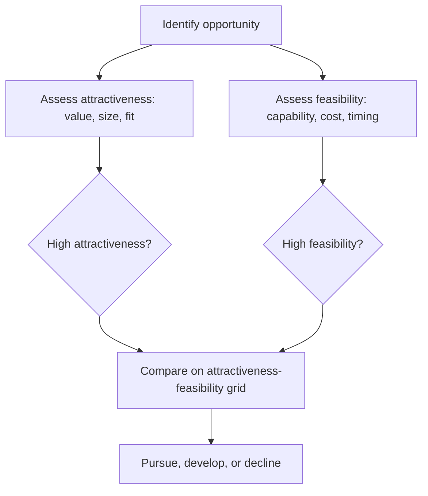

# Volume 02 - Opportunity Analysis

| Field | Value |
|---|---|
| Document ID | WORLD-VOL02-038 |
| Title | Opportunity Analysis |
| Version | 1.0 |
| Status | Approved |
| Classification | Internal |
| Founder | Mahesh Choudhary |

## Purpose

This document defines opportunity analysis from first principles: the structured evaluation of a potential favourable course of action to determine whether it is worth pursuing, and how it compares to alternatives.

## Scope

Opportunity analysis applies to new markets, products, partnerships, and investments. It covers what an opportunity is, the dimensions of evaluation, established tools such as SWOT, and the discipline of testing attractiveness against feasibility. It is the mirror image of risk assessment: both study uncertainty, but from opposite ends.

## What an Opportunity Is

An opportunity is an uncertain future event or condition that, if acted upon, could advance objectives beyond the current trajectory. Where a risk is uncertainty with a potential downside, an opportunity is uncertainty with a potential upside. A genuine opportunity has three properties: it creates value, it is accessible to the organization, and its window is open for a limited time.

## Why Analysis Matters

Opportunities are abundant, but resources are scarce. Without analysis, organizations chase novelty, over-commit to weak prospects, or miss high-value openings. Structured analysis separates attractive ideas from feasible ones and forces an honest comparison of upside against the cost and risk of capture.

## Dimensions of Evaluation

Every opportunity is assessed on two independent axes: **attractiveness** (the size and quality of the potential value) and **feasibility** (the organization's ability to capture it). Plotting the two reveals which opportunities to pursue, which to develop, and which to decline.

### The Attractiveness-Feasibility Grid

| Feasibility \\ Attractiveness | Low | High |
|---|---|---|
| High | Quick win, low priority | Pursue now |
| Low | Decline | Develop capability first |

## Established Tool: SWOT

SWOT analysis situates an opportunity against internal strengths and weaknesses and external opportunities and threats, ensuring that both capability and context are considered before commitment.

| Internal | External |
|---|---|
| Strengths that enable capture | Opportunities in the environment |
| Weaknesses that hinder capture | Threats that could erode value |

## Concrete Example

A profitable company notices demand for a complementary product from its existing customers. Attractiveness is high: the customer base is known and acquisition cost is low. Feasibility is moderate: the product requires a capability the firm partly lacks. On the grid the opportunity sits in "Develop capability first." A SWOT confirms a strong distribution strength but a product-development weakness, so the firm decides to pilot through a partner before building in-house.

## Relevance to WORLD

The AI Business Partner scans internal performance and external signals to surface opportunities a founder might otherwise miss, then scores each on attractiveness and feasibility. By pairing upside analysis with a candid capability assessment, the platform helps founders concentrate scarce resources on the openings they can realistically capture.

## Related Documents

- [Problem Identification](/docs/blueprint/volume-02-business-foundation/section-e-decision-science/35-problem-identification.md)
- [Risk Assessment](/docs/blueprint/volume-02-business-foundation/section-e-decision-science/37-risk-assessment.md)
- [Strategic Planning](/docs/blueprint/volume-02-business-foundation/section-e-decision-science/39-strategic-planning.md)

## References

- [Volume 01 - Vision and Philosophy](/docs/blueprint/volume-01-vision-and-philosophy/README.md)
- [Document Standards](/docs/governance/document-standards.md)

## Change Log

| Version | Date | Author | Notes |
|---|---|---|---|
| 1.0 | 2026-07-12 | Lead Software Engineer | Initial approved version. |
