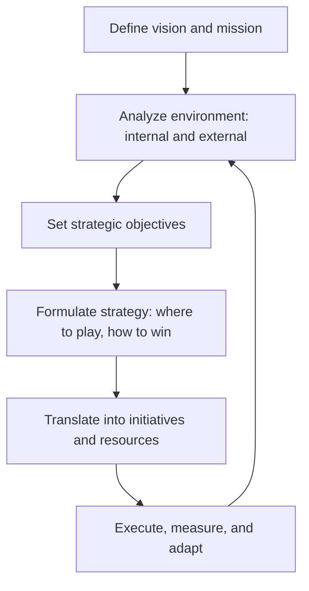

# Volume 02 - Strategic Planning

| Field | Value |
|---|---|
| Document ID | WORLD-VOL02-039 |
| Title | Strategic Planning |
| Version | 1.0 |
| Status | Approved |
| Classification | Internal |
| Founder | Mahesh Choudhary |

## Purpose

This document defines strategic planning from first principles: the disciplined process by which an organization sets direction, allocates resources, and defines how it will achieve its long-term objectives amid competition and uncertainty.

## Scope

Strategic planning applies at the level of the enterprise or a major initiative. It covers the definition of vision and mission, environmental analysis, objective setting, strategy formulation, and the translation of strategy into executable plans. It draws on opportunity analysis, risk assessment, and prioritization.

## What Strategy Is

Strategy is a coherent set of choices about where to compete and how to win, given finite resources. It is fundamentally about **choice and trade-off**: deciding what to do necessarily means deciding what not to do. A plan without trade-offs is a wish list, not a strategy. A strategy answers three questions: where are we now, where do we want to be, and how will we get there.

## Why Planning Matters

Without a strategy, organizations drift, react to events, and dissipate resources across uncoordinated efforts. Strategic planning aligns the organization behind a shared direction, concentrates resources on the few things that matter most, and creates a framework for making consistent decisions as conditions change.

## The Planning Process

### Vision, Mission, and Objectives

The **vision** describes the aspirational future state; the **mission** describes the organization's enduring purpose; and **strategic objectives** are the measurable, time-bound targets that mark progress toward the vision. Objectives should follow the SMART discipline: specific, measurable, achievable, relevant, and time-bound.

### Environmental Analysis

Sound strategy is grounded in evidence about the internal and external environment. SWOT synthesizes internal strengths and weaknesses with external opportunities and threats, while broader scans of market, competition, and macro conditions inform where advantage can be built.

## From Strategy to Execution

Strategy fails most often at execution. Each objective is decomposed into initiatives, each initiative into owned actions with resources and timelines, and progress is tracked against leading and lagging indicators.

| Level | Artifact | Time Horizon | Owner |
|---|---|---|---|
| Vision | Aspirational statement | 5+ years | Founder |
| Objective | SMART target | 1-3 years | Executive |
| Initiative | Cross-team program | Quarters | Program lead |
| Action | Task with resources | Weeks | Individual |

## Concrete Example

A regional company sets a three-year objective to double revenue. Environmental analysis reveals a strength in service quality and an opportunity in an adjacent segment. The strategy chooses to "play" in that adjacent segment and to "win" through superior service. This is translated into three initiatives (segment entry, hiring, and platform investment), each with owned actions, budgets, and quarterly metrics, and reviewed on a recurring cadence.

## Relevance to WORLD

The AI Business Partner acts as an always-on strategy office: it maintains the founder's vision and objectives, keeps environmental analysis current, and continuously checks whether day-to-day initiatives remain aligned with the chosen strategy. When conditions shift, the platform flags the misalignment and proposes adjustments, keeping strategy a living document rather than a static plan.

## Related Documents

- [Opportunity Analysis](/docs/blueprint/volume-02-business-foundation/section-e-decision-science/38-opportunity-analysis.md)
- [Prioritization Framework](/docs/blueprint/volume-02-business-foundation/section-e-decision-science/40-prioritization-framework.md)
- [Scenario Planning](/docs/blueprint/volume-02-business-foundation/section-e-decision-science/41-scenario-planning.md)

## References

- [Volume 01 - Vision and Philosophy](/docs/blueprint/volume-01-vision-and-philosophy/README.md)
- [Document Standards](/docs/governance/document-standards.md)

## Change Log

| Version | Date | Author | Notes |
|---|---|---|---|
| 1.0 | 2026-07-12 | Lead Software Engineer | Initial approved version. |
