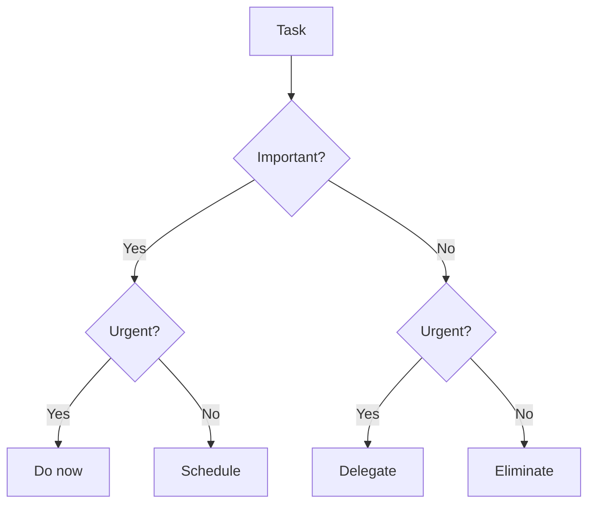

# Volume 02 - Prioritization Framework

| Field | Value |
|---|---|
| Document ID | WORLD-VOL02-040 |
| Title | Prioritization Framework |
| Version | 1.0 |
| Status | Approved |
| Classification | Internal |
| Founder | Mahesh Choudhary |

## Purpose

This document defines prioritization from first principles: the disciplined process of ordering a set of competing options so that finite resources are directed to the items that create the most value relative to their cost.

## Scope

Prioritization applies wherever demand exceeds capacity: feature backlogs, project portfolios, hiring, and spending. It covers the logic of prioritization and the established scoring methods, including weighted scoring, RICE, and the Eisenhower matrix.

## What Prioritization Is

Prioritization is the act of assigning relative rank to options under a resource constraint. Its necessity follows from a first principle: resources are finite, so choosing to do one thing is choosing not to do another. Effective prioritization maximizes total value delivered per unit of scarce resource, rather than treating all requests as equal or acting on whoever asks loudest.

## Why It Matters

Without an explicit framework, prioritization defaults to politics, recency, or noise. A transparent method makes trade-offs visible, aligns stakeholders on why an item ranks where it does, and produces decisions that can be explained and defended. It converts an emotional argument into a comparable calculation.

## Established Methods

### Weighted Scoring

Options are scored against weighted criteria and ranked by total score. The weights encode strategy: whatever the organization values most receives the highest weight.

### RICE

RICE scores each item by **Reach x Impact x Confidence / Effort**, producing a single comparable number that balances upside against cost and certainty.

| Item | Reach | Impact | Confidence | Effort | RICE Score |
|---|---|---|---|---|---|
| Feature A | 8000 | 2 | 0.8 | 4 | 3200 |
| Feature B | 3000 | 3 | 0.9 | 2 | 4050 |
| Feature C | 12000 | 1 | 0.6 | 6 | 1200 |

Feature B ranks highest despite lower reach, because its impact and low effort dominate.

### The Eisenhower Matrix

For time and attention, the Eisenhower matrix sorts tasks by urgency and importance.

## Choosing a Method

| Context | Recommended Method |
|---|---|
| Product backlog with value and cost | RICE |
| Multi-criteria portfolio decisions | Weighted scoring |
| Personal or team time management | Eisenhower matrix |

## Concrete Example

A team faces twelve feature requests and capacity for three. Rather than debating opinions, they score each with RICE. Three items score far above the rest and are selected; two loud but low-scoring requests are deferred with a documented rationale. The transparent scores defuse disagreement because the trade-off is explicit and shared.

## Relevance to WORLD

The AI Business Partner applies prioritization frameworks to a founder's backlog of opportunities, problems, and initiatives, scoring each against the founder's stated strategy and current capacity. By surfacing a ranked, explainable order of what to do next, the platform ensures scarce founder attention is spent where it produces the greatest return.

## Related Documents

- [Decision Making Framework](/docs/blueprint/volume-02-business-foundation/section-e-decision-science/34-decision-making-framework.md)
- [Strategic Planning](/docs/blueprint/volume-02-business-foundation/section-e-decision-science/39-strategic-planning.md)
- [Opportunity Analysis](/docs/blueprint/volume-02-business-foundation/section-e-decision-science/38-opportunity-analysis.md)

## References

- [Volume 01 - Vision and Philosophy](/docs/blueprint/volume-01-vision-and-philosophy/README.md)
- [Document Standards](/docs/governance/document-standards.md)

## Change Log

| Version | Date | Author | Notes |
|---|---|---|---|
| 1.0 | 2026-07-12 | Lead Software Engineer | Initial approved version. |
