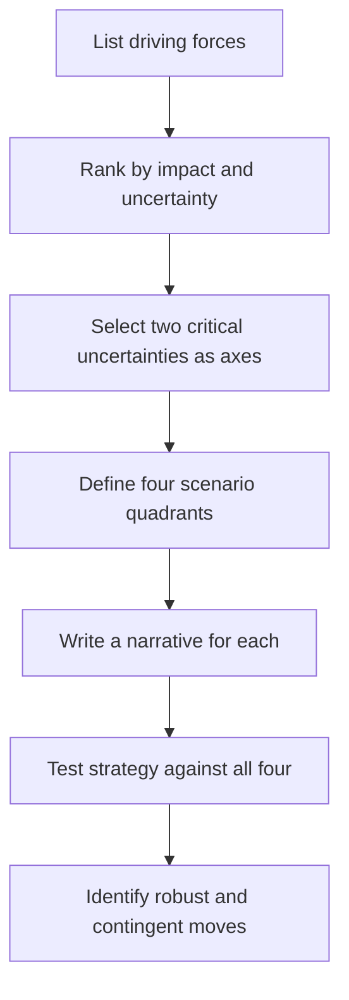

# Volume 02 - Scenario Planning

| Field | Value |
|---|---|
| Document ID | WORLD-VOL02-041 |
| Title | Scenario Planning |
| Version | 1.0 |
| Status | Approved |
| Classification | Internal |
| Founder | Mahesh Choudhary |

## Purpose

This document defines scenario planning from first principles: the structured practice of constructing several plausible, distinct futures and preparing strategy to remain robust across all of them, rather than betting on a single forecast.

## Scope

Scenario planning applies to decisions with long horizons and deep uncertainty, where prediction is unreliable but the range of outcomes can be bounded. It covers driving forces, the two-axis method for building scenarios, and the derivation of robust and contingent strategies. It complements strategic planning and risk assessment.

## What Scenario Planning Is

Scenario planning is a method for reasoning about the future when it cannot be predicted. Its first principle is that a single-point forecast is fragile: the future is shaped by uncertain driving forces whose combinations produce genuinely different worlds. Instead of asking "what will happen," scenario planning asks "what could happen, and would our strategy survive it." Scenarios are not predictions; they are internally consistent, plausible narratives used as stress tests.

## Why It Matters

Organizations that plan for one expected future are blindsided when reality diverges. Scenario planning widens peripheral vision, exposes hidden assumptions, and identifies which strategic choices are robust across many futures versus which are bets on one. It converts uncertainty from a source of paralysis into a subject of preparation.

## The Method

### Identify Driving Forces

The process begins by cataloguing the forces that will shape the outcome, then separating those that are relatively predictable from the **critical uncertainties**: forces that are both high-impact and highly uncertain.

### Build the Scenario Matrix

Two critical uncertainties are selected as axes, producing four distinct quadrants, each a coherent future.

| Axis: Demand \\ Axis: Supply | Constrained Supply | Abundant Supply |
|---|---|---|
| High Demand | Scarcity boom | Rapid expansion |
| Low Demand | Stagnation squeeze | Buyer's market |

### Derive Strategy

Each scenario is stress-tested against the current strategy. Moves that pay off in every scenario are **robust** and adopted immediately; moves that pay off only in one are **contingent** and paired with early-warning indicators that signal when to act.

## Concrete Example

A firm dependent on a volatile input models two critical uncertainties: input availability and demand growth. The four resulting scenarios reveal that investing in supplier diversification pays off in three of the four, making it a robust move adopted now. Aggressive capacity expansion pays off only in the "rapid expansion" quadrant, so it is held as a contingent move, triggered only if leading demand indicators cross a defined threshold.

## Relevance to WORLD

The AI Business Partner generates and maintains scenario sets for the businesses it advises, continuously testing the founder's strategy against a range of plausible futures. By distinguishing robust moves from contingent bets and monitoring the early-warning indicators that separate scenarios, the platform helps founders act decisively today while staying prepared for divergent tomorrows.

## Related Documents

- [Strategic Planning](/docs/blueprint/volume-02-business-foundation/section-e-decision-science/39-strategic-planning.md)
- [Risk Assessment](/docs/blueprint/volume-02-business-foundation/section-e-decision-science/37-risk-assessment.md)
- [Decision Making Framework](/docs/blueprint/volume-02-business-foundation/section-e-decision-science/34-decision-making-framework.md)

## References

- [Volume 01 - Vision and Philosophy](/docs/blueprint/volume-01-vision-and-philosophy/README.md)
- [Document Standards](/docs/governance/document-standards.md)

## Change Log

| Version | Date | Author | Notes |
|---|---|---|---|
| 1.0 | 2026-07-12 | Lead Software Engineer | Initial approved version. |
