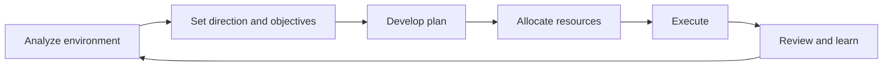

# Volume 02 - Business Planning

| Field | Value |
|---|---|
| Document ID | WORLD-VOL02-042 |
| Title | Business Planning |
| Version | 1.0 |
| Status | Approved |
| Classification | Internal |
| Founder | Mahesh Choudhary |

## Purpose

This chapter establishes, from first principles, what business planning is, why it is indispensable to any organization, and how a disciplined planning cycle is constructed. It serves as a general reference for the business-management layer of Volume 02 and provides the conceptual foundation upon which goal setting, execution, and performance evaluation depend.

## Scope

The chapter covers the definition of business planning, the rationale for planning, the standard planning cycle, the levels and horizons of plans, core components of a plan, and an illustrative example. It addresses planning as a general business discipline rather than the specific commercial plan of any single enterprise.

## What Business Planning Is

Business planning is the structured process of deciding, in advance, what an organization will achieve and how it will allocate resources to achieve it. A plan is a written, testable set of intentions that translates purpose and strategy into commitments, timelines, and resource assignments. From first principles, planning exists because resources are finite, the future is uncertain, and coordinated effort outperforms uncoordinated effort. Planning converts ambition into an executable path.

### Why Planning Matters

Without a plan, an organization reacts to events rather than shaping them. Planning matters because it aligns people around shared objectives, exposes assumptions before capital is committed, reveals resource constraints early, and creates a baseline against which progress can be measured. A plan is also a communication instrument: it lets stakeholders understand priorities and trade-offs.

## The Planning Cycle

Planning is not a one-time event but a repeating cycle. The canonical sequence moves from understanding the environment to setting direction, developing the plan, allocating resources, executing, and reviewing outcomes that feed the next cycle.

## Levels and Horizons of Planning

Plans differ by scope and time horizon. Strategic plans set long-range direction; tactical plans translate strategy into functional programs; operational plans govern day-to-day activity. Matching the horizon to the level prevents both short-sighted execution and abstract strategy that never lands.

| Level | Horizon | Focus | Typical Owner |
|---|---|---|---|
| Strategic | 3-5 years | Direction, positioning, major bets | Executive leadership |
| Tactical | 1 year | Programs, budgets, functional goals | Department heads |
| Operational | Weekly-quarterly | Tasks, schedules, throughput | Team leads |

## Core Components of a Business Plan

A complete plan generally contains an executive summary, a situation analysis, clearly stated objectives, the strategy and initiatives chosen to reach them, a resource and budget plan, a timeline with milestones, defined roles and accountabilities, and a set of assumptions and risks. Each component answers a distinct question: where are we, where are we going, how will we get there, what will it cost, when, who is responsible, and what could go wrong.

## Example

Consider a regional bakery preparing an annual plan. Its situation analysis notes rising ingredient costs and growing weekend demand. Its objective is to increase weekend revenue by a defined amount within twelve months. Its strategy is to add a pre-order channel and extend Saturday hours. The resource plan budgets for one additional baker and a simple online ordering tool. Milestones set the pre-order launch for the second quarter, and the risk register flags supplier price volatility. This single page turns a vague hope into a coordinated, measurable path.

## Relevance to WORLD

An AI Business Partner treats planning as a living, structured artifact rather than a static document. It helps founders draft plans from first principles, stress-tests assumptions, models resource constraints, and keeps the plan synchronized with real execution data so the next planning cycle begins from evidence rather than guesswork.

## Related Documents

- [Goal Management](/docs/blueprint/volume-02-business-foundation/section-f-business-management/43-goal-management.md)
- [Execution Management](/docs/blueprint/volume-02-business-foundation/section-f-business-management/44-execution-management.md)
- [Business Governance](/docs/blueprint/volume-02-business-foundation/section-f-business-management/48-business-governance.md)

## References

- [Volume 01 - Vision and Philosophy](/docs/blueprint/volume-01-vision-and-philosophy/README.md)
- [Document Standards](/docs/governance/document-standards.md)

## Change Log

| Version | Date | Author | Notes |
|---|---|---|---|
| 1.0 | 2026-07-12 | Lead Software Engineer | Initial approved version. |
