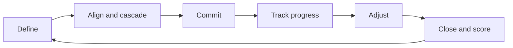

# Volume 02 - Goal Management

| Field | Value |
|---|---|
| Document ID | WORLD-VOL02-043 |
| Title | Goal Management |
| Version | 1.0 |
| Status | Approved |
| Classification | Internal |
| Founder | Mahesh Choudhary |

## Purpose

This chapter defines goal management from first principles and describes how organizations set, cascade, track, and adjust goals so that intent reliably converts into coordinated action. It provides the reference model that connects business planning to execution and performance.

## Scope

The chapter covers the definition and anatomy of a goal, why goal management matters, the goal lifecycle, established frameworks such as SMART and OKRs, the cascading of goals across levels, and a worked example. It is a general treatment applicable to any organization.

## What a Goal Is

A goal is a specific, desired future state that an organization commits to reaching within a defined period. From first principles, a goal exists to focus finite attention and resources on outcomes that matter most. A goal differs from a task: a task is an activity, whereas a goal is the result the activity is meant to produce. Good goals are measurable, time-bound, and owned by an accountable party.

### Why Goal Management Matters

Organizations fail not only from bad strategy but from unmanaged goals that drift, conflict, or go unmeasured. Goal management matters because it creates alignment across teams, makes progress visible, forces prioritization, and provides the reference points against which performance is judged. It converts strategy from a statement into a set of accountable commitments.

## Established Frameworks

Two widely adopted frameworks anchor goal management. SMART defines the quality of an individual goal. OKRs (Objectives and Key Results) provide a structure for ambitious direction paired with measurable outcomes.

| Framework | Purpose | Structure |
|---|---|---|
| SMART | Quality of a single goal | Specific, Measurable, Achievable, Relevant, Time-bound |
| OKR | Direction plus measurable outcomes | One qualitative Objective with 3-5 quantitative Key Results |
| KPI targets | Ongoing performance thresholds | Metric with a target value and cadence |

## The Goal Lifecycle

Goals move through a lifecycle from definition to closure. Managing that lifecycle explicitly prevents goals from being set and then forgotten.

## Cascading Goals

Goals gain power when they connect vertically. A company objective decomposes into departmental objectives, which decompose into team and individual goals. Each level should trace clearly to the level above so that every contributor can see how their work advances the organization's direction. Alignment sessions reconcile conflicts and expose dependencies before commitments are locked.

## Example

A software company sets a company objective to improve customer retention. Using OKRs, the Objective is stated as "Customers stay because the product becomes essential." Its Key Results are a defined reduction in monthly churn, an increase in the share of active accounts using core features, and a target improvement in the support satisfaction score. The customer-success team then adopts a supporting objective focused on onboarding, with its own key results. Progress is reviewed monthly, key results are scored at quarter end, and the scores inform the next cycle's goals.

## Relevance to WORLD

An AI Business Partner acts as an always-on goal steward: it helps articulate SMART goals and OKRs, cascades them across the organization, continuously tracks progress against key results, and proactively flags goals that are stalling or conflicting so founders can intervene early rather than at quarter end.

## Related Documents

- [Business Planning](/docs/blueprint/volume-02-business-foundation/section-f-business-management/42-business-planning.md)
- [Execution Management](/docs/blueprint/volume-02-business-foundation/section-f-business-management/44-execution-management.md)
- [Performance Management](/docs/blueprint/volume-02-business-foundation/section-f-business-management/45-performance-management.md)

## References

- [Volume 01 - Vision and Philosophy](/docs/blueprint/volume-01-vision-and-philosophy/README.md)
- [Document Standards](/docs/governance/document-standards.md)

## Change Log

| Version | Date | Author | Notes |
|---|---|---|---|
| 1.0 | 2026-07-12 | Lead Software Engineer | Initial approved version. |
