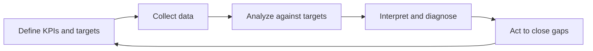

# Volume 02 - Performance Management

| Field | Value |
|---|---|
| Document ID | WORLD-VOL02-045 |
| Title | Performance Management |
| Version | 1.0 |
| Status | Approved |
| Classification | Internal |
| Founder | Mahesh Choudhary |

## Purpose

This chapter defines performance management from first principles and explains how organizations measure, interpret, and act on how well they are doing against their goals. It provides the reference model for turning raw activity into meaningful signals that guide decisions.

## Scope

The chapter covers the definition of performance management, why measurement matters, the anatomy of metrics and KPIs, the balanced scorecard perspective, the measurement cycle, and a worked example. It treats performance management as a general discipline applicable to any enterprise.

## What Performance Management Is

Performance management is the systematic process of measuring outcomes against goals, interpreting the results, and acting to close gaps. From first principles, an organization cannot improve what it does not measure, and it cannot measure meaningfully without first defining what good looks like. Performance management connects goals to evidence and evidence to decisions.

### Why Measurement Matters

Measurement converts opinion into fact. It reveals whether strategy is working, where resources are producing returns, and which assumptions were wrong. Without measurement, organizations mistake activity for progress. With well-chosen measures, they detect problems early, reward what works, and reallocate away from what does not.

## Metrics, KPIs, and Targets

A metric is any quantifiable measure. A Key Performance Indicator (KPI) is a metric chosen because it directly reflects progress toward a strategic goal. Leading indicators predict future results; lagging indicators confirm past ones. A healthy measurement set balances the two.

| Term | Definition | Example |
|---|---|---|
| Metric | Any quantifiable measure | Website visits |
| KPI | Metric tied to a strategic goal | Monthly recurring revenue |
| Leading indicator | Predicts future outcomes | Qualified pipeline |
| Lagging indicator | Confirms past outcomes | Quarterly revenue |
| Target | The value defining success | 15% growth quarter over quarter |

## The Balanced Scorecard

The balanced scorecard framework counsels against measuring only financial results. It views performance across four perspectives - financial, customer, internal process, and learning and growth - so that short-term results do not mask long-term health. A balanced view keeps an organization from optimizing one dimension at the expense of the others.

## The Measurement Cycle

Performance management runs as a continuous cycle that turns data into action.

## Example

A subscription business sets monthly recurring revenue as its primary KPI, with qualified pipeline as a leading indicator. Mid-quarter, revenue is on target but pipeline has fallen below its threshold. Because the leading indicator flags the shortfall early, leadership diagnoses a slowdown in top-of-funnel demand and shifts budget to demand generation before the lagging revenue number can decline. Measurement across both indicators enabled a correction that a single lagging metric would have surfaced too late.

## Relevance to WORLD

An AI Business Partner continuously instruments the business, computing KPIs from live data, comparing them against targets, and surfacing meaningful deviations with plain-language diagnosis. It distinguishes signal from noise, highlights leading indicators before problems become losses, and recommends corrective actions grounded in the organization's own performance history.

## Related Documents

- [Goal Management](/docs/blueprint/volume-02-business-foundation/section-f-business-management/43-goal-management.md)
- [Execution Management](/docs/blueprint/volume-02-business-foundation/section-f-business-management/44-execution-management.md)
- [Review System](/docs/blueprint/volume-02-business-foundation/section-f-business-management/46-review-system.md)

## References

- [Volume 01 - Vision and Philosophy](/docs/blueprint/volume-01-vision-and-philosophy/README.md)
- [Document Standards](/docs/governance/document-standards.md)

## Change Log

| Version | Date | Author | Notes |
|---|---|---|---|
| 1.0 | 2026-07-12 | Lead Software Engineer | Initial approved version. |
