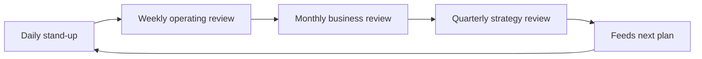

# Volume 02 - Review System

| Field | Value |
|---|---|
| Document ID | WORLD-VOL02-046 |
| Title | Review System |
| Version | 1.0 |
| Status | Approved |
| Classification | Internal |
| Founder | Mahesh Choudhary |

## Purpose

This chapter defines a business review system from first principles: the structured set of recurring meetings and mechanisms through which an organization inspects progress, makes decisions, and holds itself accountable. It explains how reviews connect planning, execution, and performance into a coherent management rhythm.

## Scope

The chapter covers the definition and purpose of a review system, the different types of reviews and their cadences, the anatomy of an effective review, the flow of information through the system, and a concrete example. It is a general reference on the practice of business review.

## What a Review System Is

A review system is the organized cadence of meetings and reporting through which an organization examines what is happening, decides what to do about it, and assigns accountability for the response. From first principles, reviews exist because plans meet reality imperfectly; a deliberate mechanism is needed to detect variance, make timely decisions, and keep the whole organization aligned. A review system replaces ad hoc, reactive meetings with a predictable, purposeful rhythm.

### Why a Review System Matters

Reviews matter because information alone does not create action; someone must inspect it, decide, and commit. A well-designed review system ensures that the right people look at the right information at the right frequency, that decisions are recorded, and that follow-through is tracked. Poorly designed reviews waste time; well-designed ones are where an organization steers itself.

## Types and Cadence of Reviews

Different decisions require different frequencies and audiences. Layering reviews by horizon prevents both micromanagement and neglect.

| Review | Cadence | Focus | Audience |
|---|---|---|---|
| Daily stand-up | Daily | Blockers, immediate work | Team |
| Weekly operating review | Weekly | Execution progress, priorities | Team and leads |
| Monthly business review | Monthly | KPIs, goal progress | Leadership |
| Quarterly strategy review | Quarterly | Strategy, OKR scoring, planning | Executives |

## The Review Rhythm

Reviews are nested: short, frequent reviews feed longer, less frequent ones. Insights from daily and weekly reviews roll up into monthly performance discussions, which in turn inform quarterly strategy.

## Anatomy of an Effective Review

Every effective review shares a common structure: a clear purpose, pre-read materials distributed in advance, a focus on exceptions and decisions rather than status recitation, explicit decisions with named owners and due dates, and a captured record of actions that is checked at the next review. The discipline of closing the loop on prior actions is what turns a meeting into a management system.

## Example

A growing services firm runs a monthly business review. The pre-read circulates two days ahead with KPI dashboards and goal progress. In the meeting, leadership skips items that are on track and concentrates on two exceptions: utilization has dropped and a key hire is delayed. Each exception produces a decision - reassign consultants and expedite recruiting - with a named owner and a deadline. At the following month's review, those actions are the first items checked. Over time the firm's problems get resolved rather than repeatedly discussed.

## Relevance to WORLD

An AI Business Partner runs the review system as a living process: it assembles pre-reads automatically from live data, highlights the exceptions that deserve attention, captures decisions and action items, and tracks their completion between meetings. It ensures no commitment falls through the cracks and that each review begins with an honest account of the last one.

## Related Documents

- [Execution Management](/docs/blueprint/volume-02-business-foundation/section-f-business-management/44-execution-management.md)
- [Performance Management](/docs/blueprint/volume-02-business-foundation/section-f-business-management/45-performance-management.md)
- [Continuous Improvement](/docs/blueprint/volume-02-business-foundation/section-f-business-management/47-continuous-improvement.md)

## References

- [Volume 01 - Vision and Philosophy](/docs/blueprint/volume-01-vision-and-philosophy/README.md)
- [Document Standards](/docs/governance/document-standards.md)

## Change Log

| Version | Date | Author | Notes |
|---|---|---|---|
| 1.0 | 2026-07-12 | Lead Software Engineer | Initial approved version. |
