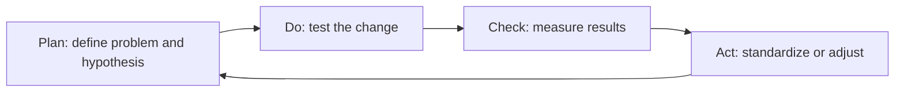

# Volume 02 - Continuous Improvement

| Field | Value |
|---|---|
| Document ID | WORLD-VOL02-047 |
| Title | Continuous Improvement |
| Version | 1.0 |
| Status | Approved |
| Classification | Internal |
| Founder | Mahesh Choudhary |

## Purpose

This chapter explains continuous improvement from first principles: the disciplined, ongoing practice of making processes, products, and outcomes incrementally better over time. It provides the reference model for how organizations learn systematically rather than by accident.

## Scope

The chapter defines continuous improvement, explains why incremental learning compounds, presents established frameworks including PDCA and Kaizen, describes the improvement cycle and root-cause analysis, and offers a concrete example. It is a general treatment applicable to any organization.

## What Continuous Improvement Is

Continuous improvement is the ongoing, structured effort to identify problems and opportunities, make small changes, measure their effect, and standardize what works. From first principles, no process is ever perfect and every process degrades or is overtaken unless it is deliberately improved. Rather than relying on rare, large transformations, continuous improvement compounds many small gains into substantial advantage over time.

### Why It Matters

Small improvements compound. A process improved a modest amount each cycle becomes dramatically better across a year, and the habit of improvement builds an organization that adapts faster than its environment changes. Continuous improvement also engages the people closest to the work, who usually see problems and solutions first, turning frontline knowledge into organizational capability.

## Established Frameworks

Several durable frameworks structure improvement work. They share a common logic: observe, hypothesize, test, and standardize.

| Framework | Core Idea | Best Applied To |
|---|---|---|
| PDCA | Plan-Do-Check-Act iterative loop | Any process improvement |
| Kaizen | Continuous small, frontline-driven changes | Operational efficiency |
| Lean | Eliminate waste, maximize value | Flow and throughput |
| Six Sigma | Reduce variation and defects | Quality-critical processes |

## The PDCA Cycle

The Plan-Do-Check-Act cycle is the canonical engine of continuous improvement. It makes improvement a repeatable loop rather than a one-off project.

## Root-Cause Analysis

Lasting improvement requires fixing causes, not symptoms. Techniques such as the Five Whys and cause-and-effect diagrams trace a visible problem back to its underlying source. Standardizing the fix - updating the process so the problem cannot recur - is what distinguishes genuine improvement from firefighting.

## Example

A support team notices that resolution times are rising. Applying PDCA, it plans a hypothesis: tickets are delayed waiting for information from customers. It runs a small test, adding a structured intake form for one week. Checking the data, first-response time falls measurably and back-and-forth messages decline. The team acts by standardizing the intake form for all tickets and updating its process documentation. A Five Whys review had earlier traced the delay to missing information at intake, ensuring the change addressed the real cause rather than the symptom.

## Relevance to WORLD

An AI Business Partner institutionalizes continuous improvement: it detects recurring problems and inefficiencies in the organization's data, proposes small experiments, tracks their results through PDCA loops, and helps standardize what works into repeatable processes. It turns every review and every metric deviation into a candidate for systematic learning.

## Related Documents

- [Performance Management](/docs/blueprint/volume-02-business-foundation/section-f-business-management/45-performance-management.md)
- [Review System](/docs/blueprint/volume-02-business-foundation/section-f-business-management/46-review-system.md)
- [Business Governance](/docs/blueprint/volume-02-business-foundation/section-f-business-management/48-business-governance.md)

## References

- [Volume 01 - Vision and Philosophy](/docs/blueprint/volume-01-vision-and-philosophy/README.md)
- [Document Standards](/docs/governance/document-standards.md)

## Change Log

| Version | Date | Author | Notes |
|---|---|---|---|
| 1.0 | 2026-07-12 | Lead Software Engineer | Initial approved version. |
