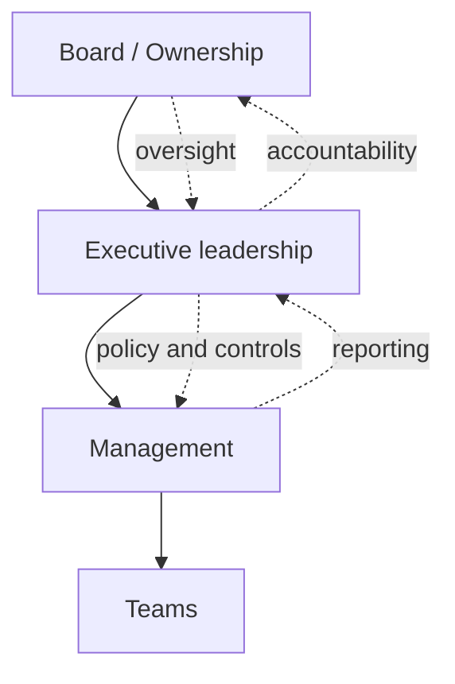

# Volume 02 - Business Governance

| Field | Value |
|---|---|
| Document ID | WORLD-VOL02-048 |
| Title | Business Governance |
| Version | 1.0 |
| Status | Approved |
| Classification | Internal |
| Founder | Mahesh Choudhary |

## Purpose

This chapter defines business governance from first principles: the framework of authority, accountability, decision rights, and controls through which an organization directs itself responsibly. It explains how governance ensures that management activity serves the organization's purpose and stakeholders.

## Scope

The chapter covers the definition and purpose of governance, its core principles, decision rights and accountability structures, the role of policies and controls, risk and compliance oversight, and a concrete example. It is a general reference on the discipline of governance rather than the governance charter of any specific enterprise.

## What Business Governance Is

Business governance is the system by which an organization is directed and controlled. From first principles, wherever authority and resources are delegated, there must be a corresponding structure of accountability and oversight to ensure that decisions serve the organization's purpose rather than narrow interests. Governance defines who may decide what, under which constraints, and how those decisions are monitored.

### Why Governance Matters

Governance matters because unchecked authority leads to misalignment, risk, and loss of trust. Clear governance accelerates decisions by removing ambiguity about who decides, protects the organization through controls and oversight, and sustains the confidence of stakeholders. It is the foundation on which planning, execution, and improvement can operate safely at scale.

## Core Principles of Governance

Sound governance rests on a small set of enduring principles that apply regardless of an organization's size.

| Principle | Meaning |
|---|---|
| Accountability | Every decision has a clear, answerable owner |
| Transparency | Decisions and their basis are visible to stakeholders |
| Fairness | Interests of stakeholders are balanced equitably |
| Responsibility | The organization acts within legal and ethical bounds |
| Oversight | Independent review checks that controls are working |

## Decision Rights and Accountability

Governance makes authority explicit. A decision-rights model specifies, for each class of decision, who is accountable, who is consulted, and who is merely informed. Making these rights explicit prevents both bottlenecks, where everything escalates, and drift, where decisions are made without authority.

## Policies, Controls, and Compliance

Governance is operationalized through policies that set the rules, controls that enforce them, and compliance mechanisms that verify adherence. Risk management identifies what could threaten the organization's objectives and ensures mitigations are in place. Together these convert governance principles into day-to-day practice, providing guardrails within which planning and execution proceed.

## Example

A scaling company introduces a spending-authority policy as part of its governance framework. The policy defines approval thresholds: team leads may approve routine expenses up to a set limit, department heads up to a higher limit, and anything larger requires executive sign-off. A quarterly control review samples transactions to confirm the thresholds are respected, and exceptions are reported to leadership. When an unauthorized large purchase surfaces, the control catches it, the accountable owner is identified, and the policy is refined to close the gap. Authority is delegated, yet oversight keeps it aligned with the organization's interest.

## Relevance to WORLD

An AI Business Partner embeds governance into daily operation: it encodes decision rights and policies, routes decisions to the accountable owner, enforces controls automatically, and maintains a transparent, auditable record of who decided what and why. It surfaces risk and compliance issues proactively, allowing founders to delegate with confidence while retaining oversight.

## Related Documents

- [Business Planning](/docs/blueprint/volume-02-business-foundation/section-f-business-management/42-business-planning.md)
- [Performance Management](/docs/blueprint/volume-02-business-foundation/section-f-business-management/45-performance-management.md)
- [Continuous Improvement](/docs/blueprint/volume-02-business-foundation/section-f-business-management/47-continuous-improvement.md)

## References

- [Volume 01 - Vision and Philosophy](/docs/blueprint/volume-01-vision-and-philosophy/README.md)
- [Document Standards](/docs/governance/document-standards.md)

## Change Log

| Version | Date | Author | Notes |
|---|---|---|---|
| 1.0 | 2026-07-12 | Lead Software Engineer | Initial approved version. |
