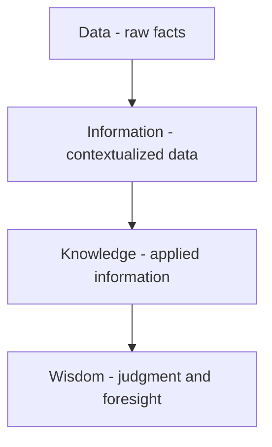

# Volume 02 - Business Data

| Field | Value |
|---|---|
| Document ID | WORLD-VOL02-049 |
| Title | Business Data |
| Version | 1.0 |
| Status | Approved |
| Classification | Internal |
| Founder | Mahesh Choudhary |

## Purpose

This document establishes, from first principles, what business data is, why it is the foundational raw material of every organization, and how it is classified. It serves as the entry point for Section G - Data and Knowledge and frames the concepts developed in later chapters on master data, transactional data, and business knowledge.

## Scope

This chapter covers the definition, nature, categories, quality dimensions, and lifecycle of business data as a general reference. It does not prescribe specific database technologies or storage architectures, which belong to implementation-focused volumes.

## Definition

Business data is the set of recorded facts, measurements, and observations that an organization captures about the entities and events relevant to its operations. A single datum, such as a customer identifier, a price, or a timestamp, carries no meaning in isolation. Data becomes valuable only when it is organized, contextualized, and interpreted. Business data is therefore the atomic layer beneath information, knowledge, and ultimately decision-making.

## Why Business Data Matters

Every business decision, from pricing a product to approving a loan, rests on data. Data quality directly determines decision quality. Organizations that treat data as a governed asset gain reliable analytics, automation, and compliance; those that neglect it accumulate errors, duplication, and risk. Data is also the fuel for artificial intelligence: models learn patterns from historical data, so the integrity of that data bounds the reliability of any automated judgment.

## The DIKW Progression

Business data sits at the base of the DIKW pyramid, the model that describes how raw facts are refined into actionable wisdom.

Data answers "what was recorded," information answers "what happened," knowledge answers "how and why," and wisdom answers "what should be done." Each layer depends on the integrity of the one beneath it.

## Categories of Business Data

| Category | Description | Example |
|---|---|---|
| Master data | Core, slowly changing business entities | Customer, product, supplier |
| Transactional data | Records of business events over time | Sales order, payment, shipment |
| Reference data | Standardized code sets and classifications | Country codes, currency codes |
| Metadata | Data that describes other data | Field definitions, data lineage |
| Analytical data | Aggregated or derived data for insight | Monthly revenue, churn rate |

## Data Quality Dimensions

Data quality is measured across several dimensions: accuracy (does it reflect reality), completeness (are required values present), consistency (does it agree across systems), timeliness (is it current), uniqueness (are there no duplicates), and validity (does it conform to defined rules). A disciplined organization measures and governs each dimension continuously.

## Data Lifecycle

Business data moves through a predictable lifecycle: it is created or captured, stored, used and processed, shared, archived, and finally disposed of under retention rules. Governance controls apply at every stage.

## Concrete Example

Consider a retail sale. The customer record and the product record are master data. The sale itself, with its date, quantity, and amount, is transactional data. The currency code applied is reference data. When the retailer aggregates thousands of such sales into a weekly revenue trend, it produces analytical data that informs a restocking decision. The same fields, governed for quality, flow from capture through archival.

## Relevance to WORLD

The AI Business Partner treats governed business data as its sensory input: it ingests master, transactional, and reference data to build an accurate model of the enterprise. Because the reliability of every recommendation depends on data quality, WORLD applies the quality dimensions and lifecycle controls described here before any datum informs an automated decision.

## Related Documents

- [Master Data](/docs/blueprint/volume-02-business-foundation/section-g-data-and-knowledge/50-master-data.md)
- [Transactional Data](/docs/blueprint/volume-02-business-foundation/section-g-data-and-knowledge/51-transactional-data.md)
- [Business Knowledge](/docs/blueprint/volume-02-business-foundation/section-g-data-and-knowledge/52-business-knowledge.md)

## References

- [Volume 01 - Vision and Philosophy](/docs/blueprint/volume-01-vision-and-philosophy/README.md)
- [Document Standards](/docs/governance/document-standards.md)

## Change Log

| Version | Date | Author | Description |
|---|---|---|---|
| 1.0 | 2026-07-12 | Lead Software Engineer | Initial approved version. |
