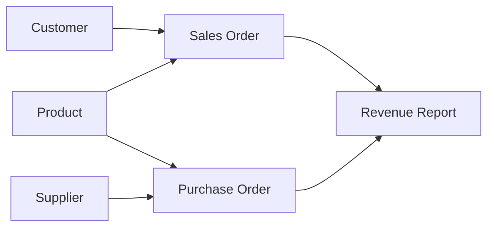

# Volume 02 - Master Data

| Field | Value |
|---|---|
| Document ID | WORLD-VOL02-050 |
| Title | Master Data |
| Version | 1.0 |
| Status | Approved |
| Classification | Internal |
| Founder | Mahesh Choudhary |

## Purpose

This document defines master data from first principles, explains its role as the shared vocabulary of the enterprise, and describes how it is governed. It complements the broader treatment of business data and contrasts master data with transactional data.

## Scope

This chapter covers the definition, domains, characteristics, and governance of master data as a general business reference. It does not specify a particular master data management (MDM) product.

## Definition

Master data is the set of core business entities that are shared across processes and systems and that change relatively infrequently. These are the nouns of the business: customers, products, suppliers, employees, accounts, and locations. A single, authoritative record for each such entity is the goal of master data management. Master data provides the stable reference points against which transactions are recorded.

## Why Master Data Matters

When the same customer or product is represented differently in each system, reports disagree, invoices are misdirected, and automation fails. Master data creates a single, trusted view of each entity so that every process, from ordering to reporting, speaks the same language. It is the connective tissue that makes cross-functional analytics and automation possible.

## Master Data Domains

| Domain | Represents | Typical Attributes |
|---|---|---|
| Customer | Buyers of goods or services | Name, identifier, address, segment |
| Product | Items sold or produced | SKU, description, category, unit |
| Supplier | Vendors and partners | Name, identifier, terms, contact |
| Employee | Members of the workforce | ID, role, department, status |
| Financial | Chart of accounts and cost centers | Account code, type, hierarchy |
| Location | Sites and geographies | Site ID, address, region |

## Characteristics of Master Data

Master data is shared across the organization, relatively stable over time, referenced by many transactions, and low in volume compared with transactional data. It is best managed centrally with clear ownership, defined survivorship rules for merging duplicates, and controlled workflows for creation and change.

## Master Data in the Data Landscape

The diagram shows master entities on the left being referenced by transactions, which in turn feed analytics. Master data is the fixed frame; transactions are the moving events.

## Master Data versus Transactional Data

| Aspect | Master Data | Transactional Data |
|---|---|---|
| Nature | Entities (nouns) | Events (verbs) |
| Change frequency | Low, slowly changing | High, continuous |
| Volume | Relatively small | Large and growing |
| Time dimension | Current state | Point-in-time record |
| Example | Customer profile | Customer's order |

## Governance

Master data governance assigns a data owner and stewards for each domain, defines the golden record and its survivorship rules, controls the create-read-update-deactivate lifecycle, and enforces quality standards. Deduplication and matching maintain the single authoritative view.

## Concrete Example

A company operating an e-commerce site, a call center, and a warehouse may hold three separate records for the same customer. A master data process matches these records on name, email, and address, merges them into one golden record with an authoritative address, and links all three source systems to it. Every future order references this single record, eliminating conflicting addresses and duplicate mailings.

## Relevance to WORLD

The AI Business Partner relies on clean master data to reason about who and what the business deals with. By resolving each customer, product, and supplier to a single golden record, WORLD can connect fragmented events into a coherent picture and act consistently across every channel it operates.

## Related Documents

- [Business Data](/docs/blueprint/volume-02-business-foundation/section-g-data-and-knowledge/49-business-data.md)
- [Transactional Data](/docs/blueprint/volume-02-business-foundation/section-g-data-and-knowledge/51-transactional-data.md)
- [Business Knowledge](/docs/blueprint/volume-02-business-foundation/section-g-data-and-knowledge/52-business-knowledge.md)

## References

- [Volume 01 - Vision and Philosophy](/docs/blueprint/volume-01-vision-and-philosophy/README.md)
- [Document Standards](/docs/governance/document-standards.md)

## Change Log

| Version | Date | Author | Description |
|---|---|---|---|
| 1.0 | 2026-07-12 | Lead Software Engineer | Initial approved version. |
