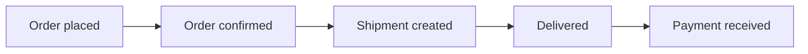

# Volume 02 - Transactional Data

| Field | Value |
|---|---|
| Document ID | WORLD-VOL02-051 |
| Title | Transactional Data |
| Version | 1.0 |
| Status | Approved |
| Classification | Internal |
| Founder | Mahesh Choudhary |

## Purpose

This document defines transactional data from first principles, explains why it is the record of business activity, and contrasts it with master data. It establishes the vocabulary used when the AI Business Partner reasons about business events over time.

## Scope

This chapter covers the definition, characteristics, structure, and lifecycle of transactional data as a general reference. It does not prescribe specific transaction-processing technologies.

## Definition

Transactional data is the set of records that capture business events as they occur. Where master data describes the entities of a business, transactional data describes the things that happen to and between those entities: a sale, a payment, a shipment, a login, a support ticket. Each transaction is a time-stamped fact that references one or more master entities and records the state of an activity at a moment in time.

## Why Transactional Data Matters

Transactional data is the empirical history of the business. It is the source from which revenue, cash flow, inventory movement, and customer behavior are derived. Because it accumulates continuously and in high volume, it is also the primary training and inference input for analytics and machine learning. Accurate transactional data is essential for financial integrity, operational visibility, and audit.

## Characteristics of Transactional Data

Transactional data is high in volume, generated continuously, immutable once committed (corrections are made through new offsetting transactions rather than edits), and always associated with a timestamp. Each record typically references master data, giving the event its context.

## Anatomy of a Transaction

| Element | Description | Example |
|---|---|---|
| Identifier | Unique key for the transaction | Order #100582 |
| Timestamp | When the event occurred | 2026-07-12 14:03 UTC |
| Master references | Entities involved | Customer C-9, Product P-14 |
| Quantities and amounts | Measures of the event | 3 units, 149.00 USD |
| Status | State of the transaction | Confirmed, Shipped, Paid |

## Transactional Data over Time

The diagram shows a single business activity producing a sequence of transactional records, each capturing a distinct state change. Together they form the auditable timeline of the order.

## Master Data versus Transactional Data

| Aspect | Master Data | Transactional Data |
|---|---|---|
| Represents | Entities (nouns) | Events (verbs) |
| Volume | Small, stable | Large, ever-growing |
| Change | Slowly changing | Created continuously |
| Time | Current state | Point-in-time record |
| Dependency | Referenced by transactions | References master data |

Master data and transactional data are complementary: a transaction is only meaningful because it points to master entities, and a master entity is only valuable because transactions give it a history.

## Lifecycle

Transactional data is captured at the point of activity, validated against business rules and master data, committed to the system of record, used for operations and reporting, and eventually archived under retention policy. Corrections follow an append-only pattern to preserve auditability.

## Concrete Example

When a customer buys a subscription, the system records an order transaction referencing the customer and product master records. A payment transaction follows, then a series of recurring billing transactions each month. Aggregating these transactions yields monthly recurring revenue, while their sequence reveals whether the customer renewed or churned. No master record changed, yet the transactional trail tells the full story.

## Relevance to WORLD

The AI Business Partner consumes transactional data as the live pulse of the business, using the stream of events to detect trends, anomalies, and opportunities in real time. Because transactions reference governed master data, WORLD can attribute every event to the correct customer, product, or account and reason about the business as a coherent timeline.

## Related Documents

- [Business Data](/docs/blueprint/volume-02-business-foundation/section-g-data-and-knowledge/49-business-data.md)
- [Master Data](/docs/blueprint/volume-02-business-foundation/section-g-data-and-knowledge/50-master-data.md)
- [Business Knowledge](/docs/blueprint/volume-02-business-foundation/section-g-data-and-knowledge/52-business-knowledge.md)

## References

- [Volume 01 - Vision and Philosophy](/docs/blueprint/volume-01-vision-and-philosophy/README.md)
- [Document Standards](/docs/governance/document-standards.md)

## Change Log

| Version | Date | Author | Description |
|---|---|---|---|
| 1.0 | 2026-07-12 | Lead Software Engineer | Initial approved version. |
